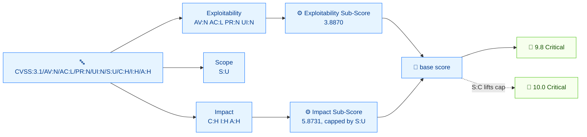

# 🧩 Your First Vector

⏱️ 20 min · beginner · CLI

You will dissect the most common CVSS v3.1 vector in the wild:

```
CVSS:3.1/AV:N/AC:L/PR:N/UI:N/S:U/C:H/I:H/A:H
```

By the end you will know what every `KEY:VALUE` pair means, why this combination scores **9.8 Critical**, and how to change one metric and watch the score drop. We use the `cvss` CLI throughout.

## Prerequisites

- The `cvss` binary on your `$PATH` (or `./cvss-cli` from the repo root)
- Finish [getting-started](./getting-started) so you can run a `score` command

## Flow



## Step 1 — The shape of a vector

Every CVSS 3.x vector has the same skeleton:

```
CVSS:<version>/<Metric>:<Value>/<Metric>:<Value>/...
```

- `CVSS:3.1` is the **version prefix**. It decides which scoring rules apply.
- After the first `/` come the **metric:value pairs**, separated by `/`.
- Order is not significant to the score, but the CLI can normalize it with `canonicalize`:

```bash
cvss canonicalize "CVSS:3.1/C:H/AV:N/AC:L/PR:N/UI:N/S:U/I:H/A:H"
```

```
CVSS:3.1/AV:N/AC:L/PR:N/UI:N/S:U/C:H/I:H/A:H
```

Our vector has eight pairs. They are all **Base** metrics — the minimum needed to produce a score. There are no temporal (`E`/`RL`/`RC`) or environmental (`CR`/`MAV`/...) metrics here.

## Step 2 — The Exploitability metrics (AV, AC, PR, UI)

The first four metrics describe how easy it is to exploit the vulnerability.

### `AV:N` — Attack Vector = Network

How the attacker reaches the vulnerable component.

| Value | Meaning | Reach |
| --- | --- | --- |
| `N` | Network | any network — worst |
| `A` | Adjacent | same broadcast/auth domain |
| `L` | Local | local execution or physical access |
| `P` | Physical | hands-on the device |

`AV:N` means remotely exploitable over the network — the scariest option.

### `AC:L` — Attack Complexity = Low

Conditions beyond the attacker's control that make the attack harder.

| Value | Meaning |
| --- | --- |
| `L` | Low — no special conditions |
| `H` | High — e.g. race condition, special timing |

`AC:L` means the attack is straightforward to mount.

### `PR:N` — Privileges Required = None

Whether the attacker must be authenticated before the attack.

| Value | Meaning |
| --- | --- |
| `N` | None |
| `L` | Low privilege |
| `H` | High privilege |

`PR:N` means a completely unauthenticated attacker.

### `UI:N` — User Interaction = None

Whether a second user (other than the attacker) must do something.

| Value | Meaning |
| --- | --- |
| `N` | None |
| `R` | Required |

`UI:N` means no victim interaction needed.

::: tip These four together = "remotely, trivially, anonymously, autonomously"
`AV:N/AC:L/PR:N/UI:N` is the classic "drive-by RCE" profile — maximum exploitability.
:::

## Step 3 — `S:U` — Scope = Unchanged

Scope is the subtlest base metric. It captures whether a successful exploit in the **vulnerable component** can affect resources in a **different component** (a different security authority).

| Value | Meaning |
| --- | --- |
| `U` | Unchanged — impact stays in the vulnerable component |
| `C` | Changed — impact crosses into another component |

`S:U` means the blast radius is contained. `S:C` would multiply the impact — that is why the [preset critical vector](./presets-and-random) uses `S:C` to reach 10.0.

## Step 4 — The Impact metrics (C, I, A)

The last three describe what the attacker accomplishes once in.

| Metric | Concern | Values |
| --- | --- | --- |
| `C` | Confidentiality | `H` High / `L` Low / `N` None |
| `I` | Integrity | `H` High / `L` Low / `N` None |
| `A` | Availability | `H` High / `L` Low / `N` None |

Our vector has `C:H/I:H/A:H` — total compromise of all three properties. Combined with `S:U` that is the maximum impact for an unchanged-scope vulnerability.

## Step 5 — See it all at once

```bash
cvss describe "CVSS:3.1/AV:N/AC:L/PR:N/UI:N/S:U/C:H/I:H/A:H"
```

```
Attack Vector: Network, Attack Complexity: Low, Privileges Required: None, User Interaction: None, Scope: Unchanged, Confidentiality: High, Integrity: High, Availability: High
```

And the per-metric weight the calculator uses:

```bash
cvss score --breakdown "CVSS:3.1/AV:N/AC:L/PR:N/UI:N/S:U/C:H/I:H/A:H"
```

```
=== Score Breakdown ===
--- Base Metrics ---
  AV:N = 0.8500  (Attack Vector)
  AC:L = 0.7700  (Attack Complexity)
  PR:N = 0.8500  (Privileges Required)
  UI:N = 0.8500  (User Interaction)
  S:U = 0.0000  (Scope)
  C:H = 0.5600  (Confidentiality)
  I:H = 0.5600  (Integrity)
  A:H = 0.5600  (Availability)
```

::: warning S:U = 0.0000 is not "no contribution"
Scope is a multiplier/switch, not a linear weight — its `0.0000` in the breakdown just means the per-metric weight column is zero; the score formula still uses `S` to pick which impact formula to run.
:::

## Step 6 — Why 9.8?

The base score is built from two sub-scores:

- **Impact Sub-Score (ISC)** — how bad the C/I/A damage is
- **Exploitability Sub-Score (ESS)** — how easy AV/AC/PR/UI make it

See them directly with `subs`:

```bash
cvss subs "CVSS:3.1/AV:N/AC:L/PR:N/UI:N/S:U/C:H/I:H/A:H"
```

```
Impact Sub-Score:        5.8731
Exploitability Sub-Score: 3.8870
```

For `S:U` with `C:H/I:H/A:H`, the Impact Sub-Score (ISC) saturates at 5.8731 — the unchanged-scope formula `ISC = 6.42 × (1 − (1−C)(1−I)(1−A))` is capped at 6.42 before further scaling. The Exploitability Sub-Score (ESS) is at 3.8870 because all four exploitability metrics sit at their most-severe value. The two combine into 9.8.

```bash
cvss score "CVSS:3.1/AV:N/AC:L/PR:N/UI:N/S:U/C:H/I:H/A:H"
```

```
9.8 (Critical)
```

::: tip Why not 10.0?
The ISC cap is what holds `S:U` back from 10.0. To reach 10.0 you need `S:C` (changed scope), which lifts the cap. Compare:
:::

```bash
cvss score "CVSS:3.1/AV:N/AC:L/PR:N/UI:N/S:C/C:H/I:H/A:H"
```

```
10.0 (Critical)
```

One character — `S:U` → `S:C` — moves 9.8 to 10.0. That is the whole point of Scope.

## Step 7 — Change one metric, watch the score move

Lower the impact: turn `C:H/I:H/A:H` into `C:L/I:N/A:N`:

```bash
cvss score "CVSS:3.1/AV:N/AC:L/PR:N/UI:N/S:U/C:L/I:N/A:N"
```

```
5.3 (Medium)
```

Or harden exploitability: raise `AC:L` to `AC:H`:

```bash
cvss score "CVSS:3.1/AV:N/AC:H/PR:N/UI:N/S:U/C:H/I:H/A:H"
```

```
8.1 (High)
```

These two examples show the two levers — impact and exploitability — that the base score gives you.

## Recap

You took `CVSS:3.1/AV:N/AC:L/PR:N/UI:N/S:U/C:H/I:H/A:H` apart:

- `AV:N/AC:L/PR:N/UI:N` = maximum exploitability
- `S:U` = contained blast radius (the cap that holds the score at 9.8, not 10.0)
- `C:H/I:H/A:H` = total confidentiality/integrity/availability loss
- Together → **9.8 Critical**

You also saw that `S:C` reaches 10.0 and that lowering impact drops you to Medium.

## Next

- Watch the score evolve as you add temporal and environmental metrics in [scoring-walkthrough](./scoring-walkthrough)
- Build vectors from scratch in Go in [building-vectors](./building-vectors)
