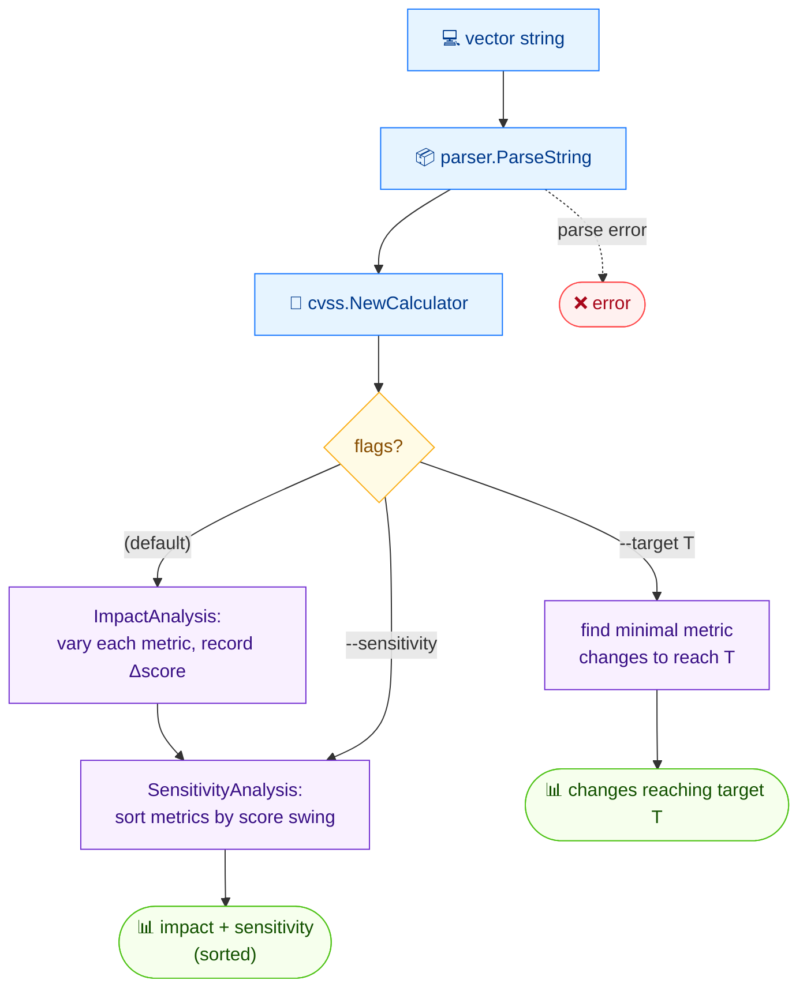

# 🔬 analyze

🔬 分析 · 🟢 stable

## 简介

`cvss analyze` 剖析每个指标如何影响 CVSS 总评分。它报告**影响分析**（改变每个指标取值会如何移动评分）与**敏感性分析**（哪些指标的评分摆动最大）。用 `--target` 可计算达到目标评分所需的最小指标改动；用 `--sensitivity` 可只打印敏感性部分。

## 工作原理

对每个指标，命令在变化该指标的同时重新计算评分，生成影响分析与（排序后的）敏感性分析；`--target` 则搜索达到目标评分所需的最小指标改动。



## 用法

```bash
cvss analyze [vector-string] [flags]
```

### Flags

| Flag            | 类型  | 默认值  | 说明                              |
| --------------- | ----- | ------- | --------------------------------- |
| `-h, --help`    | bool  | `false` | `analyze` 的帮助信息              |
| `--sensitivity` | bool  | `false` | 仅显示敏感性分析                  |
| `--target`      | float | `0`     | 计算达到目标评分所需的指标改动    |

## 示例

::: code-group

```bash [影响 + 敏感性]
cvss analyze "CVSS:3.1/AV:N/AC:L/PR:N/UI:N/S:U/C:H/I:H/A:H"
```

```text [输出]
=== Impact Analysis ===
AV (current: N, score: 9.8)
  A (Adjacent): 8.8 (High) [-1.0]
  L (Local): 8.4 (High) [-1.4]
  P (Physical): 6.8 (Medium) [-3.0]
PR (current: N, score: 9.8)
  L (Low): 8.8 (High) [-1.0]
  H (High): 7.2 (High) [-2.6]
AC (current: L, score: 9.8)
  H (High): 8.1 (High) [-1.7]
UI (current: N, score: 9.8)
  R (Required): 8.8 (High) [-1.0]
C (current: H, score: 9.8)
  L (Low): 9.4 (Critical) [-0.4]
  N (None): 9.1 (Critical) [-0.7]
I (current: H, score: 9.8)
  L (Low): 9.4 (Critical) [-0.4]
  N (None): 9.1 (Critical) [-0.7]
A (current: H, score: 9.8)
  L (Low): 9.4 (Critical) [-0.4]
  N (None): 9.1 (Critical) [-0.7]
S (current: U, score: 9.8)
  C (Changed): 10.0 (Critical) [+0.2]

=== Sensitivity Analysis ===
AV: 6.8 ~ 9.8 (swing: 3.0, current: 9.8)
PR: 7.2 ~ 9.8 (swing: 2.6, current: 9.8)
AC: 8.1 ~ 9.8 (swing: 1.7, current: 9.8)
UI: 8.8 ~ 9.8 (swing: 1.0, current: 9.8)
C: 9.1 ~ 9.8 (swing: 0.7, current: 9.8)
```

:::

::: tip 解读 delta 列
每个候选取值都标注了 `[Δ]`——相对当前取值的评分变化。`[-3.0]` 表示该取值使评分下降 3.0；`[+0.2]` 表示使其上升 0.2。
:::

## 底层 API

用 [`parser.ParseString`](/zh/sdk/parser) 解析向量，再运行 [`cvss.ImpactAnalysis`](/zh/sdk/impact) 与 [`cvss.SensitivityAnalysis`](/zh/sdk/impact)。带 `--target` 时还会调用 [`cvss.FindMetricChangesToReachTarget`](/zh/sdk/impact)。

```go
import (
    "log"

    "github.com/scagogogo/cvss-skills/pkg/cvss"
    "github.com/scagogogo/cvss-skills/pkg/parser"
)

cv, err := parser.ParseString("CVSS:3.1/AV:N/AC:L/PR:N/UI:N/S:U/C:H/I:H/A:H")
if err != nil {
    log.Fatal(err)
}

impacts, err := cvss.ImpactAnalysis(cv)
if err != nil {
    log.Fatal(err)
}
for _, imp := range impacts {
    // imp.Metric, imp.CurrentValue, imp.Alternatives ...
}

sensitivities, err := cvss.SensitivityAnalysis(cv)
if err != nil {
    log.Fatal(err)
}

// 达到目标评分所需的最小指标改动
changes, err := cvss.FindMetricChangesToReachTarget(cv, 7.0)
```

## 相关

- [score](/zh/cli/commands/score) — 被分析的那个评分
- [range](/zh/cli/commands/range) — 不完整向量的最佳/最差评分范围
- [影响与敏感性](/zh/sdk/impact) — Go SDK 参考
