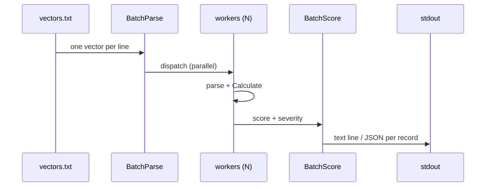

# ⚡ batch score

<span class="badge">CVSS v3.0</span>
<span class="badge">CVSS v3.1</span>
<span class="badge badge-info">文本 + JSON</span>

## 简介

`cvss batch score` 从文件（或 stdin）逐行读取 CVSS 向量并并行评分。每行输入对应一条输出记录：文本模式下为 `评分 (严重性)  向量` 一行，JSON 模式下为含 `line`、`vector`、`score`、`severity` 的对象。它是批量梳理向量积压的评分主力命令。

`batch` 是批量操作的父命令；`score` 是其评分子命令（兄弟命令为 `batch validate`）。

## 工作原理

输入行被分发到 worker 池，并行解析并评分每个向量，然后按行序重组为逐行输出记录。



## 用法

```
cvss batch score [文件] [flags]
```

### Flags

| Flag | 默认值 | 说明 |
| --- | --- | --- |
| `--format string` | `text` | 输出格式：`text` 或 `json` |
| `--workers int` | `4` | 并行 worker 数 |
| `-h, --help` | — | `score` 的帮助 |

::: tip 文件或 stdin
传入文件路径，或用 `-`（或管道）从 stdin 读取。空行与以 `#` 开头的行会自动跳过。
:::

## 示例

::: code-group

```bash [给向量文件评分]
cat > vectors.txt <<'EOF'
CVSS:3.1/AV:N/AC:L/PR:N/UI:N/S:U/C:H/I:H/A:H
CVSS:3.1/AV:N/AC:L/PR:N/UI:N/S:C/C:H/I:H/A:H
EOF
cvss batch score vectors.txt
```

```bash [JSON 输出管道传入 jq]
cvss batch score --format json --workers 8 vectors.txt | jq 'select(.score >= 9.0)'
```

```bash [从 stdin]
cat vectors.txt | cvss batch score -
```

:::

::: warning 解析错误输出到 stderr
解析失败的行以 `Line N: parse error: ...` 形式输出到 stderr 并跳过；其余合法向量仍会评分。逐向量评分错误在 JSON 模式下以 `{"line":N,"error":"..."}` 对象输出（文本模式下输出到 stderr）。
:::

## 底层 API

```go
import (
    "github.com/scagogogo/cvss-skills/pkg/cvss"
    "github.com/scagogogo/cvss-skills/pkg/parser"
)

lines := readLines("vectors.txt") // []string，每行一个向量

// 并行解析（workerCount 个 worker）。
parseResults := parser.BatchParse(lines, 8) // []BatchParseResult

var vectors []*cvss.Cvss3x
var validIndices []int
for _, r := range parseResults {
    if r.Error != nil {
        continue
    }
    vectors = append(vectors, r.Vector)
    validIndices = append(validIndices, r.Index)
}

// 并行评分。
scoreResults := cvss.BatchScore(vectors, 8) // []BatchScoreResult
for i, r := range scoreResults {
    fmt.Printf("%.1f (%s)  %s\n", r.Score, r.Severity, r.Vector.String())
}
```

`parser.BatchParse(vectors []string, workerCount int) []BatchParseResult` 并行解析各行；每条结果含 `Index`、`Vector`、`Error`。`cvss.BatchScore(vectors []*Cvss3x, workerCount int) []BatchScoreResult` 并行评分已解析向量；每条结果含 `Vector`、`Score`、`Severity`、`Error`。

## 相关命令

- [`batch validate`](/zh/cli/commands/batch-validate) —— 批量校验（非评分）向量
- [`score`](/zh/cli/commands/score) —— 为单个向量评分
- [`sort`](/zh/cli/commands/sort) —— 按评分排序向量
