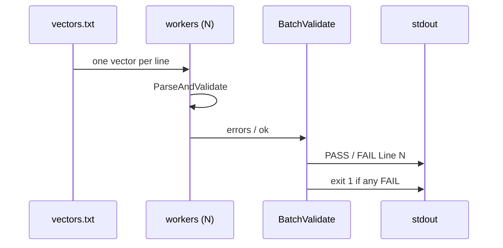

# ✅ batch validate

<span class="badge">CVSS v3.0</span>
<span class="badge">CVSS v3.1</span>
<span class="badge badge-info">文本输出</span>

## 简介

`cvss batch validate` 从文件（或 stdin）逐行读取 CVSS 向量并并行校验。每行打印 `PASS Line N: <向量>` 或 `FAIL Line N: <向量>`，并在失败行后列出具体错误原因。任一行失败时命令以 `1` 退出，因此可作为 CI 门控。

`batch` 是批量操作的父命令；`validate` 是其校验子命令（兄弟命令为 `batch score`）。

## 工作原理

输入行被分发到 worker 池，并行校验每个向量；每行打印 PASS 或 FAIL 及其原因，任一行失败则命令以 1 退出。



## 用法

```
cvss batch validate [文件] [flags]
```

### Flags

| Flag | 默认值 | 说明 |
| --- | --- | --- |
| `--workers int` | `4` | 并行 worker 数 |
| `-h, --help` | — | `validate` 的帮助 |

::: warning 没有 `--format` flag
与 `batch score` 不同，`batch validate` 没有 `--format json` —— 它始终打印 `PASS`/`FAIL` 文本行。
:::

## 示例

::: code-group

```bash [校验向量文件]
cat > vectors.txt <<'EOF'
CVSS:3.1/AV:N/AC:L/PR:N/UI:N/S:U/C:H/I:H/A:H
CVSS:3.1/AV:N
EOF
cvss batch validate vectors.txt
```

```bash [从 stdin]
cat vectors.txt | cvss batch validate -
```

:::

::: tip 退出码即门控
退出 `0` 表示每行都通过校验；退出 `1` 表示至少一行失败。用 `cvss batch validate vectors.txt && deploy` 即可让流水线以向量合法性作为门控。
:::

## 底层 API

```go
import "github.com/scagogogo/cvss-skills/pkg/parser"

lines := readLines("vectors.txt") // []string，每行一个向量

results := parser.BatchValidate(lines, 4) // []BatchValidateResult
hasErrors := false
for _, r := range results {
    if r.Valid {
        fmt.Printf("PASS Line %d: %s\n", r.Index+1, lines[r.Index])
    } else {
        hasErrors = true
        fmt.Printf("FAIL Line %d: %s\n", r.Index+1, lines[r.Index])
        for _, e := range r.Errors {
            fmt.Printf("  - %s\n", e)
        }
    }
}
if hasErrors {
    os.Exit(1)
}
```

`parser.BatchValidate(vectors []string, workerCount int) []BatchValidateResult` 并行校验各行。每条结果含 `Index`、`Valid` 与 `Errors`（人类可读失败原因的 `[]string`）。

## 相关命令

- [`batch score`](/zh/cli/commands/batch-score) —— 批量评分（非校验）向量
- [`validate`](/zh/cli/commands/validate) —— 校验单条向量字符串
- [`enumerate`](/zh/cli/commands/enumerate) —— 列出某指标的合法取值
