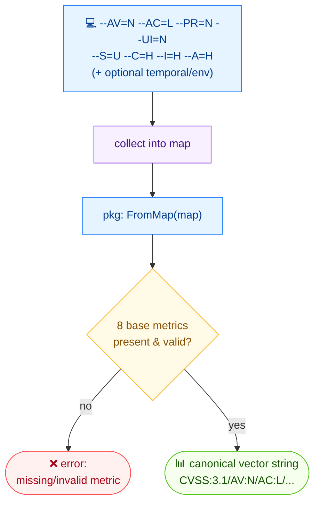

# 🏗️ build

🏗️ 构建 · 🟢 stable

## 简介

`cvss build` 把通过 flag 传入的逐项指标取值（`--AV=N`、`--AC=L` 等）组装成 CVSS 向量字符串。8 个基础指标全部必填；时间与环境指标可选。使用 `--cvss-version` 可指定目标版本为 v3.0 或 v3.1。

## 工作原理

各指标的 flag 取值被收集到一个 map 并交给 `FromMap`；八个基础指标必填，时间/环境条目可选，结果是一个规范向量字符串。



## 用法

```bash
cvss build [flags]
```

### Flags

| Flag              | 类型   | 默认值  | 说明                          |
| ----------------- | ------ | ------- | ----------------------------- |
| `--A`             | string |         | 可用性 (H/L/N)                |
| `--AC`            | string |         | 攻击复杂度 (L/H)              |
| `--AR`            | string |         | 可用性需求 (X/H/M/L)          |
| `--AV`            | string |         | 攻击向量 (N/A/L/P)            |
| `--C`             | string |         | 机密性 (H/L/N)                |
| `--CR`            | string |         | 机密性需求 (X/H/M/L)          |
| `--E`             | string |         | 利用代码成熟度 (X/U/P/F/H)    |
| `--I`             | string |         | 完整性 (H/L/N)                |
| `--IR`            | string |         | 完整性需求 (X/H/M/L)          |
| `--MA`            | string |         | 修改后可用性 (X/H/L/N)        |
| `--MAC`           | string |         | 修改后攻击复杂度 (X/L/H)      |
| `--MAV`           | string |         | 修改后攻击向量 (X/N/A/L/P)    |
| `--MC`            | string |         | 修改后机密性 (X/H/L/N)        |
| `--MI`            | string |         | 修改后完整性 (X/H/L/N)        |
| `--MPR`           | string |         | 修改后所需权限 (X/N/L/H)      |
| `--MS`            | string |         | 修改后范围 (X/U/C)            |
| `--MUI`           | string |         | 修改后用户交互 (X/N/R)        |
| `--PR`            | string |         | 所需权限 (N/L/H)              |
| `--RC`            | string |         | 报告可信度 (X/U/R/C)          |
| `--RL`            | string |         | 修复级别 (X/O/T/W/U)          |
| `--S`             | string |         | 范围 (U/C)                    |
| `--UI`            | string |         | 用户交互 (N/R)                |
| `--cvss-version`  | string | `3.1`   | CVSS 规范版本：`3.0` 或 `3.1` |
| `-h, --help`      | bool   | `false` | `build` 的帮助信息            |

::: warning 8 个基础指标全部必填
`--AV`、`--AC`、`--PR`、`--UI`、`--S`、`--C`、`--I`、`--A` 必须全部给出。时间（`E`/`RL`/`RC`）与环境（`CR`/`IR`/`AR` 及所有 `M*`）指标可选，未设置时不会出现在输出中。
:::

## 示例

::: code-group

```bash [基础指标]
cvss build --AV=N --AC=L --PR=N --UI=N --S=U --C=H --I=H --A=H
```

```text [输出]
CVSS:3.1/AV:N/AC:L/PR:N/UI:N/S:U/C:H/I:H/A:H
```

:::

::: code-group

```bash [含时间指标]
cvss build --AV=N --AC=L --PR=N --UI=N --S=U --C=H --I=H --A=H --E=F --RL=T --RC=C
```

```text [输出]
CVSS:3.1/AV:N/AC:L/PR:N/UI:N/S:U/C:H/I:H/A:H/E:F/RL:T/RC:C
```

:::

::: code-group

```bash [目标 v3.0]
cvss build --cvss-version=3.0 --AV=N --AC=L --PR=N --UI=N --S=C --C=H --I=H --A=H
```

```text [输出]
CVSS:3.0/AV:N/AC:L/PR:N/UI:N/S:C/C:H/I:H/A:H
```

:::

## 底层 API

把各 flag 取值收集到 `map[string]string` 中，调用 [`cvss.FromMap`](/zh/sdk/cvss)，再打印 `cv.String()`。

```go
import (
    "fmt"

    "github.com/scagogogo/cvss-skills/pkg/cvss"
)

m := map[string]string{
    "AV": "N", "AC": "L", "PR": "N", "UI": "N",
    "S": "U", "C": "H", "I": "H", "A": "H",
    // 可选的时间 / 环境项在缺省时不写入
    "E": "F", "RL": "T", "RC": "C",
}

cv, err := cvss.FromMap(m)
if err != nil {
    log.Fatal(err)
}
fmt.Println(cv.String()) // CVSS:3.1/AV:N/AC:L/PR:N/UI:N/S:U/C:H/I:H/A:H/E:F/RL:T/RC:C
```

## 相关

- [modify](/zh/cli/commands/modify) — 在已有向量上改动少量指标
- [parse](/zh/cli/commands/parse) — 验证构建出的向量能被正确解析
- [validate](/zh/cli/commands/validate) — 校验结果
- [FromMap](/zh/sdk/cvss) — Go SDK 参考
