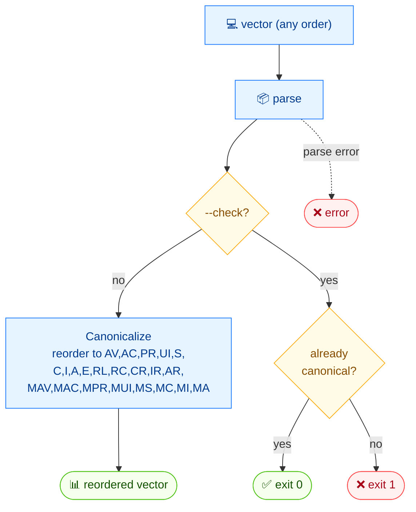

# 🔢 canonicalize

🔢 规范化 · 🟢 stable

## 简介

`cvss canonicalize` 把 CVSS 向量字符串重排为规范指标顺序（AV, AC, PR, UI, S, C, I, A, E, RL, RC, CR, IR, AR, MAV, MAC, MPR, MUI, MS, MC, MI, MA）。使用 `--check` 可在不改写向量的前提下测试其是否已是规范形态。

## 工作原理

解析各指标并按固定的规范顺序重新输出；`--check` 跳过改写，只回答输入是否已是规范形式（退出码 0/1）。



## 用法

```bash
cvss canonicalize [vector-string] [flags]
```

### Flags

| Flag         | 类型   | 默认值  | 说明                                       |
| ------------ | ------ | ------- | ------------------------------------------ |
| `--check`    | bool   | `false` | 仅检查是否规范（退出码 0=是，1=否）        |
| `--format`   | string | `text`  | 输出格式：`text` 或 `json`                 |
| `-h, --help` | bool   | `false` | `canonicalize` 的帮助信息                  |

::: tip `--check` 可用于脚本
`--check` 在向量已规范时退出 `0`，否则退出 `1`，可直接用于 shell 的 `if` 判断与 CI 卡点。
:::

## 示例

::: code-group

```bash [已是规范形态]
cvss canonicalize "CVSS:3.1/AV:N/AC:L/PR:N/UI:N/S:U/C:H/I:H/A:H"
```

```text [输出]
CVSS:3.1/AV:N/AC:L/PR:N/UI:N/S:U/C:H/I:H/A:H
```

:::

::: code-group

```bash [检查模式]
cvss canonicalize --check "CVSS:3.1/AV:N/AC:L/PR:N/UI:N/S:U/C:H/I:H/A:H"
```

```text [输出]
Canonical [PASS]
```

:::

::: warning 非规范示例
`canonicalize "CVSS:3.1/S:U/C:H/I:H/A:H/AV:N/AC:L/PR:N/UI:N"`（指标乱序）会把向量重写为规范顺序；配合 `--check` 会打印 `Canonical [FAIL]` 并以 `1` 退出。
:::

## 底层 API

用 [`cvss.Canonicalize(str)`](/zh/sdk/sql-sort) 重排，用 [`cvss.IsCanonical(str)`](/zh/sdk/sql-sort) 实现 `--check`。

```go
import (
    "fmt"

    "github.com/scagogogo/cvss-skills/pkg/cvss"
)

// 重排为规范顺序
canonical, err := cvss.Canonicalize("CVSS:3.1/AV:N/AC:L/PR:N/UI:N/S:U/C:H/I:H/A:H")
if err != nil {
    log.Fatal(err)
}
fmt.Println(canonical)

// 仅检查
if cvss.IsCanonical("CVSS:3.1/AV:N/AC:L/PR:N/UI:N/S:U/C:H/I:H/A:H") {
    fmt.Println("Canonical [PASS]")
}
```

## 相关

- [parse](/zh/cli/commands/parse) — 也会规范化向量字符串（经解析器处理）
- [validate](/zh/cli/commands/validate) — 在重排前后做校验
- [SQL 与排序](/zh/sdk/sql-sort) — Go SDK 参考
