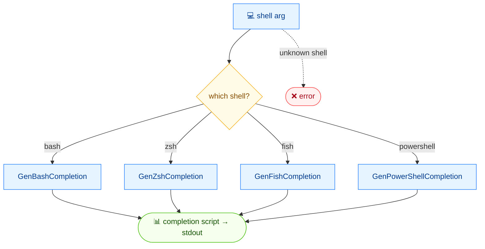

# 🐚 completion

<span class="badge">bash</span>
<span class="badge">zsh</span>
<span class="badge">fish</span>
<span class="badge">powershell</span>

## 简介

`cvss completion` 为 `cvss` 命令生成 shell 自动补全脚本，支持四种 shell —— `bash`、`zsh`、`fish` 与 `powershell` —— 并将脚本打印到 stdout。将其 source（或写入对应的补全目录）即可获得命令、flag 与指标取值的 Tab 补全。

## 工作原理

shell 参数选中对应的生成器，向 stdout 输出一份补全脚本，可供 source 或保存到 shell 的补全目录。



## 用法

```
cvss completion [bash|zsh|fish|powershell] [flags]
```

### Flags

| Flag | 说明 |
| --- | --- |
| `-h, --help` | `completion` 的帮助 |

::: tip 必填 shell 参数
`completion` 恰好接收一个参数，为 `bash`、`zsh`、`fish`、`powershell` 之一。其他值会被拒绝。
:::

## 示例

::: code-group

```bash [生成 bash 脚本（开头部分）]
cvss completion bash
# 输出（前几行 —— 完整脚本约 1400 行）：
# # bash completion for cvss                                 -*- shell-script -*-
#
# __cvss_debug()
# {
#     if [[ -n ${BASH_COMP_DEBUG_FILE:-} ]]; then
#         echo "$*" >> "${BASH_COMP_DEBUG_FILE}"
#     fi
# }
#
# # Homebrew on Macs have version 1.3 of bash-completion which doesn't include
# # _init_completion. This is a very minimal version of that function.
# __cvss_init_completion()
# {
#     COMPREPLY=()
#     _get_comp_words_by_ref "$@" cur prev words cword
# }
# ...
```

```bash [为 bash 安装]
source <(cvss completion bash)
# 或持久化：
cvss completion bash > /etc/bash_completion.d/cvss
```

```bash [为 zsh 安装]
autoload -Uz compinit && compinit
cvss completion zsh > "${fpath[1]}/_cvss"
```

```bash [为 fish 安装]
cvss completion fish > ~/.config/fish/completions/cvss.fish
```

```powershell [为 PowerShell 安装]
cvss completion powershell | Out-String | Invoke-Expression
# 或加入配置文件：
cvss completion powershell >> $PROFILE
```

:::

::: warning 输出是脚本，不是数据
补全脚本体积很大（仅 bash 脚本就有约 1400 行），用于 `source` 或写入文件，而非解析。上方示例仅展示输出的开头部分。
:::

## 底层 API

```go
import "github.com/spf13/cobra"

// rootCmd 是 cvss CLI 的根 *cobra.Command。
switch shell {
case "bash":
    err = rootCmd.GenBashCompletion(os.Stdout)
case "zsh":
    err = rootCmd.GenZshCompletion(os.Stdout)
case "fish":
    err = rootCmd.GenFishCompletion(os.Stdout, true)
case "powershell":
    err = rootCmd.GenPowerShellCompletion(os.Stdout)
}
```

`completion` 委托给 cobra 内置的补全生成器：根 `*cobra.Command` 上的 `GenBashCompletion`、`GenZshCompletion`、`GenFishCompletion`、`GenPowerShellCompletion`。各自将对应 shell 的脚本写入传入的 `io.Writer`。

## 相关命令

- [命令行参考](/zh/cli/) —— 全部命令总览与安装方式
- [下载](/zh/downloads/) —— 内置 `completion` 的预编译二进制
