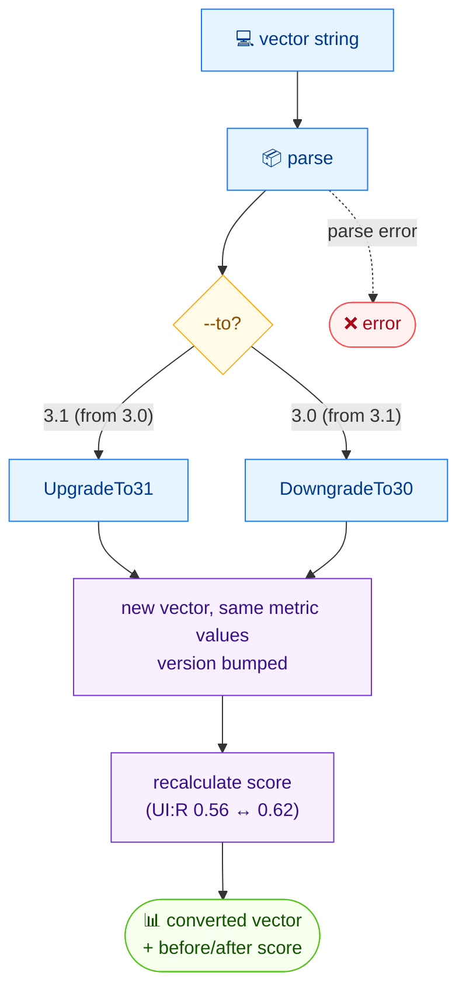

# 🔁 convert

🔁 转换 · 🟢 stable

## 简介

`cvss convert` 在 CVSS v3.0 与 v3.1 之间转换向量。指标取值保持不变，只有版本号改变——但由于 `UI:R` 的常量在两个版本中不同（v3.0 为 0.56，v3.1 为 0.62），转换后的评分可能发生变化。

## 工作原理

只有版本号改变——指标取值原样保留——但由于 `UI:R` 常量在 v3.0（0.56）与 v3.1（0.62）间不同，重算后的评分可能漂移，命令会将其列出供比较。



## 用法

```bash
cvss convert [vector-string] [flags]
```

### Flags

| Flag         | 类型   | 默认值  | 说明                    |
| ------------ | ------ | ------- | ----------------------- |
| `-h, --help` | bool   | `false` | `convert` 的帮助信息    |
| `--to`       | string | `3.1`   | 目标版本：`3.0` 或 `3.1` |

### 支持的转换

| 源    | 目标  | 操作   |
| ----- | ----- | ------ |
| v3.0  | v3.1  | 升级   |
| v3.1  | v3.0  | 降级   |

::: warning 评分可能变化
指标取值原样保留，但版本相关的 `UI:R` 常量（v3.0 为 0.56，v3.1 为 0.62）意味着含 `UI:R` 的向量转换后评分可能不同。命令会同时打印原始与转换后的评分，便于查看差值。
:::

## 示例

::: code-group

```bash [v3.1 → v3.0]
cvss convert --to 3.0 "CVSS:3.1/AV:N/AC:L/PR:N/UI:N/S:C/C:H/I:H/A:H"
```

```text [输出]
Original:  CVSS:3.1/AV:N/AC:L/PR:N/UI:N/S:C/C:H/I:H/A:H (10.0)
Converted: CVSS:3.0/AV:N/AC:L/PR:N/UI:N/S:C/C:H/I:H/A:H (10.0)
```

:::

## 底层 API

用 [`parser.ParseString`](/zh/sdk/parser) 解析向量，随后分发到 [`cv.UpgradeTo31()`](/zh/sdk/cvss) 或 [`cv.DowngradeTo30()`](/zh/sdk/cvss)——二者都委托给 [`cv.ConvertToVersion(3, 0|1)`](/zh/sdk/cvss)。前后显示的评分来自各自向量上的 [`cvss.Calculator`](/zh/sdk/calculator)。

```go
import (
    "fmt"

    "github.com/scagogogo/cvss-skills/pkg/cvss"
    "github.com/scagogogo/cvss-skills/pkg/parser"
)

cv, err := parser.ParseString("CVSS:3.1/AV:N/AC:L/PR:N/UI:N/S:C/C:H/I:H/A:H")
if err != nil {
    log.Fatal(err)
}

// 降级到 v3.0（反向可用 cv.UpgradeTo31()）
converted, err := cv.DowngradeTo30()
if err != nil {
    log.Fatal(err)
}

fmt.Printf("Original:  %s\n", cv.String())
fmt.Printf("Converted: %s\n", converted.String())
```

## 相关

- [parse](/zh/cli/commands/parse) — 校验转换后的向量
- [score](/zh/cli/commands/score) — 独立重新计算评分
- [v3.0 与 v3.1 差异](/zh/concepts/version-diff) — 版本差异概念页
- [Conversion](/zh/sdk/cvss) — Go SDK 参考
