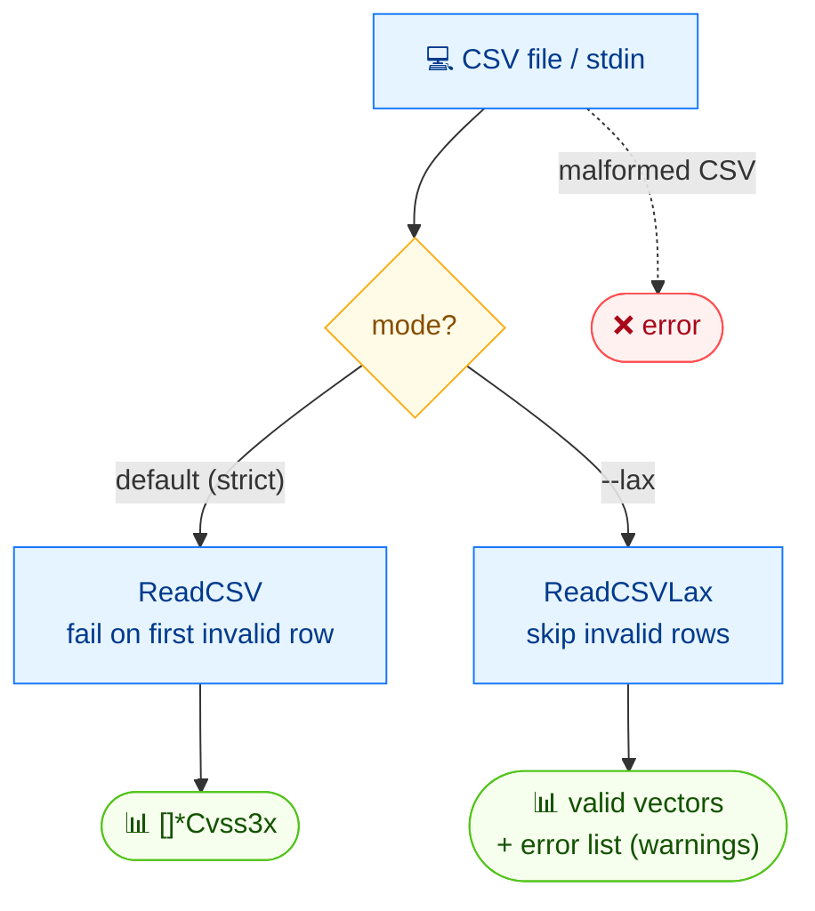

# 📖 csv read

<span class="badge">CVSS v3.0</span>
<span class="badge">CVSS v3.1</span>
<span class="badge badge-info">文本输出</span>

## 简介

`cvss csv read` 从 CSV 文件（或 stdin）读取 CVSS 向量，逐行打印解析后的向量字符串。CSV 格式把向量字符串放在第一列。默认模式下遇到第一行非法数据即失败；加 `--lax` 则跳过非法行并作为警告上报。

`csv` 是 CSV 读写父命令；`read` 是其读取子命令（兄弟命令为 `csv write`）。

## 工作原理

逐行读取 CSV；严格模式在遇到首个非法行时报错，`--lax` 则跳过坏行并作为警告报告，返回合法向量与错误列表。



## 用法

```
cvss csv read [文件] [flags]
```

### Flags

| Flag | 默认值 | 说明 |
| --- | --- | --- |
| `--lax` | `false` | 容错模式：跳过非法行而非失败 |
| `-h, --help` | — | `read` 的帮助 |

## 示例

::: code-group

```bash [读取 CSV 文件]
cvss csv read input.csv
```

```bash [从 stdin]
cat vectors.csv | cvss csv read -
```

```bash [容错模式]
cvss csv read --lax messy.csv
```

:::

::: tip 默认模式 vs `--lax`
严格模式（默认）下，第一行格式错误即中止读取并报错。`--lax` 模式下，错误行被跳过并以 `Warning: ...` 输出到 stderr；所有合法行仍会被解析并打印。
:::

## 底层 API

```go
import "github.com/scagogogo/cvss-skills/pkg/cvss"

// 严格模式 —— 遇第一行非法即失败。
vectors, err := cvss.ReadCSV(os.Stdin) // ([]*Cvss3x, error)
if err != nil {
    log.Fatal(err)
}
for _, cv := range vectors {
    fmt.Println(cv.String())
}

// 容错模式 —— 跳过非法行，收集警告。
vectors, readErrors, err := cvss.ReadCSVLax(os.Stdin) // ([]*Cvss3x, []CSVReadError, error)
if err != nil {
    log.Fatal(err)
}
for _, cv := range vectors {
    fmt.Println(cv.String())
}
for _, e := range readErrors {
    fmt.Fprintln(os.Stderr, "Warning:", e.String())
}
```

`cvss.ReadCSV(r io.Reader) ([]*Cvss3x, error)` 是严格读取器。`cvss.ReadCSVLax(r io.Reader) ([]*Cvss3x, []CSVReadError, error)` 是容错读取器 —— 它返回已解析向量以及描述每个跳过行的 `[]CSVReadError`，仅当出现 I/O 或 CSV 结构性错误时才返回非 nil 的 `error`。

## 相关命令

- [`csv write`](/zh/cli/commands/csv-write) —— 将向量写入 CSV
- [`validate`](/zh/cli/commands/validate) —— 校验单条向量字符串
- [`batch validate`](/zh/cli/commands/batch-validate) —— 从文本文件批量校验向量
