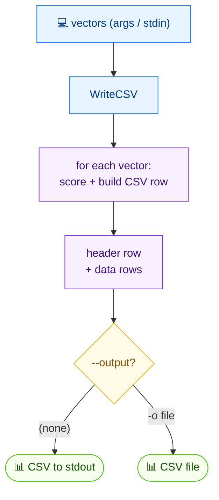

# 📝 csv write

<span class="badge">CVSS v3.0</span>
<span class="badge">CVSS v3.1</span>
<span class="badge badge-info">文本（CSV）</span>

## 简介

`cvss csv write` 将 CVSS 向量连同其计算出的评分写入 CSV 文件。向量来自位置参数或 stdin（每行一个）。CSV 格式把向量字符串放在第一列，其后为评分列。不带 `-o` 时输出到 stdout。

`csv` 是 CSV 读写父命令；`write` 是其写入子命令（兄弟命令为 `csv read`）。

## 工作原理

来自参数或 stdin 的向量被评分并写成 CSV 行——向量字符串在第一列，其后是各评分列——输出到文件或 stdout。



## 用法

```
cvss csv write [向量字符串...] [flags]
```

### Flags

| Flag | 默认值 | 说明 |
| --- | --- | --- |
| `-o, --output string` | `""`（stdout） | 输出文件（默认：stdout） |
| `-h, --help` | — | `write` 的帮助 |

## 示例

::: code-group

```bash [多个向量写入文件]
cvss csv write -o output.csv "CVSS:3.1/AV:N/AC:L/PR:N/UI:N/S:U/C:H/I:H/A:H" "CVSS:3.1/AV:L/AC:H/PR:H/UI:R/S:C/C:L/I:L/A:N"
```

```bash [单个向量经 stdin 传入]
echo "CVSS:3.1/AV:N/AC:L/PR:N/UI:N/S:U/C:H/I:H/A:H" | cvss csv write -
```

```bash [输出到 stdout（不带 -o）]
cvss csv write "CVSS:3.1/AV:N/AC:L/PR:N/UI:N/S:U/C:H/I:H/A:H"
```

:::

::: tip 三种输入方式
`csv write` 接受向量来源为：（1）位置参数；（2）显式 `-` 参数表示读 stdin；（3）不传参 —— 此时若 stdin 不是终端则自动读取 stdin。
:::

::: warning 非法向量被跳过
解析失败的行以 `Skipping invalid vector: <行> (<错误>)` 输出到 stderr 并从 CSV 中排除。若没有合法向量剩余，命令以非零码退出并提示 `No valid vectors to write`。
:::

## 底层 API

```go
import (
    "github.com/scagogogo/cvss-skills/pkg/cvss"
    "github.com/scagogogo/cvss-skills/pkg/parser"
)

var vectors []*cvss.Cvss3x
for _, s := range []string{
    "CVSS:3.1/AV:N/AC:L/PR:N/UI:N/S:U/C:H/I:H/A:H",
    "CVSS:3.1/AV:L/AC:H/PR:H/UI:R/S:C/C:L/I:L/A:N",
} {
    cv, err := parser.ParseString(s)
    if err != nil {
        continue
    }
    vectors = append(vectors, cv)
}

// 写入任意 io.Writer（os.Stdout 或 *os.File）。
if err := cvss.WriteCSV(os.Stdout, vectors); err != nil {
    log.Fatal(err)
}
```

`cvss.WriteCSV(w io.Writer, vectors []*Cvss3x) error` 将向量序列化为 CSV，评分由内部计算器计算。第一列为向量字符串，其后为评分列。

## 相关命令

- [`csv read`](/zh/cli/commands/csv-read) —— 从 CSV 读回向量
- [`sort`](/zh/cli/commands/sort) —— 按评分排序向量
- [`score`](/zh/cli/commands/score) —— 为单个向量评分
