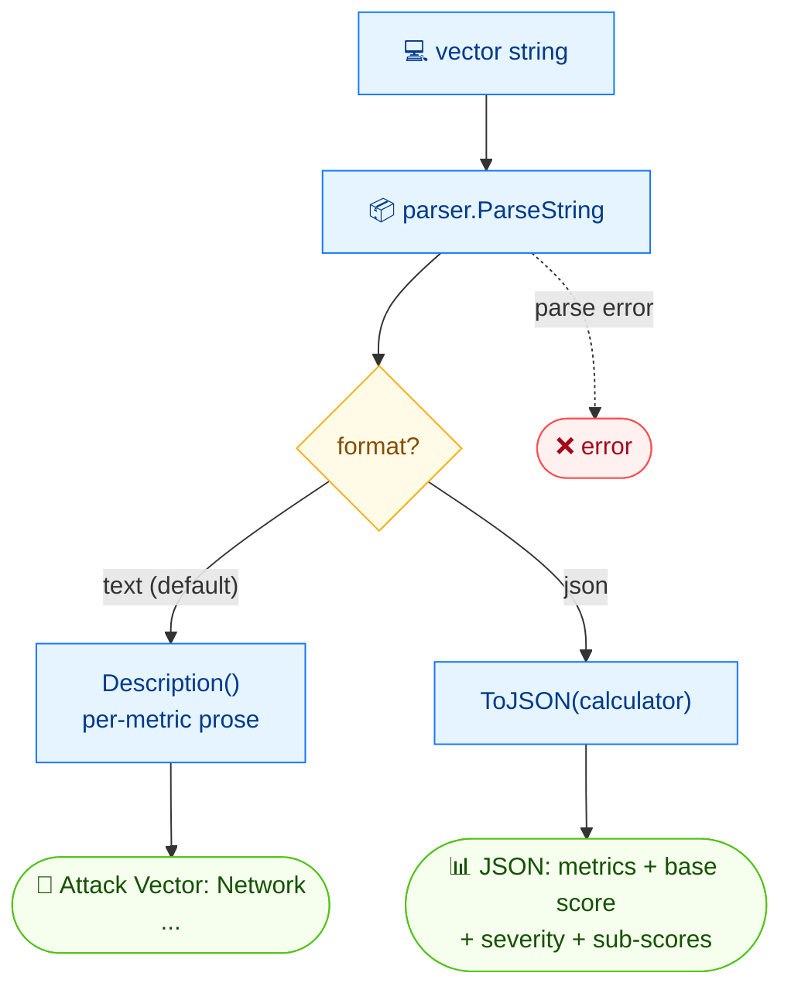

# 📝 describe

📝 描述 · 🟢 stable

## 简介

`cvss describe` 把 CVSS 向量字符串转为每个指标及其取值的纯文本列表（例如 "Attack Vector: Network"）。使用 `--format json` 可返回完整的结构化文档——包含基础评分、严重性以及可利用性/影响子评分。

## 工作原理

向量被解析一次；随后命令要么把各指标走成人读文本，要么用 `--format json` 输出包含评分与子评分的完整结构化文档。



## 用法

```bash
cvss describe [vector-string] [flags]
```

### Flags

| Flag         | 类型   | 默认值  | 说明                |
| ------------ | ------ | ------- | ------------------- |
| `--format`   | string | `text`  | 输出格式：`text` 或 `json` |
| `-h, --help` | bool   | `false` | `describe` 的帮助信息 |

## 示例

::: code-group

```bash [文本]
cvss describe "CVSS:3.1/AV:N/AC:L/PR:N/UI:N/S:C/C:H/I:H/A:H"
```

```text [输出]
Attack Vector: Network, Attack Complexity: Low, Privileges Required: None, User Interaction: None, Scope: Changed, Confidentiality: High, Integrity: High, Availability: High
```

:::

::: code-group

```bash [JSON]
cvss describe --format json "CVSS:3.1/AV:N/AC:L/PR:N/UI:N/S:C/C:H/I:H/A:H"
```

```json [输出]
{
  "version": "3.1",
  "vectorString": "CVSS:3.1/AV:N/AC:L/PR:N/UI:N/S:C/C:H/I:H/A:H",
  "baseScore": 10,
  "baseSeverity": "Critical",
  "metrics": {
    "base": {
      "attackVector": "Network",
      "attackComplexity": "Low",
      "privilegesRequired": "None",
      "userInteraction": "None",
      "scope": "Changed",
      "confidentiality": "High",
      "integrity": "High",
      "availability": "High",
      "exploitabilityScore": 3.8870427750000003,
      "impactScore": 6.128026328809978
    }
  }
}
```

:::

## 底层 API

用 [`parser.ParseString`](/zh/sdk/parser) 解析向量。文本模式打印 `cv.Description()`；JSON 模式序列化 [`cv.ToJSON(calc)`](/zh/sdk/json)，其中嵌入了由 [`cvss.Calculator`](/zh/sdk/calculator) 计算的评分与子评分。

```go
import (
    "fmt"

    "github.com/scagogogo/cvss-skills/pkg/cvss"
    "github.com/scagogogo/cvss-skills/pkg/parser"
)

cv, err := parser.ParseString("CVSS:3.1/AV:N/AC:L/PR:N/UI:N/S:C/C:H/I:H/A:H")
if err != nil {
    log.Fatal(err)
}

// 纯文本描述
fmt.Println(cv.Description())

// 结构化 JSON 文档（含评分与子评分）
calc := cvss.NewCalculator(cv)
out, _ := cv.ToJSON(calc)
fmt.Println(string(out))
```

## 相关

- [parse](/zh/cli/commands/parse) — 查看版本 / 完整性 / 原始向量
- [groups](/zh/cli/commands/groups) — 按基础 / 时间 / 环境分组展示指标
- [json](/zh/cli/commands/json) — 等价的结构化 JSON 输出
- [JSON 序列化](/zh/sdk/json) — Go SDK 参考
