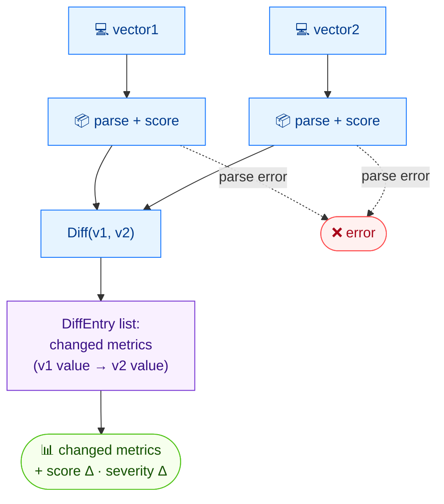

# 🔀 diff

<span class="badge">CVSS v3.0</span>
<span class="badge">CVSS v3.1</span>
<span class="badge badge-info">文本 + JSON</span>

## 简介

`cvss diff` 比较两个 CVSS 向量，报告哪些指标不同，并展示评分与严重性因此发生的变化。在梳理“这两份评估之间到底改了什么”时，就用这个命令。

## 工作原理

两个向量都被解析并评分，随后逐指标 diff 列出每个变化字段以及评分与严重性差值。



## 用法

```
cvss diff [向量1] [向量2] [flags]
```

### Flags

| Flag | 默认值 | 说明 |
| --- | --- | --- |
| `--format string` | `text` | 输出格式：`text` 或 `json` |
| `-h, --help` | — | `diff` 的帮助 |

## 示例

::: code-group

```bash [Scope 改变，其余指标相同]
cvss diff "CVSS:3.1/AV:N/AC:L/PR:N/UI:N/S:U/C:H/I:H/A:H" "CVSS:3.1/AV:N/AC:L/PR:N/UI:N/S:C/C:H/I:H/A:H"
# 输出：
# Found 1 difference(s):
#
#   S: U (Unchanged) → C (Changed)
#
# Score: 9.8 (Critical) → 10.0 (Critical)  [Δ=0.2]
```

:::

::: tip 完全相同的向量
当两个向量完全相同时，`diff` 打印 `Vectors are identical` 并以 `0` 退出。
:::

## 底层 API

```go
import (
    "github.com/scagogogo/cvss-skills/pkg/cvss"
    "github.com/scagogogo/cvss-skills/pkg/parser"
)

cv1, _ := parser.ParseString("CVSS:3.1/AV:N/AC:L/PR:N/UI:N/S:U/C:H/I:H/A:H")
cv2, _ := parser.ParseString("CVSS:3.1/AV:N/AC:L/PR:N/UI:N/S:C/C:H/I:H/A:H")

diffs := cv1.Diff(cv2) // []DiffEntry（Metric, V1, V1Long, V2, V2Long）

calc1 := cvss.NewCalculator(cv1)
calc2 := cvss.NewCalculator(cv2)
s1, _ := calc1.Calculate()
s2, _ := calc2.Calculate()

fmt.Printf("Score: %.1f → %.1f  [Δ=%.1f]\n", s1, s2, s2-s1)
```

`Diff(other *Cvss3x) []DiffEntry` 对每个取值不同的指标返回一条记录。每条 `DiffEntry` 含 `Metric`、`V1`/`V2`（短值）与 `V1Long`/`V2Long`（长名）。评分由各自独立的 `cvss.NewCalculator` 计算。

## 相关命令

- [`equal`](/zh/cli/commands/equal) —— 带退出码的布尔相等判断
- [`distance`](/zh/cli/commands/distance) —— 两个向量之间的数值距离度量
- [`score`](/zh/cli/commands/score) —— 为单个向量评分
