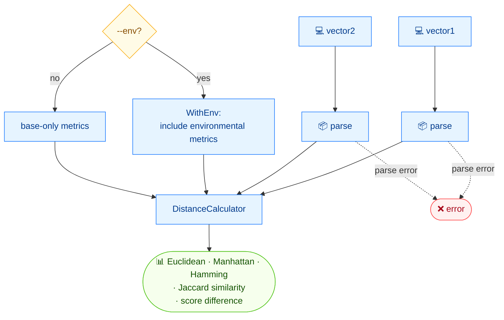

# 📏 distance

<span class="badge">CVSS v3.0</span>
<span class="badge">CVSS v3.1</span>
<span class="badge badge-info">文本 + JSON</span>

## 简介

`cvss distance` 计算两个 CVSS 向量之间的五种距离/相似度度量：欧氏距离、曼哈顿距离、汉明距离、Jaccard 相似度、以及评分绝对差。加 `--env` 可在前四个结构性度量中纳入环境（含修改）指标。

## 工作原理

两个向量由距离计算器比较，产出五项指标；`--env` 把四项结构指标（欧氏、曼哈顿、汉明、Jaccard）扩展到包含环境/修改后指标。



## 用法

```
cvss distance [向量1] [向量2] [flags]
```

### Flags

| Flag | 默认值 | 说明 |
| --- | --- | --- |
| `--env` | `false` | 距离计算时纳入环境指标 |
| `--format string` | `text` | 输出格式：`text` 或 `json` |
| `-h, --help` | — | `distance` 的帮助 |

### 可用距离度量

- **欧氏距离（Euclidean）** —— 数值评分差异
- **曼哈顿距离（Manhattan）** —— 评分绝对差之和
- **汉明距离（Hamming）** —— 不同指标个数
- **Jaccard 相似度** —— 相同指标占比
- **评分差（Score difference）** —— 评分绝对差

## 示例

::: code-group

```bash [仅基础指标]
cvss distance "CVSS:3.1/AV:N/AC:L/PR:N/UI:N/S:U/C:H/I:H/A:H" "CVSS:3.1/AV:N/AC:L/PR:N/UI:N/S:C/C:H/I:H/A:H"
# 输出：
# Euclidean:  1.0000
# Manhattan:  1.0000
# Hamming:    1
# Jaccard:    0.8750
# Score diff: 0.2
```

```bash [纳入环境指标]
cvss distance --env "CVSS:3.1/AV:N/AC:L/PR:N/UI:N/S:U/C:H/I:H/A:H/CR:H/IR:M/AR:L/MAV:L/MC:N" "CVSS:3.1/AV:N/AC:L/PR:N/UI:N/S:U/C:H/I:H/A:H"
# 输出：
# Euclidean (with env):  0.0000
# Manhattan (with env):  0.0000
# Hamming (with env):    0
# Jaccard (with env):    1.0000
# Score diff: 2.8
```

:::

::: tip `Score diff` 始终基于基础评分
`Score diff` 反映两个向量评分的绝对差，**不受** `--env` 影响。其余四个度量在设置 `--env` 时切换为 `*WithEnv` 版本，同时比较修改/环境指标。
:::

## 底层 API

```go
import (
    "github.com/scagogogo/cvss-skills/pkg/cvss"
    "github.com/scagogogo/cvss-skills/pkg/parser"
)

cv1, _ := parser.ParseString("CVSS:3.1/AV:N/AC:L/PR:N/UI:N/S:U/C:H/I:H/A:H")
cv2, _ := parser.ParseString("CVSS:3.1/AV:N/AC:L/PR:N/UI:N/S:C/C:H/I:H/A:H")

dc := cvss.NewDistanceCalculator(cv1, cv2)
fmt.Printf("Euclidean:  %.4f\n", dc.EuclideanDistance())
fmt.Printf("Manhattan:  %.4f\n", dc.ManhattanDistance())
fmt.Printf("Hamming:    %d\n", dc.HammingDistance())
fmt.Printf("Jaccard:    %.4f\n", dc.JaccardSimilarity())
fmt.Printf("Score diff: %.1f\n", dc.ScoreDifference())

// --env 时使用 *WithEnv 变体：
// dc.EuclideanDistanceWithEnv(), dc.ManhattanDistanceWithEnv(),
// dc.HammingDistanceWithEnv(), dc.JaccardSimilarityWithEnv()
```

`NewDistanceCalculator(vector1, vector2 *Cvss3x) *DistanceCalculator` 构造计算器；每个度量都是其上的方法。`*WithEnv` 系列在结构性比较中纳入修改与环境指标。

## 相关命令

- [`diff`](/zh/cli/commands/diff) —— 哪些具体指标不同
- [`equal`](/zh/cli/commands/equal) —— 带退出码的布尔相等判断
- [`score`](/zh/cli/commands/score) —— 为单个向量评分
