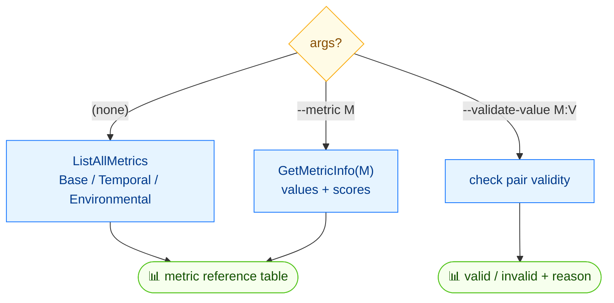

# 📋 enumerate

<span class="badge">CVSS v3.0</span>
<span class="badge">CVSS v3.1</span>
<span class="badge badge-info">文本 + JSON</span>

## 简介

`cvss enumerate` 是一个参考命令：它列出所有 CVSS v3.x 指标、其合法取值与每个取值的分数，按 Base / Temporal / Environmental 分组。用 `--metric` 聚焦单个指标，或用 `--validate-value` 校验某个 `指标:取值` 是否合法。

## 工作原理

不带参数时列出所有 CVSS v3.x 指标及其合法取值与各取值评分；`--metric` 聚焦单个指标，`--validate-value` 校验单个 `METRIC:VALUE` 对。



## 用法

```
cvss enumerate [flags]
```

### Flags

| Flag | 默认值 | 说明 |
| --- | --- | --- |
| `--format string` | `text` | 输出格式：`text` 或 `json` |
| `--metric string` | `""` | 仅显示某指标详情（如 `AV`） |
| `--validate-value string` | `""` | 校验 `指标:取值`（如 `AV:N`） |
| `-h, --help` | — | `enumerate` 的帮助 |

## 示例

::: code-group

```bash [单个指标的取值与分数]
cvss enumerate --metric AV
# 输出：
# AV (Attack Vector) [Base]:
#   N = Network (score: 0.85)
#   A = Adjacent (score: 0.62)
#   L = Local (score: 0.55)
#   P = Physical (score: 0.20)
```

```bash [所有指标]
cvss enumerate
```

```bash [校验取值]
cvss enumerate --validate-value AV:N
```

```bash [JSON]
cvss enumerate --format json
```

:::

::: tip `--validate-value` 的退出码
`--validate-value` 在取值合法时退出 `0`，非法时退出 `1`（打印 `Invalid: X is not a valid value for METRIC`）。因此可在脚本中用作守卫。
:::

## 底层 API

```go
import "github.com/scagogogo/cvss-skills/pkg/cvss"

// 列出所有指标，按 Base/Temporal/Environmental 分组。
metrics := cvss.ListAllMetrics() // []MetricInfo
for _, m := range metrics {
    fmt.Print(m.String())
}

// 聚焦单个指标。
info, err := cvss.GetMetricInfo("AV") // (MetricInfo, error)
if err != nil {
    log.Fatal(err)
}
fmt.Print(info.String())

// 校验单个取值（rune）。
valid := cvss.IsValidMetricValue("AV", 'N') // bool
```

三块基石是 `ListAllMetrics() []MetricInfo`、`GetMetricInfo(shortName string) (MetricInfo, error)` 与 `IsValidMetricValue(shortName string, value rune) bool`。

## 相关命令

- [`validate`](/zh/cli/commands/validate) —— 校验整条向量字符串
- [`get`](/zh/cli/commands/get) —— 从向量中读取单个指标值
- [`build`](/zh/cli/commands/build) —— 用指标 flag 组装向量
