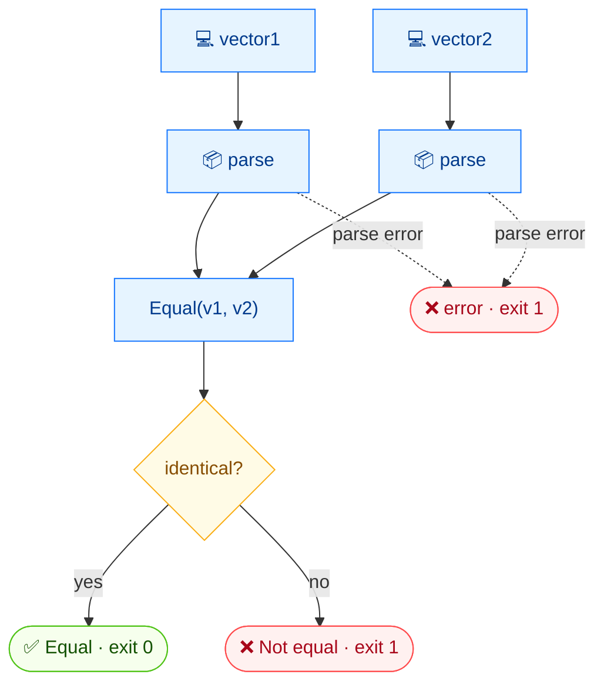

# ⚖️ equal

<span class="badge">CVSS v3.0</span>
<span class="badge">CVSS v3.1</span>
<span class="badge badge-info">文本 + JSON</span>

## 简介

`cvss equal` 对两个 CVSS 向量做深度相等判断。它打印 `Equal` 或 `Not equal`，并用退出码表示结果：相同为 `0`，不同或出错为 `1`。因此非常适合用于 shell 的 `if` 守卫与 CI 门控。

## 工作原理

两个向量都被解析并按深度相等比较；命令打印 `Equal`/`Not equal`，并用退出码编码结果（0 相等，1 不等或出错）。



## 用法

```
cvss equal [向量1] [向量2] [flags]
```

### Flags

| Flag | 默认值 | 说明 |
| --- | --- | --- |
| `--format string` | `text` | 输出格式：`text` 或 `json` |
| `-h, --help` | — | `equal` 的帮助 |

## 示例

::: code-group

```bash [不同向量 —— 非零退出]
cvss equal "CVSS:3.1/AV:N/AC:L/PR:N/UI:N/S:U/C:H/I:H/A:H" "CVSS:3.1/AV:N/AC:L/PR:N/UI:N/S:C/C:H/I:H/A:H"
# 输出：
# Not equal
# （stderr: not equal，exit=1）
```

```bash [相同向量 —— 零退出]
cvss equal "CVSS:3.1/AV:N/AC:L/PR:N/UI:N/S:U/C:H/I:H/A:H" "CVSS:3.1/AV:N/AC:L/PR:N/UI:N/S:U/C:H/I:H/A:H"
# 输出：
# Equal
```

:::

::: warning 退出码即契约
文本模式下，`Not equal` 打印到 stdout **同时** `not equal` 打印到 stderr，随后进程以 `1` 退出。脚本应依据退出码判断，而非 stdout 文本。JSON 模式下，结果为 `{"equal": false, ...}`，不等时退出 `1`。
:::

## 底层 API

```go
import "github.com/scagogogo/cvss-skills/pkg/parser"

cv1, _ := parser.ParseString("CVSS:3.1/AV:N/AC:L/PR:N/UI:N/S:U/C:H/I:H/A:H")
cv2, _ := parser.ParseString("CVSS:3.1/AV:N/AC:L/PR:N/UI:N/S:C/C:H/I:H/A:H")

eq := cv1.Equal(cv2) // bool
if eq {
    fmt.Println("Equal")
} else {
    fmt.Println("Not equal")
    os.Exit(1)
}
```

`Equal(other *Cvss3x) bool` 对两个向量的指标取值做深度比较。

## 相关命令

- [`diff`](/zh/cli/commands/diff) —— 展示*具体哪里*不同，而非仅判断是否不同
- [`distance`](/zh/cli/commands/distance) —— 两个向量相差程度的数值度量
- [`validate`](/zh/cli/commands/validate) —— 校验单个向量的合法性
