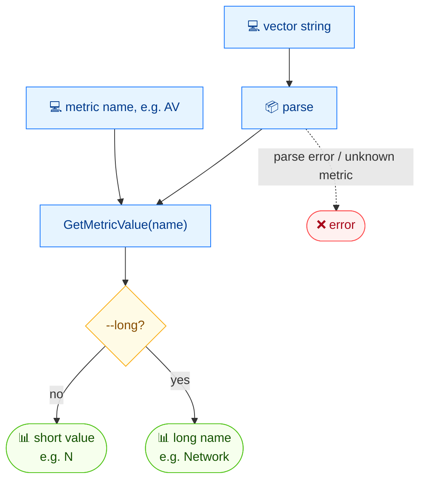

# 🔎 get

<span class="badge">CVSS v3.0</span>
<span class="badge">CVSS v3.1</span>
<span class="badge badge-info">文本输出</span>

## 简介

`cvss get` 从 CVSS 向量字符串中提取单个指标的值。默认输出短值字符（如 `N`）；加 `--long` 则输出人类可读的长名（如 `Network`）。这是在脚本中查看向量某个字段最轻量的方式。

## 工作原理

向量被解析后查找指定指标；默认打印短取值字符，加 `--long` 打印长人读名。



## 用法

```
cvss get [向量字符串] [指标名] [flags]
```

### Flags

| Flag | 默认值 | 说明 |
| --- | --- | --- |
| `--long` | `false` | 输出长名而非短值 |
| `-h, --help` | — | `get` 的帮助 |

::: tip 位置参数
第一个位置参数是向量字符串，第二个是指标短名（如 `AV`、`PR`、`S`）。两者都必填 —— `get` 恰好接收两个参数。
:::

## 示例

::: code-group

```bash [短值]
cvss get "CVSS:3.1/AV:N/AC:L/PR:N/UI:N/S:C/C:H/I:H/A:H" AV
# 输出：
# N
```

```bash [长名]
cvss get --long "CVSS:3.1/AV:N/AC:L/PR:N/UI:N/S:C/C:H/I:H/A:H" AV
# 输出：
# Network
```

:::

::: warning `get` 没有 `--format json`
与多数命令不同，`get` 只输出单个词（`N` 或 `Network`），不接受 `--format json`。需要结构化输出请用 [`cvss map`](/zh/cli/commands/map) 或 [`cvss json`](/zh/cli/commands/json)。
:::

## 底层 API

```go
import "github.com/scagogogo/cvss-skills/pkg/parser"

cv, err := parser.ParseString("CVSS:3.1/AV:N/AC:L/PR:N/UI:N/S:C/C:H/I:H/A:H")
if err != nil {
    log.Fatal(err)
}

// shortVal 是 rune；longVal 是人类可读名。
shortVal, longVal, err := cv.GetMetricValue("AV")
if err != nil {
    log.Fatal(err)
}
fmt.Println(string(shortVal)) // N
fmt.Println(longVal)          // Network
```

`GetMetricValue(shortName string) (rune, string, error)` 定义在 `*cvss.Cvss3x` 上。

## 相关命令

- [`map`](/zh/cli/commands/map) —— 将整个向量输出为 `key=value` 键值对
- [`groups`](/zh/cli/commands/groups) —— 按 Base / Temporal / Environmental 分组查看指标
- [`enumerate`](/zh/cli/commands/enumerate) —— 列出某指标的合法取值与分数
