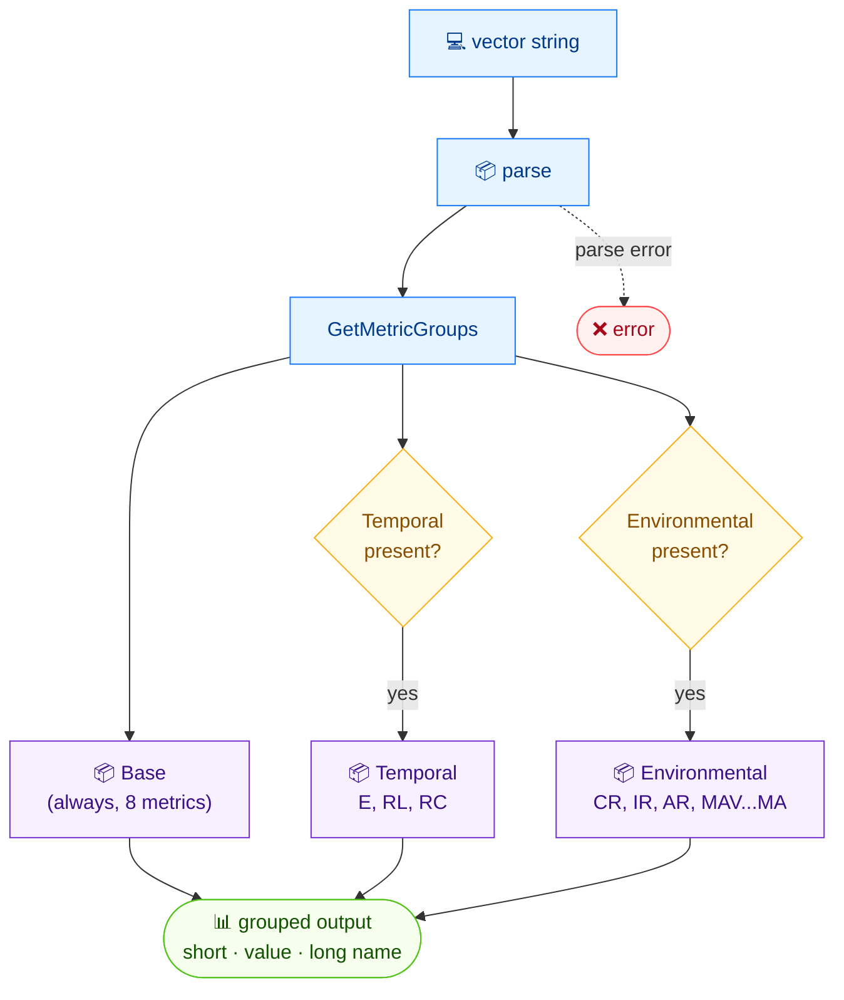

# 🗂️ groups

<span class="badge">CVSS v3.0</span>
<span class="badge">CVSS v3.1</span>
<span class="badge badge-info">文本 + JSON</span>

## 简介

`cvss groups` 将向量的所有指标按 CVSS 分组展示 —— **Base**、**Temporal**、**Environmental**（后两者仅当向量中存在时才显示）。每个指标行显示短名、当前值与长名，便于一眼扫清整个向量。

## 工作原理

解析后的向量指标按 CVSS 分组归桶——基础组总是出现，时间与环境组仅在其存在时出现——每组展示短名、取值与长名。



## 用法

```
cvss groups [向量字符串] [flags]
```

### Flags

| Flag | 默认值 | 说明 |
| --- | --- | --- |
| `--format string` | `text` | 输出格式：`text` 或 `json` |
| `-h, --help` | — | `groups` 的帮助 |

## 示例

::: code-group

```bash [文本 —— 含时间指标]
cvss groups "CVSS:3.1/AV:N/AC:L/PR:N/UI:N/S:U/C:H/I:H/A:H/E:U/RL:O/RC:C"
# 输出：

# [Base]
#   AV:N  Attack Vector = Network
#   AC:L  Attack Complexity = Low
#   PR:N  Privileges Required = None
#   UI:N  User Interaction = None
#   S:U  Scope = Unchanged
#   C:H  Confidentiality = High
#   I:H  Integrity = High
#   A:H  Availability = High

# [Temporal]
#   E:U  Exploit Code Maturity = Unproven
#   RL:O  Remediation Level = Official Fix
#   RC:C  Report Confidence = Confirmed
```

```bash [JSON]
cvss groups --format json "CVSS:3.1/AV:N/AC:L/PR:N/UI:N/S:U/C:H/I:H/A:H/E:F/RL:T/RC:C"
```

:::

::: tip 分组仅当存在时才显示
仅含基础指标的向量只打印 `[Base]` 段。`[Temporal]` 与 `[Environmental]` 段仅当向量携带相应指标时才出现。
:::

## 底层 API

```go
import "github.com/scagogogo/cvss-skills/pkg/parser"

cv, err := parser.ParseString("CVSS:3.1/AV:N/AC:L/PR:N/UI:N/S:U/C:H/I:H/A:H/E:U/RL:O/RC:C")
if err != nil {
    log.Fatal(err)
}

groups := cv.GetMetricGroups() // []MetricGroup{Name, Metrics}
for _, g := range groups {
    fmt.Printf("\n[%s]\n", g.Name)
    for _, m := range g.Metrics { // m 为 MetricValuePair
        fmt.Printf("  %s:%s  %s = %s\n", m.ShortName, m.Value, m.LongName, m.LongValue)
    }
}
```

`GetMetricGroups() []MetricGroup` 返回的分组，其 `Metrics` 字段为 `[]MetricValuePair`，含 `ShortName`、`LongName`、`Value`（短值）、`LongValue`。

## 相关命令

- [`get`](/zh/cli/commands/get) —— 读取单个指标值
- [`map`](/zh/cli/commands/map) —— 所有指标的扁平 `key=value` 视图
- [`parse`](/zh/cli/commands/parse) —— 向量的完整结构化分解
