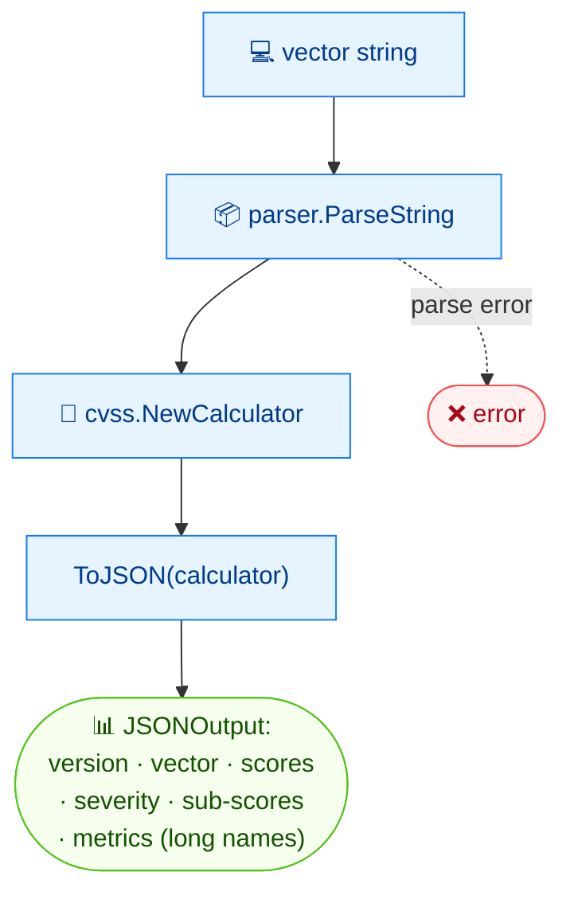

# 🧾 json

<span class="badge">CVSS v3.0</span>
<span class="badge">CVSS v3.1</span>
<span class="badge badge-info">JSON 输出</span>

## 简介

`cvss json` 将 CVSS 向量字符串序列化为结构化 JSON 文档。输出包含版本、向量字符串、基础评分、严重性等级、以及带长名的指标详情，并附带可利用性与影响子分数。它是向量的规范机器可读表示。

## 工作原理

解析后的向量加一个计算器被送入 `ToJSON`，产出一份文档，含版本、向量字符串、评分、严重性、子评分以及各指标详情（带长名）。



## 用法

```
cvss json [向量字符串] [flags]
```

### Flags

| Flag | 说明 |
| --- | --- |
| `-h, --help` | `json` 的帮助 |

::: tip 本身即 JSON
`json` 按定义输出 JSON —— 没有 `--format` flag。输出始终是带缩进的 JSON。
:::

## 示例

::: code-group

```bash [Scope 变更的向量]
cvss json "CVSS:3.1/AV:N/AC:L/PR:N/UI:N/S:C/C:H/I:H/A:H"
# 输出：
# {
#   "version": "3.1",
#   "vectorString": "CVSS:3.1/AV:N/AC:L/PR:N/UI:N/S:C/C:H/I:H/A:H",
#   "baseScore": 10,
#   "baseSeverity": "Critical",
#   "metrics": {
#     "base": {
#       "attackVector": "Network",
#       "attackComplexity": "Low",
#       "privilegesRequired": "None",
#       "userInteraction": "None",
#       "scope": "Changed",
#       "confidentiality": "High",
#       "integrity": "High",
#       "availability": "High",
#       "exploitabilityScore": 3.8870427750000003,
#       "impactScore": 6.128026328809978
#     }
#   }
# }
```

:::

::: warning 输出前先校验
`ToJSON` 会先调用向量的 `Check()`；非法向量会导致命令以非零码退出，stderr 报解析错误，且不产生任何 JSON。
:::

## 底层 API

```go
import (
    "github.com/scagogogo/cvss-skills/pkg/cvss"
    "github.com/scagogogo/cvss-skills/pkg/parser"
)

cv, err := parser.ParseString("CVSS:3.1/AV:N/AC:L/PR:N/UI:N/S:C/C:H/I:H/A:H")
if err != nil {
    log.Fatal(err)
}

calc := cvss.NewCalculator(cv)
data, err := cv.ToJSON(calc) // []byte
if err != nil {
    log.Fatal(err)
}
fmt.Println(string(data))
```

`ToJSON(calculator *Calculator) ([]byte, error)` 序列化向量。若 `calculator` 为 `nil` 则默认 `NewCalculator(x)`。计算器提供 JSON 中嵌入的评分。

## 相关命令

- [`describe`](/zh/cli/commands/describe) —— 同样的数据，单行人类可读字符串
- [`score`](/zh/cli/commands/score) —— 仅输出数值评分与严重性
- [`map`](/zh/cli/commands/map) —— 面向 shell 脚本的扁平 `key=value` 形式
