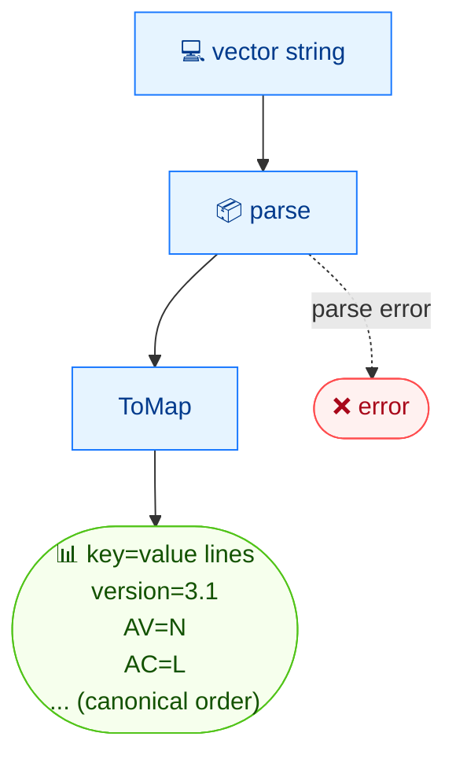

# 🗺️ map

<span class="badge">CVSS v3.0</span>
<span class="badge">CVSS v3.1</span>
<span class="badge badge-info">文本输出</span>

## 简介

`cvss map` 将 CVSS 向量输出为 `key=value` 键值对，每行一个，按规范的指标顺序排列。它专为 shell 脚本设计 —— 每行都易于 `grep`、`awk` 或 `source` 进 shell 关联数组。`version` 键总是最先输出。

## 工作原理

向量按规范指标顺序序列化为 `key=value` 行，`version` 键最先输出——便于 grep、awk 或 source。



## 用法

```
cvss map [向量字符串] [flags]
```

### Flags

| Flag | 说明 |
| --- | --- |
| `-h, --help` | `map` 的帮助 |

## 示例

::: code-group

```bash [Scope 变更的向量]
cvss map "CVSS:3.1/AV:N/AC:L/PR:N/UI:N/S:C/C:H/I:H/A:H"
# 输出：
# version=3.1
# AV=N
# AC=L
# PR=N
# UI=N
# S=C
# C=H
# I=H
# A=H
```

:::

::: tip 规范顺序
键值对始终按 CVSS 规范顺序输出：先是 `version`，然后基础指标（`AV AC PR UI S C I A`），再时间指标（`E RL RC`），最后环境需求与修改指标 —— 但仅打印向量中实际存在的指标。
:::

::: warning 没有 `--format` flag
`map` 没有 `--format json` —— `key=value` 输出本身就是它的脚本化契约。需要 JSON 请用 [`cvss json`](/zh/cli/commands/json)。
:::

## 底层 API

```go
import "github.com/scagogogo/cvss-skills/pkg/parser"

cv, err := parser.ParseString("CVSS:3.1/AV:N/AC:L/PR:N/UI:N/S:C/C:H/I:H/A:H")
if err != nil {
    log.Fatal(err)
}

m := cv.ToMap() // map[string]string

// CLI 按固定的规范键顺序遍历，仅打印存在的键。
order := []string{"version", "AV", "AC", "PR", "UI", "S", "C", "I", "A",
    "E", "RL", "RC", "CR", "IR", "AR", "MAV", "MAC", "MPR", "MUI", "MS", "MC", "MI", "MA"}
for _, key := range order {
    if val, ok := m[key]; ok {
        fmt.Printf("%s=%s\n", key, val)
    }
}
```

`ToMap() map[string]string` 返回所有存在指标，以短名为键，另含 `version`。

## 相关命令

- [`get`](/zh/cli/commands/get) —— 读取单个指标值
- [`groups`](/zh/cli/commands/groups) —— 同样数据的分组视图
- [`json`](/zh/cli/commands/json) —— 结构化 JSON 序列化
