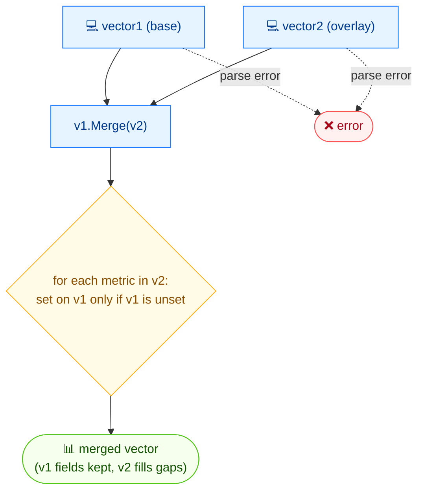

# 🔗 merge

🔗 合并 · 🟢 stable

## 简介

`cvss merge` 合并两个 CVSS 向量：第二个向量中的字段用于填补第一个向量缺失的指标，而第一个向量中已设置的指标绝不会被覆盖。这在把时间/环境叠加层加到基础向量上、或合并不完整向量时很有用。

## 工作原理

第二个向量只填充第一个向量中缺失的指标；第一个向量已设置的指标被保留，得到一个合并后的向量。



## 用法

```bash
cvss merge [vector1] [vector2] [flags]
```

### Flags

| Flag         | 类型   | 默认值  | 说明                |
| ------------ | ------ | ------- | ------------------- |
| `--format`   | string | `text`  | 输出格式：`text` 或 `json` |
| `-h, --help` | bool   | `false` | `merge` 的帮助信息  |

::: warning 第一个向量优先
`vector1` 中已有的指标保持不变。`vector2` 只贡献 `vector1` 缺失的指标——因此参数顺序很重要。
:::

## 示例

::: code-group

```bash [基础 + 基础叠加]
cvss merge "CVSS:3.1/AV:N/AC:L/PR:N/UI:N" "CVSS:3.1/AV:N/AC:L/PR:N/UI:N/S:U/C:H/I:H/A:H"
```

```text [输出]
CVSS:3.1/AV:N/AC:L/PR:N/UI:N/S:U/C:H/I:H/A:H
```

:::

::: tip 把时间指标叠加到基础向量
常见做法是把时间叠加层（`E:F/RL:T/RC:C`）合并到完整基础向量上——基础指标保留，时间指标被补齐。由于 `vector1` 保留其取值，请把基础向量放在第一个，叠加层放在第二个。
:::

## 底层 API

用 [`parser.ParseString`](/zh/sdk/parser) 解析两个向量，随后调用 [`cv1.Merge(cv2)`](/zh/sdk/cvss)，返回携带指标并集的新 `*Cvss3x`（冲突时第一个向量优先）。

```go
import (
    "fmt"

    "github.com/scagogogo/cvss-skills/pkg/parser"
)

cv1, err := parser.ParseString("CVSS:3.1/AV:N/AC:L/PR:N/UI:N")
if err != nil {
    log.Fatal(err)
}
cv2, err := parser.ParseString("CVSS:3.1/AV:N/AC:L/PR:N/UI:N/S:U/C:H/I:H/A:H")
if err != nil {
    log.Fatal(err)
}

merged := cv1.Merge(cv2) // cv1 的指标保留；cv2 填补空缺
fmt.Println(merged.String()) // CVSS:3.1/AV:N/AC:L/PR:N/UI:N/S:U/C:H/I:H/A:H
```

## 相关

- [modify](/zh/cli/commands/modify) — 覆盖指定指标，而非填补空缺
- [strip](/zh/cli/commands/strip) — 反向操作：移除时间/环境指标
- [diff](/zh/cli/commands/diff) — 查看两个向量的差异
- [Merge](/zh/sdk/cvss) — Go SDK 参考
