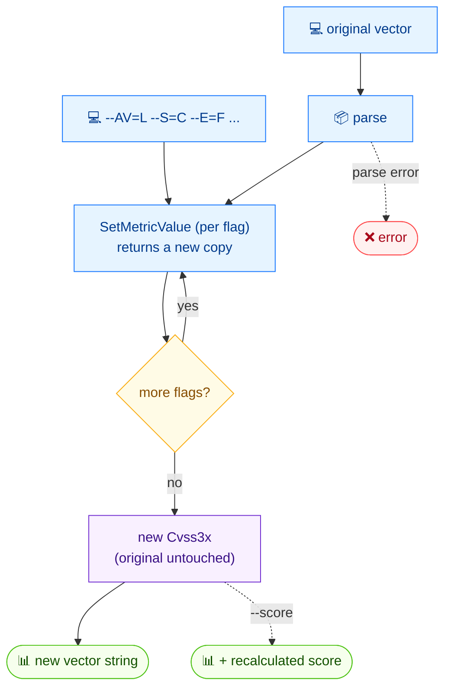

# ✏️ modify

✏️ 修改 · 🟢 stable

## 简介

`cvss modify` 接收一个已有 CVSS 向量，应用通过 flag 传入的指标变更（`--AV=L`、`--S=C` 等），然后输出新向量。原向量不会被修改。传入 `--score` 可额外打印结果重新计算的评分。

## 工作原理

每个 `--flag` 依次通过 `SetMetricValue` 应用，返回新副本，原向量永不被修改；最终副本渲染回向量字符串（可附带重算评分）。



## 用法

```bash
cvss modify [vector-string] [flags]
```

### Flags

| Flag         | 类型   | 默认值  | 说明                          |
| ------------ | ------ | ------- | ----------------------------- |
| `--A`        | string |         | 可用性 (H/L/N)                |
| `--AC`       | string |         | 攻击复杂度 (L/H)              |
| `--AR`       | string |         | 可用性需求 (X/H/M/L)          |
| `--AV`       | string |         | 攻击向量 (N/A/L/P)            |
| `--C`        | string |         | 机密性 (H/L/N)                |
| `--CR`       | string |         | 机密性需求 (X/H/M/L)          |
| `--E`        | string |         | 利用代码成熟度 (X/U/P/F/H)    |
| `--I`        | string |         | 完整性 (H/L/N)                |
| `--IR`       | string |         | 完整性需求 (X/H/M/L)          |
| `--MA`       | string |         | 修改后可用性 (X/H/L/N)        |
| `--MAC`      | string |         | 修改后攻击复杂度 (X/L/H)      |
| `--MAV`      | string |         | 修改后攻击向量 (X/N/A/L/P)    |
| `--MC`       | string |         | 修改后机密性 (X/H/L/N)        |
| `--MI`       | string |         | 修改后完整性 (X/H/L/N)        |
| `--MPR`      | string |         | 修改后所需权限 (X/N/L/H)      |
| `--MS`       | string |         | 修改后范围 (X/U/C)            |
| `--MUI`      | string |         | 修改后用户交互 (X/N/R)        |
| `--PR`       | string |         | 所需权限 (N/L/H)              |
| `--RC`       | string |         | 报告可信度 (X/U/R/C)          |
| `--RL`       | string |         | 修复级别 (X/O/T/W/U)          |
| `--S`        | string |         | 范围 (U/C)                    |
| `--UI`       | string |         | 用户交互 (N/R)                |
| `--format`   | string | `text`  | 输出格式：`text` 或 `json`    |
| `-h, --help` | bool   | `false` | `modify` 的帮助信息           |
| `--score`    | bool   | `false` | 显示计算得到的评分            |

::: tip 只传要改的指标
未提供的 flag 保持原指标不变，因此可以只改单个取值（如 `--AV=L`）而无需重新指定其余指标。
:::

## 示例

::: code-group

```bash [单处变更]
cvss modify "CVSS:3.1/AV:N/AC:L/PR:N/UI:N/S:U/C:H/I:H/A:H" --AV=L
```

```text [输出]
CVSS:3.1/AV:L/AC:L/PR:N/UI:N/S:U/C:H/I:H/A:H
```

:::

::: code-group

```bash [改攻击向量]
cvss modify --AV=L "CVSS:3.1/AV:N/AC:L/PR:N/UI:N/S:U/C:H/I:H/A:H"
```

```text [输出]
CVSS:3.1/AV:L/AC:L/PR:N/UI:N/S:U/C:H/I:H/A:H
```

:::

::: warning flag 可在向量之前或之后
`cvss modify "<vec>" --AV=L` 与 `cvss modify --AV=L "<vec>"` 都可用——Cobra 的 flag 与位置无关。在脚本里选用更易读的写法即可。
:::

## 底层 API

用 [`parser.ParseString`](/zh/sdk/parser) 解析向量，随后对每个提供的 flag 调用 [`cv.SetMetricValue(metric, rune)`](/zh/sdk/cvss)，累加得到新的 `*Cvss3x`。结果用 `cv.String()` 打印（设置 `--score` 时通过计算器算分）。

```go
import (
    "fmt"

    "github.com/scagogogo/cvss-skills/pkg/cvss"
    "github.com/scagogogo/cvss-skills/pkg/parser"
)

cv, err := parser.ParseString("CVSS:3.1/AV:N/AC:L/PR:N/UI:N/S:U/C:H/I:H/A:H")
if err != nil {
    log.Fatal(err)
}

// 把 AV 改为 L（返回新的 *Cvss3x；原对象不变）
cv, err = cv.SetMetricValue("AV", 'L')
if err != nil {
    log.Fatal(err)
}
fmt.Println(cv.String()) // CVSS:3.1/AV:L/AC:L/PR:N/UI:N/S:U/C:H/I:H/A:H
```

## 相关

- [build](/zh/cli/commands/build) — 从零构建向量，而非编辑已有向量
- [score](/zh/cli/commands/score) — 为修改后的结果评分
- [convert](/zh/cli/commands/convert) — 改 CVSS 版本而非指标
- [SetMetricValue](/zh/sdk/cvss) — Go SDK 参考
