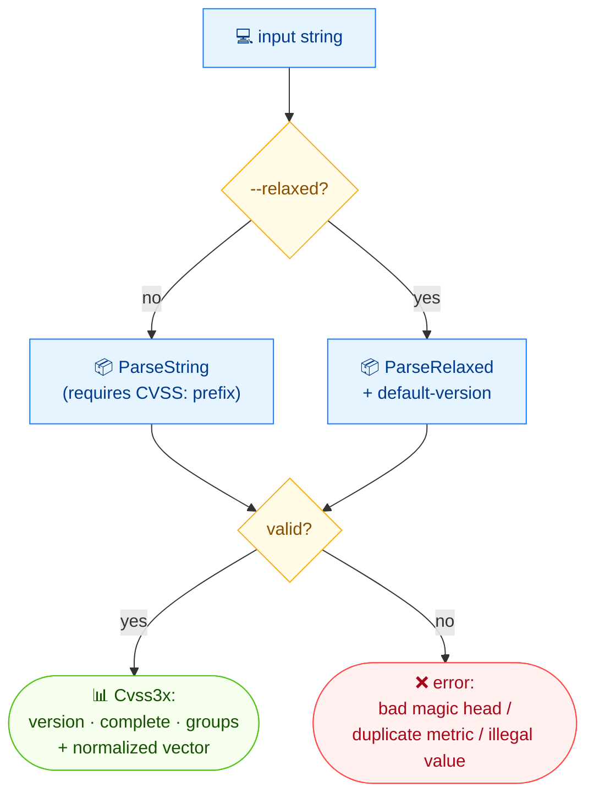

# 🔍 parse

🔍 解析 · 🟢 stable

## 简介

`cvss parse` 解析 CVSS 向量字符串，报告其版本、是否完整、是否含时间/环境指标，随后输出规范化向量字符串与人类可读描述。默认要求 `CVSS:3.x/` 前缀；`--relaxed` 可接受不带前缀的指标列表，并按可配置的默认版本处理。

## 工作原理

字符串被路由到严格或宽松解析器：严格解析要求 `CVSS:3.x/` 前缀；宽松解析接受裸指标列表并使用默认版本。二者均产出 `Cvss3x` 或一个错误（魔数头错、重复指标、非法取值）。



## 用法

```bash
cvss parse [vector-string] [flags]
```

### Flags

| Flag                | 类型   | 默认值  | 说明                       |
| ------------------- | ------ | ------- | -------------------------- |
| `--default-version` | string | `3.1`   | 宽松解析时使用的默认版本   |
| `-h, --help`        | bool   | `false` | `parse` 的帮助信息         |
| `--relaxed`         | bool   | `false` | 不带 `CVSS:` 前缀解析      |

## 示例

::: code-group

```bash [完整向量]
cvss parse "CVSS:3.1/AV:N/AC:L/PR:N/UI:N/S:U/C:H/I:H/A:H/E:U/RL:O/RC:C"
```

```text [输出]
Version: 3.1
Complete: true
Has Temporal: true
Has Environmental: false

Vector String: CVSS:3.1/AV:N/AC:L/PR:N/UI:N/S:U/C:H/I:H/A:H/E:U/RL:O/RC:C

Description:
Attack Vector: Network, Attack Complexity: Low, Privileges Required: None, User Interaction: None, Scope: Unchanged, Confidentiality: High, Integrity: High, Availability: High, Exploit Code Maturity: Unproven, Remediation Level: Official Fix, Report Confidence: Confirmed
```

:::

::: code-group

```bash [宽松解析、不完整向量]
cvss parse --relaxed "AV:N/AC:L"
```

```text [输出]
Version: 3.1
Complete: false
Has Temporal: false
Has Environmental: false

Vector String: CVSS:3.1/AV:N/AC:L

Description:
Attack Vector: Network, Attack Complexity: Low
```

:::

::: warning 宽松解析需要默认版本
没有 `CVSS:` 前缀时版本未知，`--relaxed` 会回退到 `--default-version`（默认 `3.1`）。若你的裸向量为 v3.0，请传入 `--default-version 3.0`。
:::

## 底层 API

严格解析用 [`parser.ParseString`](/zh/sdk/parser)；宽松解析用 [`parser.ParseRelaxed(str, defaultVersion)`](/zh/sdk/parser)。完整性及时间/环境指标的有无来自 `cv.IsComplete()`、`cv.HasTemporalMetrics()` 与 `cv.HasEnvironmentalMetrics()`；向量字符串来自 `cv.String()`；描述来自 `cv.Description()`。

```go
import (
    "fmt"

    "github.com/scagogogo/cvss-skills/pkg/parser"
)

// 严格解析 —— 要求 CVSS: 前缀
cv, err := parser.ParseString("CVSS:3.1/AV:N/AC:L/PR:N/UI:N/S:U/C:H/I:H/A:H/E:U/RL:O/RC:C")

// 宽松解析 —— 无前缀，默认版本 3.1
cv, err = parser.ParseRelaxed("AV:N/AC:L", "3.1")

fmt.Println("Version:", cv.Version())
fmt.Println("Complete:", cv.IsComplete())
fmt.Println("Has Temporal:", cv.HasTemporalMetrics())
fmt.Println("Has Environmental:", cv.HasEnvironmentalMetrics())
fmt.Println("Vector String:", cv.String())
fmt.Println("Description:", cv.Description())
```

## 相关

- [validate](/zh/cli/commands/validate) — 同样报告缺失/非法指标，含通过/失败
- [describe](/zh/cli/commands/describe) — 仅描述视图（无版本/完整性）
- [parser 包](/zh/sdk/parser) — Go SDK 参考
