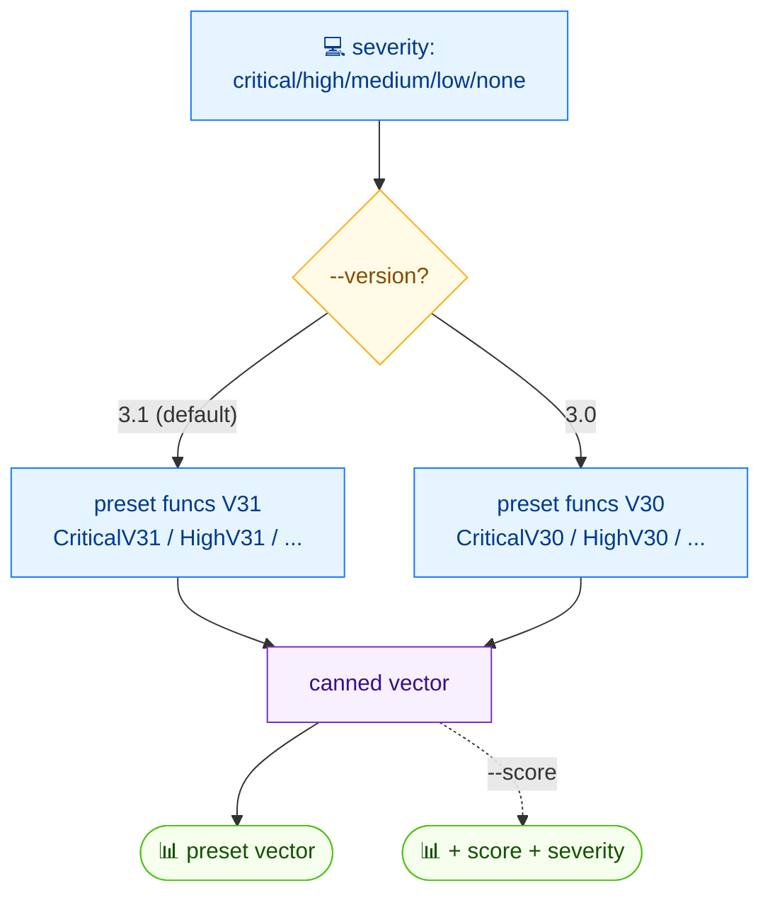

# 🎯 preset

<span class="badge">CVSS v3.0</span>
<span class="badge">CVSS v3.1</span>
<span class="badge badge-info">文本 + JSON</span>

## 简介

`cvss preset` 按请求的严重性等级输出一个预设 CVSS 向量 —— `critical`、`high`、`medium`、`low` 或 `none`。默认版本为 3.1；加 `--version 3.0` 取 v3.0 预设。加 `--score` 可在向量之外同时打印计算出的评分与严重性。适合作为示例、测试或模板的已知良好起点。

## 工作原理

严重性参数按键版本选择一个预设函数（如 `CriticalV31` / `CriticalV30`）；结果是一个已知良好的向量，可选附带评分输出。



## 用法

```
cvss preset [严重性] [flags]
```

### Flags

| Flag | 默认值 | 说明 |
| --- | --- | --- |
| `--format string` | `text` | 输出格式：`text` 或 `json` |
| `--score` | `false` | 在向量旁显示评分 |
| `--version string` | `3.1` | CVSS 版本：`3.0` 或 `3.1` |
| `-h, --help` | — | `preset` 的帮助 |

### 可用严重性等级

`critical`、`high`、`medium`、`low`、`none`

## 示例

::: code-group

```bash [Critical v3.1]
cvss preset critical
# 输出：
# CVSS:3.1/AV:N/AC:L/PR:N/UI:N/S:C/C:H/I:H/A:H
```

```bash [High v3.0 带评分]
cvss preset --score --version 3.0 high
# 输出：
# CVSS:3.0/AV:N/AC:L/PR:N/UI:N/S:U/C:H/I:H/A:H
# Score: 9.8 (Critical)
```

```bash [JSON]
cvss preset --format json critical
```

:::

::: tip 注意“等级”与“评级”的区别
请求的*严重性*（`critical`、`high`……）命名的是预设档位，而*计算出的*严重性评级可能不同。在上面的 `--score` 示例中，`high` 预设的 v3.0 向量评分为 `9.8`，其评级向上归为 `Critical` —— 档位名与数值评级并不保证完全一致。
:::

## 底层 API

```go
import "github.com/scagogogo/cvss-skills/pkg/cvss"

// v3.1 预设
cv := cvss.CriticalV31() // *Cvss3x
_ = cvss.HighV31()
_ = cvss.MediumV31()
_ = cvss.LowV31()
_ = cvss.NoneV31()

// v3.0 预设
_ = cvss.CriticalV30()
_ = cvss.HighV30()
_ = cvss.MediumV30()
_ = cvss.LowV30()
_ = cvss.NoneV30()

fmt.Println(cv.String())

// 带 --score：
calc := cvss.NewCalculator(cv)
score, _ := calc.Calculate()
fmt.Printf("Score: %.1f (%s)\n", score, cvss.GetSeverity(score))
```

每个严重性等级对应一个专用构造函数：v3.1 为 `CriticalV31`/`HighV31`/`MediumV31`/`LowV31`/`NoneV31`，v3.0 为对应的 `*V30` 版本。均返回 `*cvss.Cvss3x`。

## 相关命令

- [`random`](/zh/cli/commands/random) —— 生成随机向量
- [`score`](/zh/cli/commands/score) —— 为任意向量评分
- [`range`](/zh/cli/commands/range) —— 部分向量的评分范围
