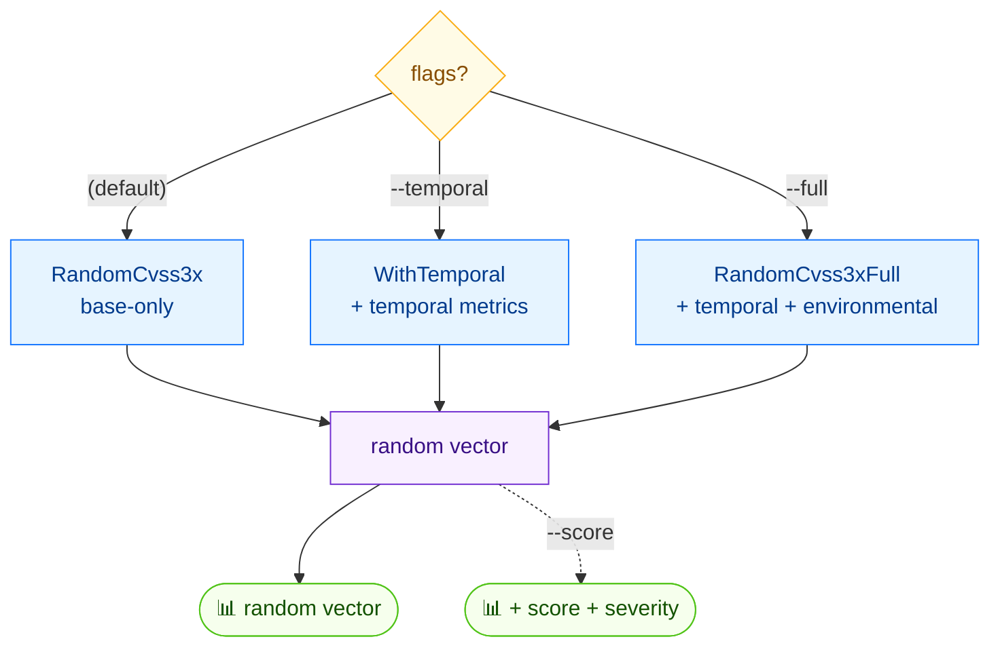

# 🎲 random

<span class="badge">CVSS v3.0</span>
<span class="badge">CVSS v3.1</span>
<span class="badge badge-info">文本 + JSON</span>

## 简介

`cvss random` 生成随机 CVSS 向量，用于测试或演示。默认只输出基础指标。用 `--temporal` 加入时间指标，或用 `--full` 同时加入时间与环境指标。默认版本为 3.1；加 `--cvss-version 3.0` 取 v3.0。加 `--score` 可在向量之外同时打印计算出的评分与严重性。

::: warning 输出不确定
每次调用都会生成不同的随机向量。下方示例输出仅为示意 —— 你的输出会不同。
:::

## 工作原理

默认生成带基础指标的随机向量；`--temporal` 增加时间指标，`--full` 同时增加时间与环境指标，`--score` 打印结果评分。



## 用法

```
cvss random [flags]
```

### Flags

| Flag | 默认值 | 说明 |
| --- | --- | --- |
| `--cvss-version string` | `3.1` | CVSS 版本：`3.0` 或 `3.1` |
| `--format string` | `text` | 输出格式：`text` 或 `json` |
| `--full` | `false` | 包含时间与环境指标 |
| `--score` | `false` | 显示计算出的评分 |
| `--temporal` | `false` | 包含时间指标 |
| `-h, --help` | — | `random` 的帮助 |

## 示例

::: code-group

```bash [仅基础（默认）]
cvss random
# 示例输出（你的会不同）：
# CVSS:3.1/AV:L/AC:H/PR:L/UI:R/S:C/C:H/I:L/A:H
```

```bash [带评分、v3.0、全量]
cvss random --cvss-version 3.0 --full --score
```

```bash [JSON]
cvss random --format json
```

:::

::: tip Flag 优先级
`--full` 优先于 `--temporal`：两者同设时得到全量（时间 + 环境）向量。两者都不设则仅基础指标。
:::

## 底层 API

```go
import (
    "github.com/scagogogo/cvss-skills/pkg/cvss"
    "github.com/scagogogo/cvss-skills/pkg/mock"
)

minor := 1 // 1 为 v3.1，0 为 v3.0

var cv *cvss.Cvss3x
// --full
cv = mock.RandomCvss3xFull(minor)
// --temporal（不带 --full）
// cv = mock.RandomCvss3xWithTemporal(minor)
// 仅基础（默认）
// cv = mock.RandomCvss3x(minor)

fmt.Println(cv.String())

// 带 --score：
calc := cvss.NewCalculator(cv)
score, err := calc.Calculate()
if err == nil {
    fmt.Printf("Score: %.1f (%s)\n", score, cvss.GetSeverity(score))
}
```

三个构造函数位于 `pkg/mock`：`RandomCvss3x(minorVersion int)`、`RandomCvss3xWithTemporal(minorVersion int)`、`RandomCvss3xFull(minorVersion int)`。均返回 `*cvss.Cvss3x`。传 `1` 为 v3.1，传 `0` 为 v3.0。

## 相关命令

- [`preset`](/zh/cli/commands/preset) —— 按严重性档位的已知良好向量
- [`score`](/zh/cli/commands/score) —— 为任意向量评分
- [`range`](/zh/cli/commands/range) —— 部分向量的评分范围
