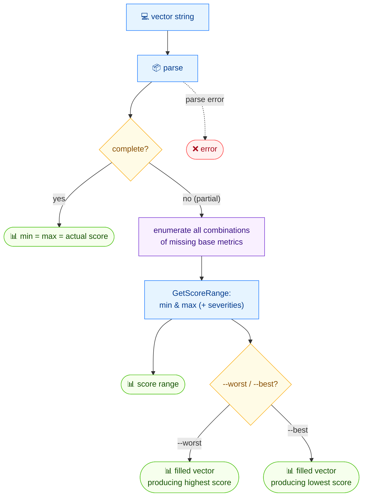

# 📊 range

<span class="badge">CVSS v3.0</span>
<span class="badge">CVSS v3.1</span>
<span class="badge badge-info">文本 + JSON</span>

## 简介

`cvss range` 计算 CVSS 向量的最低与最高可能评分。对于完整向量，min 等于 max 等于实际评分。对于**不完整**向量（缺失基础指标），它会枚举缺失指标的所有组合以找出评分范围。用 `--worst` 或 `--best` 查看产生最高或最低评分的补全向量。

## 工作原理

完整向量时 min 等于 max 等于实际评分；部分向量时穷举组合缺失的基础指标以找到评分区间，`--worst`/`--best` 返回填满后的极端向量。



## 用法

```
cvss range [向量字符串] [flags]
```

### Flags

| Flag | 默认值 | 说明 |
| --- | --- | --- |
| `--best` | `false` | 显示最佳情形（最低评分）向量 |
| `--format string` | `text` | 输出格式：`text` 或 `json` |
| `--worst` | `false` | 显示最差情形（最高评分）向量 |
| `-h, --help` | — | `range` 的帮助 |

## 示例

::: code-group

```bash [不完整向量 —— 缺 4 个指标]
cvss range "CVSS:3.1/AV:N/AC:L/PR:N/UI:N"
# 输出：
# Score range: 0.0 (None) ~ 10.0 (Critical)
# Complete: false, Missing metrics: 4
```

```bash [附带补全的最差情形向量]
cvss range --worst "CVSS:3.1/AV:N/AC:L/PR:N/UI:N"
# 输出：
# Score range: 0.0 (None) ~ 10.0 (Critical)
# Complete: false, Missing metrics: 4
# Worst case: CVSS:3.1/AV:N/AC:L/PR:N/UI:N/S:C/C:H/I:H/A:H (10.0)
```

:::

::: tip 为何最差情形是 `Scope: Changed`
对于不完整的基础向量，最高评分由把缺失影响指标填为 `High`、`Scope` 填为 `Changed` 得到，二者合力将评分推到 `10.0`。最低为 `0.0`（所有影响为 `None`、scope 为 `Unchanged`）。
:::

::: tip `--best` 与 `--worst` 相互独立
二者可任传其一、都传或都不传。都不传时仅输出范围摘要。JSON 模式（`--format json`）无论是否传 `--best`/`--worst`，都会序列化整个 `ScoreRange` 结构。
:::

## 底层 API

```go
import (
    "github.com/scagogogo/cvss-skills/pkg/cvss"
    "github.com/scagogogo/cvss-skills/pkg/parser"
)

// ParseRelaxed 接受不完整向量（缺失基础指标）。
cv, err := parser.ParseRelaxed("CVSS:3.1/AV:N/AC:L/PR:N/UI:N", "3.1")
if err != nil {
    log.Fatal(err)
}

rng := cvss.GetScoreRange(cv) // ScoreRange
fmt.Printf("Score range: %.1f (%s) ~ %.1f (%s)\n",
    rng.MinScore, rng.MinSeverity, rng.MaxScore, rng.MaxSeverity)
fmt.Printf("Complete: %v, Missing metrics: %d\n", rng.IsComplete, rng.MissingCount)

// --worst
worst, score, err := cvss.GetWorstCase(cv) // (*Cvss3x, float64, error)
if err == nil {
    fmt.Printf("Worst case: %s (%.1f)\n", worst.String(), score)
}

// --best
best, score, err := cvss.GetBestCase(cv) // (*Cvss3x, float64, error)
```

`parser.ParseRelaxed`（与 `ParseString` 不同）接受不完整向量。`cvss.GetScoreRange(cv *Cvss3x) ScoreRange` 返回含 `MinScore`、`MaxScore`、`MinSeverity`、`MaxSeverity`、`IsComplete`、`MissingCount` 的结构。`cvss.GetWorstCase` 与 `cvss.GetBestCase` 各自返回补全后的 `*Cvss3x` 及其评分。

## 相关命令

- [`score`](/zh/cli/commands/score) —— 为完整向量评分
- [`analyze`](/zh/cli/commands/analyze) —— 逐指标敏感性分析
- [`preset`](/zh/cli/commands/preset) —— 按严重性档位的已知良好向量
