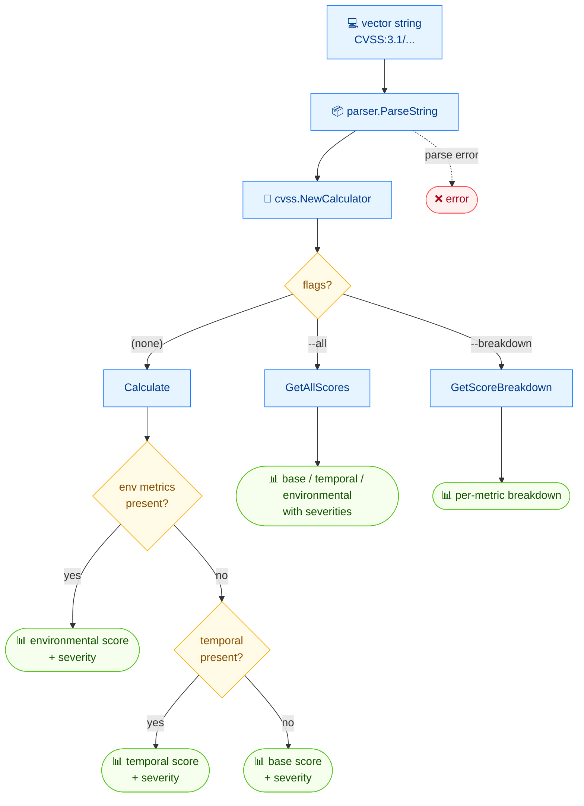

# 🧮 score

🧮 评分 · 🟢 stable

## 简介

`cvss score` 从向量字符串计算 CVSS 总评分并打印其严重性等级。使用 `--all` 可分别输出基础/时间/环境评分，使用 `--breakdown` 可查看逐指标对评分的贡献。所有模式均支持 `--format json`。

## 工作原理

从向量字符串出发，命令解析并隐式校验各指标，把结果交给计算器，随后按要报告的评分组分支——默认为实际可用的最具体评分。



## 用法

```bash
cvss score [vector-string] [flags]
```

### Flags

| Flag            | 类型   | 默认值  | 说明                                            |
| --------------- | ------ | ------- | ----------------------------------------------- |
| `--all`         | bool   | `false` | 显示所有评分（基础、时间、环境）及其严重性      |
| `--breakdown`   | bool   | `false` | 显示逐指标的评分贡献                            |
| `--format`      | string | `text`  | 输出格式：`text` 或 `json`                      |
| `-h, --help`    | bool   | `false` | `score` 的帮助信息                              |

::: tip 默认输出总评分
不带任何 flag 时，命令只输出单个总评分及其严重性——若包含环境指标则取环境评分，否则取时间评分，再否则取基础评分。
:::

## 示例

::: code-group

```bash [总评分]
cvss score "CVSS:3.1/AV:N/AC:L/PR:N/UI:N/S:C/C:H/I:H/A:H"
```

```text [输出]
10.0 (Critical)
```

:::

::: code-group

```bash [所有评分]
cvss score --all "CVSS:3.1/AV:N/AC:L/PR:N/UI:N/S:C/C:H/I:H/A:H"
```

```text [输出]
Base: 10.0 (Critical)
```

:::

::: code-group

```bash [JSON]
cvss score --format json "CVSS:3.1/AV:N/AC:L/PR:N/UI:N/S:C/C:H/I:H/A:H"
```

```json [输出]
{
  "score": 10,
  "severity": "Critical"
}
```

:::

## 底层 API

用 [`parser.ParseString`](/zh/sdk/parser) 解析向量，再通过 `cvss.NewCalculator` 包裹为 [`cvss.Calculator`](/zh/sdk/calculator)，随后根据 flag 调用 `calc.Calculate()` / `calc.GetAllScores()` / `calc.GetScoreBreakdown()`。

```go
import (
    "fmt"

    "github.com/scagogogo/cvss-skills/pkg/cvss"
    "github.com/scagogogo/cvss-skills/pkg/parser"
)

cv, err := parser.ParseString("CVSS:3.1/AV:N/AC:L/PR:N/UI:N/S:C/C:H/I:H/A:H")
if err != nil {
    log.Fatal(err)
}

calc := cvss.NewCalculator(cv)
score, _ := calc.Calculate()
fmt.Printf("%.1f (%s)\n", score, cvss.GetSeverity(score))

// 所有基础 / 时间 / 环境评分及其严重性
all, _ := calc.GetAllScores()
fmt.Printf("Base: %.1f (%s)\n", all.BaseScore, all.BaseSeverity)

// 逐指标的贡献
bd, _ := calc.GetScoreBreakdown()
_ = bd
```

## 相关

- [severity](/zh/cli/commands/severity) — 将数值评分映射为等级
- [subs](/zh/cli/commands/subs) — 影响 / 可利用性子评分
- [analyze](/zh/cli/commands/analyze) — 每个指标如何影响评分
- [评分计算器](/zh/sdk/calculator) — Go SDK 参考
