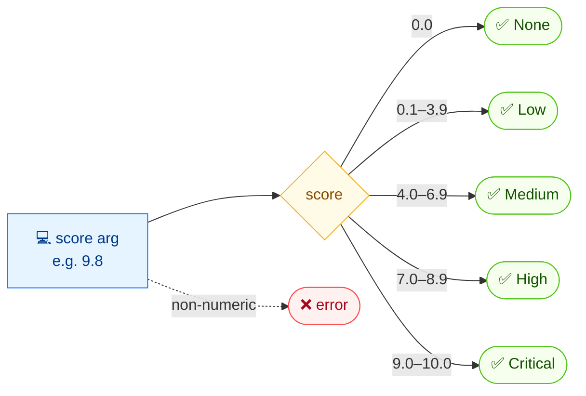

# 🏷️ severity

🏷️ 定级 · 🟢 stable

## 简介

`cvss severity` 将数值化的 CVSS 评分映射为定性的严重性等级。当你已从扫描器、表格或 API 拿到评分、只想得到等级而无需解析完整向量时，它非常方便。

## 工作原理

读入单个数值评分，经 v3.1 阈值表映射为五档评级之一；不解析也不评分。



## 用法

```bash
cvss severity [score] [flags]
```

### Flags

| Flag         | 类型   | 默认值  | 说明                |
| ------------ | ------ | ------- | ------------------- |
| `--format`   | string | `text`  | 输出格式：`text` 或 `json` |
| `-h, --help` | bool   | `false` | `severity` 的帮助信息 |

### CVSS v3.1 阈值

| 等级     | 范围            |
| -------- | --------------- |
| None     | `0.0`           |
| Low      | `0.1 – 3.9`     |
| Medium   | `4.0 – 6.9`     |
| High     | `7.0 – 8.9`     |
| Critical | `9.0 – 10.0`    |

::: warning v3.0 与 v3.1
数值阈值在 v3.0 与 v3.1 中完全相同，但同一个向量在两个版本下可能算出略不同的评分（尤其是 `UI:R`），从而跨越等级边界。`severity` 本身与版本无关——它只看你传入的数字。
:::

## 示例

::: code-group

```bash [文本]
cvss severity 7.5
```

```text [输出]
High
```

:::

::: code-group

```bash [JSON]
cvss severity --format json 9.2
```

```json [输出]
{
  "score": 9.2,
  "severity": "Critical"
}
```

:::

## 底层 API

调用独立的 [`cvss.GetSeverity`](/zh/sdk/cvss) 函数，返回 `cvss.Severity` 值。无需解析向量。

```go
import (
    "fmt"

    "github.com/scagogogo/cvss-skills/pkg/cvss"
)

severity := cvss.GetSeverity(9.2)
fmt.Println(severity) // Critical
```

## 相关

- [score](/zh/cli/commands/score) — 先从向量计算评分
- [严重性等级](/zh/concepts/severity) — 等级模型概念页
