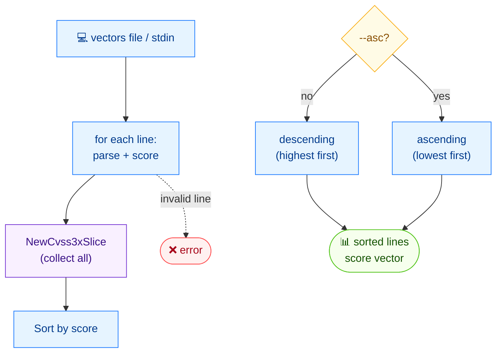

# 🔢 sort

<span class="badge">CVSS v3.0</span>
<span class="badge">CVSS v3.1</span>
<span class="badge badge-info">文本输出</span>

## 简介

`cvss sort` 从文件（或 stdin）读取 CVSS 向量，并按评分打印排序结果。默认顺序为**降序**（高分在前）；加 `--asc` 改为升序。每行输出为 `评分  向量字符串`。

## 工作原理

每行输入被解析、评分并收集到一个切片，再按评分排序——默认降序，加 `--asc` 升序——以 `score  vector` 行重新输出。



## 用法

```
cvss sort [文件] [flags]
```

### Flags

| Flag | 默认值 | 说明 |
| --- | --- | --- |
| `--asc` | `false` | 升序排序（低分在前） |
| `-h, --help` | — | `sort` 的帮助 |

## 示例

::: code-group

```bash [降序排序文件]
cat > vectors.txt <<'EOF'
CVSS:3.1/AV:N/AC:L/PR:N/UI:N/S:U/C:H/I:H/A:H
CVSS:3.1/AV:N/AC:L/PR:N/UI:N/S:C/C:H/I:H/A:H
CVSS:3.1/AV:L/AC:H/PR:H/UI:R/S:U/C:L/I:L/A:N
EOF
cvss sort vectors.txt
```

```bash [升序，从 stdin]
cat vectors.txt | cvss sort --asc -
```

:::

::: tip `sort` 读入的是向量，不是 JSON
`cvss sort` 接收纯文本向量文件（每行一个向量），输出 `评分  向量` 文本。它**不**消费 `--format json` 的输出。空行与 `#` 注释行会被跳过。
:::

::: warning 非法向量被跳过，不致命
解析失败的行以 `Skipping invalid: <行>` 输出到 stderr 并从排序结果中排除；合法向量仍会被排序并输出。
:::

## 底层 API

```go
import (
    "github.com/scagogogo/cvss-skills/pkg/cvss"
    "github.com/scagogogo/cvss-skills/pkg/parser"
)

lines := readLines("vectors.txt") // []string

var vectors []*cvss.Cvss3x
for _, line := range lines {
    cv, err := parser.ParseString(line)
    if err != nil {
        continue // 跳过
    }
    vectors = append(vectors, cv)
}

slice := cvss.NewCvss3xSlice(vectors...) // *Cvss3xSlice
// slice.Asc() 设为升序（默认为降序）
slice.Sort()

for _, cv := range slice.Items() {
    calc := cvss.NewCalculator(cv)
    score, _ := calc.Calculate()
    fmt.Printf("%.1f  %s\n", score, cv.String())
}
```

`cvss.NewCvss3xSlice(items ...*Cvss3x) *Cvss3xSlice` 包装向量；调用 `.Asc()` 切换为升序（默认降序），再 `.Sort()` 原地排序，最后 `.Items()` 取回结果。评分由每个向量独立的 `cvss.NewCalculator` 计算。

## 相关命令

- [`batch score`](/zh/cli/commands/batch-score) —— 批量评分（不排序）向量
- [`score`](/zh/cli/commands/score) —— 为单个向量评分
- [`csv write`](/zh/cli/commands/csv-write) —— 将向量与评分写入 CSV
