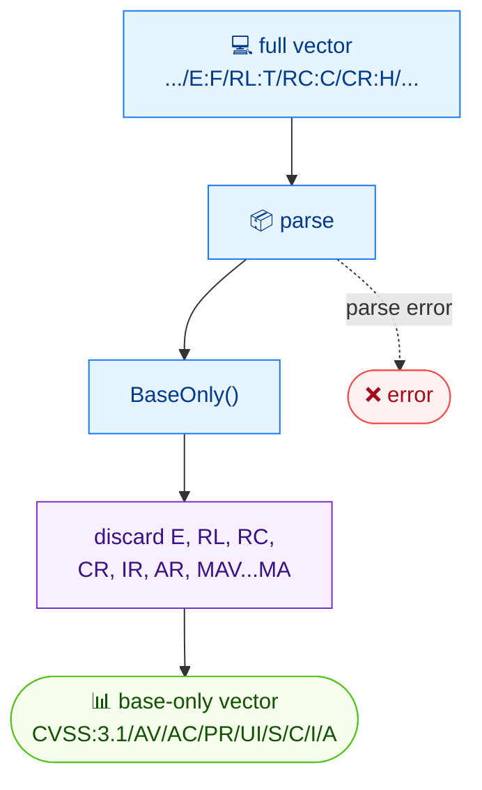

# ✂️ strip

✂️ 裁剪 · 🟢 stable

## 简介

`cvss strip`（别名 `base-only`）移除 CVSS 向量的时间与环境指标，仅保留 8 个基础指标（`AV`/`AC`/`PR`/`UI`/`S`/`C`/`I`/`A`）。在比较、评分或存储前，可用它把完整向量归一为基础形态。

## 工作原理

丢弃所有时间与环境指标，只留八个基础指标；结果是一个最小的基础向量。



## 用法

```bash
cvss base-only [vector-string] [flags]
```

**别名：** `base-only`、`strip`

### Flags

| Flag         | 类型 | 默认值  | 说明                 |
| ------------ | ---- | ------- | -------------------- |
| `-h, --help` | bool | `false` | `base-only` 的帮助信息 |

::: tip 两个名字，同一条命令
规范命令名是 `base-only`；`strip` 是内置别名。二者调用同一套代码，在脚本里选用更易读的即可。
:::

## 示例

::: code-group

```bash [移除时间指标]
cvss strip "CVSS:3.1/AV:N/AC:L/PR:N/UI:N/S:U/C:H/I:H/A:H/E:U/RL:O/RC:C"
```

```text [输出]
CVSS:3.1/AV:N/AC:L/PR:N/UI:N/S:U/C:H/I:H/A:H
```

:::

::: tip 对环境指标同样有效
携带环境指标（`CR`/`IR`/`AR` 及任意 `M*`）的向量以同样方式归一——所有非基础指标都被移除，只留基础向量。
:::

## 底层 API

用 [`parser.ParseString`](/zh/sdk/parser) 解析向量，随后调用 [`cv.BaseOnly()`](/zh/sdk/cvss)，返回仅含基础指标的新 `*Cvss3x`。

```go
import (
    "fmt"

    "github.com/scagogogo/cvss-skills/pkg/parser"
)

cv, err := parser.ParseString("CVSS:3.1/AV:N/AC:L/PR:N/UI:N/S:U/C:H/I:H/A:H/E:U/RL:O/RC:C")
if err != nil {
    log.Fatal(err)
}

base := cv.BaseOnly()
fmt.Println(base.String()) // CVSS:3.1/AV:N/AC:L/PR:N/UI:N/S:U/C:H/I:H/A:H
```

## 相关

- [merge](/zh/cli/commands/merge) — 反向操作：把时间/环境指标加回来
- [convert](/zh/cli/commands/convert) — 改 CVSS 版本而非指标集合
- [score](/zh/cli/commands/score) — 为裁剪后的基础向量评分
- [BaseOnly](/zh/sdk/cvss) — Go SDK 参考
