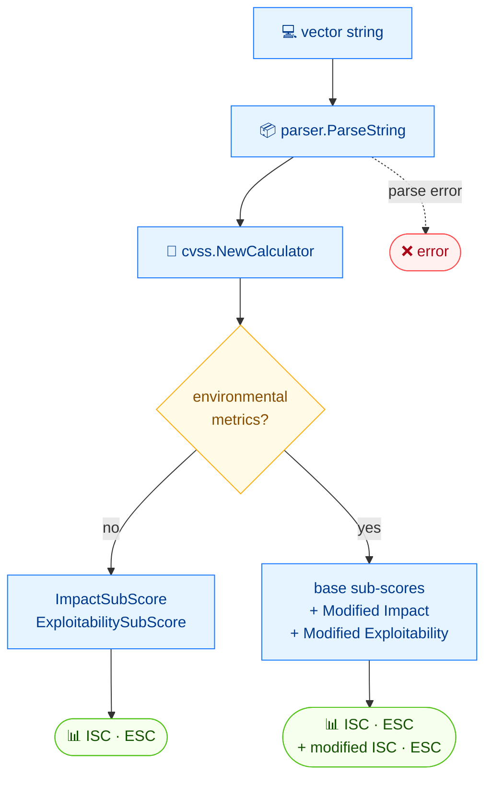

# 🧩 subs

🧩 子评分 · 🟢 stable

## 简介

`cvss subs` 打印构成 CVSS 基础评分的影响子评分（Impact Sub-Score）与可利用性子评分（Exploitability Sub-Score）。对于带环境（修改后）指标的向量，还会额外显示环境评分所用到的修改后影响与修改后可利用性子评分。

## 工作原理

计算器暴露构成基础评分的两个子评分；当环境（修改后）指标存在时，它额外报告喂给环境评分的修改后子评分。



## 用法

```bash
cvss subs [vector-string] [flags]
```

### Flags

| Flag         | 类型   | 默认值  | 说明            |
| ------------ | ------ | ------- | --------------- |
| `--format`   | string | `text`  | 输出格式：`text` 或 `json` |
| `-h, --help` | bool   | `false` | `subs` 的帮助信息 |

::: tip 何时出现修改后子评分
两行 `Modified *` 仅在向量包含至少一个环境指标（`CR`/`IR`/`AR` 或任意 `M*`）时才打印。纯基础或基础+时间向量只显示两行基础子评分。
:::

## 示例

::: code-group

```bash [基础 + 时间]
cvss subs "CVSS:3.1/AV:N/AC:L/PR:N/UI:N/S:U/C:H/I:H/A:H/E:U/RL:O/RC:C"
```

```text [输出]
Impact Sub-Score:        5.8731
Exploitability Sub-Score: 3.8870
```

:::

::: code-group

```bash [含环境指标]
cvss subs "CVSS:3.1/AV:N/AC:L/PR:N/UI:N/S:U/C:H/I:H/A:H/CR:H/IR:M/AR:L/MAV:L/MC:N"
```

```text [输出]
Impact Sub-Score:        5.8731
Exploitability Sub-Score: 3.8870
Modified Impact Sub-Score:        4.3861
Modified Exploitability Sub-Score: 2.5151
```

:::

## 底层 API

用 [`parser.ParseString`](/zh/sdk/parser) 解析向量，包裹为 [`cvss.Calculator`](/zh/sdk/calculator)，随后读取 `calc.GetImpactSubScore()` / `calc.GetExploitabilitySubScore()`（含环境指标时还有 `calc.GetModifiedImpactSubScore()` / `calc.GetModifiedExploitabilitySubScore()`）。

```go
import (
    "fmt"

    "github.com/scagogogo/cvss-skills/pkg/cvss"
    "github.com/scagogogo/cvss-skills/pkg/parser"
)

cv, err := parser.ParseString("CVSS:3.1/AV:N/AC:L/PR:N/UI:N/S:U/C:H/I:H/A:H/E:U/RL:O/RC:C")
if err != nil {
    log.Fatal(err)
}

calc := cvss.NewCalculator(cv)
impact, _ := calc.GetImpactSubScore()
exploit, _ := calc.GetExploitabilitySubScore()
fmt.Printf("Impact Sub-Score: %.4f\n", impact)
fmt.Printf("Exploitability Sub-Score: %.4f\n", exploit)

// 仅在存在环境指标时：
if cv.HasEnvironmentalMetrics() {
    mImpact, _ := calc.GetModifiedImpactSubScore()
    mExploit, _ := calc.GetModifiedExploitabilitySubScore()
    fmt.Printf("Modified Impact Sub-Score: %.4f\n", mImpact)
    fmt.Printf("Modified Exploitability Sub-Score: %.4f\n", mExploit)
}
```

## 相关

- [score](/zh/cli/commands/score) — 由这些子评分合成的总评分
- [describe](/zh/cli/commands/describe) — 完整指标拆解，JSON 下含子评分
- [评分计算器](/zh/sdk/calculator) — Go SDK 参考
