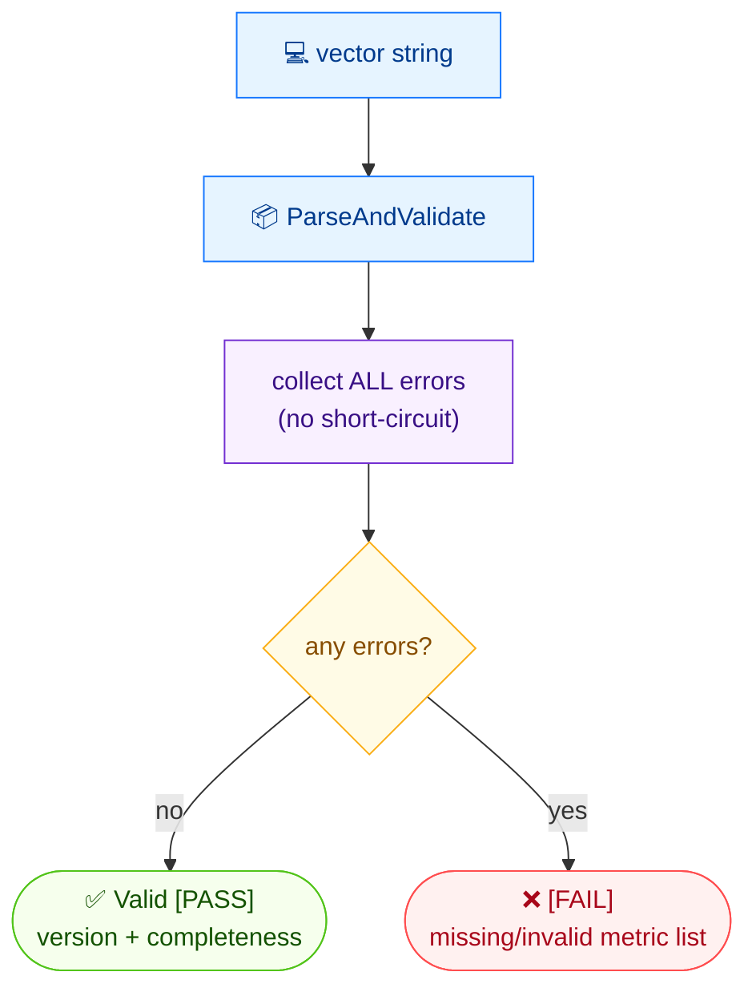

# ✅ validate

✅ 校验 · 🟢 stable

## 简介

`cvss validate` 检查 CVSS 向量字符串，一次性报告所有缺失或非法指标（不会在首个错误处短路）。校验通过时打印 `Valid [PASS]` 及版本与完整性；失败时列出所有问题。

## 工作原理

字符串被解析，每个指标在一次不短路校验中检查，因此所有缺失与非法指标一并报告——只有当集合完整且良构时才 `PASS`。



## 用法

```bash
cvss validate [vector-string] [flags]
```

### Flags

| Flag         | 类型   | 默认值  | 说明                |
| ------------ | ------ | ------- | ------------------- |
| `--format`   | string | `text`  | 输出格式：`text` 或 `json` |
| `-h, --help` | bool   | `false` | `validate` 的帮助信息 |

## 示例

::: code-group

```bash [合法向量]
cvss validate "CVSS:3.1/AV:N/AC:L/PR:N/UI:N/S:C/C:H/I:H/A:H"
```

```text [输出]
Valid [PASS]
  Version: 3.1
  Complete: true
```

:::

::: code-group

```bash [非法向量]
cvss validate "bad"
```

```text [输出]
Validation failed: validation failed: metric I: is required but not set; metric A: is required but not set
```

:::

::: tip 一次性看到全部错误
由于校验不会短路，单次运行即可暴露所有缺失指标——在批量清理畸形向量时很有用。上面的非法示例在一条消息里同时报告了 `I` 和 `A`。
:::

## 底层 API

调用 [`parser.ParseAndValidate`](/zh/sdk/parser)，它在一步内完成解析与校验，向量非法时返回列出所有问题的错误。

```go
import (
    "fmt"
    "log"

    "github.com/scagogogo/cvss-skills/pkg/parser"
)

cv, err := parser.ParseAndValidate("CVSS:3.1/AV:N/AC:L/PR:N/UI:N/S:C/C:H/I:H/A:H")
if err != nil {
    log.Fatalf("Validation failed: %v", err) // 列出所有缺失/非法指标
}
fmt.Printf("Valid [PASS]\n  Version: %s\n  Complete: %v\n", cv.Version(), cv.IsComplete())
```

## 相关

- [parse](/zh/cli/commands/parse) — 不做严格校验的解析
- [canonicalize](/zh/cli/commands/canonicalize) — 也提供 `--check` 检查规范顺序
- [校验模型](/zh/concepts/validation) — 概念页
- [parser 包](/zh/sdk/parser) — Go SDK 参考
