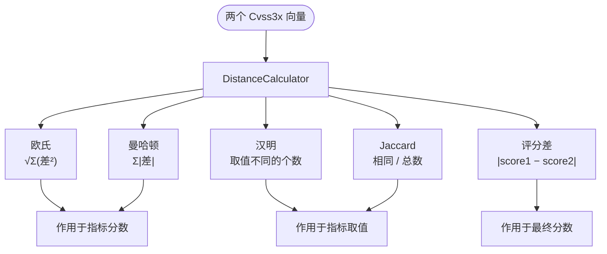

# 📏 距离度量

## 简介

比较两个 CVSS 向量很少只是"它们相等吗？"这样一个问题 —— 通常你想知道它们*相差多远*，以及在何种意义上相差。工具包在 `DistanceCalculator` 上提供**五种距离度量**，每种都有可选的 `...WithEnv`（纳入环境指标）与 `...Checked`（返回错误而非静默 `0.0`）变体。

## 五种度量

| 度量 | 返回类型 | 衡量内容 | 敏感维度 |
|------|---------|---------|---------|
| `EuclideanDistance` | `float64` | 指标分数空间中的直线距离 | 幅度 |
| `ManhattanDistance` | `float64` | 各指标分数差绝对值之和 | 幅度 |
| `HammingDistance` | `int` | **取值**不同的指标个数 | 计数 |
| `JaccardSimilarity` | `float64` | 相同 / 总指标数 | 比率（0–1） |
| `ScoreDifference` | `float64` | 最终计算分数的绝对差 | 最终分数 |

所有基于分数的度量（欧氏、曼哈顿）作用于**各指标数值分数**，而非原始取值码。`PR` 结合 Scope 上下文解析（`GetPrivilegesRequiredScore`），`UI` 结合版本上下文解析（`GetUserInteractionScore`，确保 `UI:R` 正确取 `0.56` 或 `0.62`）。`Scope` 视作二元 `0`/`1`。

### 一图对比



## 变体

### `...WithEnv` —— 纳入环境指标

仅基础指标的方法会忽略 `Cvss3xEnvironmental` 块。`WithEnv` 变体在两个向量都有环境数据时，额外纳入 11 个环境指标（CR、IR、AR、MAV、MAC、MPR、MUI、MS、MC、MI、MA）：

- `EuclideanDistanceWithEnv`
- `ManhattanDistanceWithEnv`
- `HammingDistanceWithEnv`
- `JaccardSimilarityWithEnv`

若任一向量缺少环境指标，`WithEnv` 方法会优雅回退：汉明/Jaccard 退为基础+时间，欧氏/曼哈顿跳过环境项。

### `...Checked` —— 返回错误而非静默零

普通方法在输入不完整（如缺失基础指标）时返回 `0.0`，可能掩盖真实问题。`Checked` 变体返回显式 `error`：

- `EuclideanDistanceChecked` —— 基础指标不完整时返回 `errIncompleteMetrics`
- `ManhattanDistanceChecked`
- `ScoreDifferenceChecked` —— 包装各向量的 `Calculate` 错误
- `EuclideanDistanceWithEnvChecked`
- `ManhattanDistanceWithEnvChecked`

## 何时用哪种

- **"这两个向量在影响幅度上差多少？"** → `ManhattanDistance`（或欧氏看复合视图）。两者在分数空间中等权加权每个指标。
- **"它们改了几个指标？"** → `HammingDistance`。对指标*改了多少*不敏感，只关心是否改变。
- **"多少比例的指标一致？"** → `JaccardSimilarity`。汉明的归一化 `0–1` 对应物；`1.0` 表示完全相同。
- **"最终严重性是否变了，变了多少？"** → `ScoreDifference`。唯一会运行完整计算器的度量 —— 它捕捉所有差异的*净*效应，包括 Scope 的 `1.08` 乘子与 `roundUp`。
- **比较环境调优后的向量** → `WithEnv` 系列。
- **不可静默产出 `0` 的生产代码** → `Checked` 系列。

## 代码实现

所有度量都是 `DistanceCalculator` 的方法（`pkg/cvss/distance.go`、`distance_env.go`、`distance_checked.go`）：

```go
dc := cvss.NewDistanceCalculator(cv1, cv2)

eu  := dc.EuclideanDistance()         // float64
man := dc.ManhattanDistance()         // float64
ham := dc.HammingDistance()           // int
jac := dc.JaccardSimilarity()         // float64 0–1
sd  := dc.ScoreDifference()           // float64

// 纳入环境
euE := dc.EuclideanDistanceWithEnv()

// Checked（返回 error）
if d, err := dc.EuclideanDistanceChecked(); err == nil {
    fmt.Println("欧氏距离:", d)
}
```

`ScoreDifference` 内部构造两个 `Calculator` 并各调一次 `Calculate()`，因此它遵循版本（`UI:R`）、Scope 与 `roundUp` —— 是最"端到端"的比较。

## 示例

```bash
$ cvss distance "CVSS:3.1/AV:N/AC:L/PR:N/UI:N/S:U/C:H/I:H/A:H" "CVSS:3.1/AV:N/AC:L/PR:N/UI:N/S:U/C:L/I:L/A:N"
# 报告 欧氏、曼哈顿、汉明、Jaccard 与评分差
```

## 相关

- [Go SDK：距离与比较](/zh/sdk/distance) —— 面向 SDK 的 API
- [评分公式](./scoring-formula) —— `ScoreDifference` 最终运行的内容
- [v3.0 与 v3.1 差异](./version-diff) —— 为何 `UI` 解析需要版本
