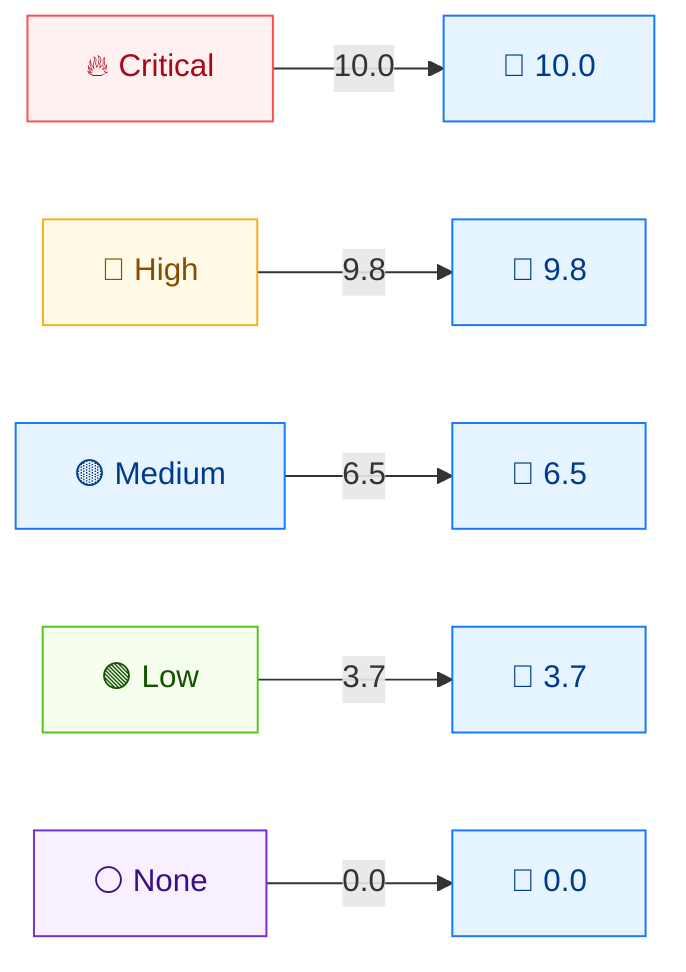

# 📦 预设与严重性

## 简介

当你需要某个严重性档位的代表性向量 —— 用于测试、演示、夹具或默认值 —— 工具包为五个严重性档位都提供了预设向量，覆盖 v3.0 与 v3.1。共有三种形态：独立构造函数、函数式选项基础预设，以及 `pkg/mock` 包的预设。

## 严重性档位预设（pkg/cvss）

每个预设返回一个完整填充、合法的 `*Cvss3x`，其基础评分落在对应档位。定义于 `pkg/cvss/presets.go`：

| 预设 | 向量串 | 基础评分 | 严重性 |
|------|--------|---------|--------|
| `CriticalV31()` | `CVSS:3.1/AV:N/AC:L/PR:N/UI:N/S:C/C:H/I:H/A:H` | **10.0** | Critical |
| `HighV31()` | `CVSS:3.1/AV:N/AC:L/PR:N/UI:N/S:U/C:H/I:H/A:H` | **9.8** | Critical |
| `MediumV31()` | `CVSS:3.1/AV:N/AC:L/PR:N/UI:N/S:U/C:L/I:L/A:N` | **6.5** | Medium |
| `LowV31()` | `CVSS:3.1/AV:N/AC:H/PR:N/UI:N/S:U/C:L/I:N/A:N` | **3.7** | Low |
| `NoneV31()` | `CVSS:3.1/AV:N/AC:L/PR:N/UI:N/S:U/C:N/I:N/A:N` | **0.0** | None |

`CriticalV31`（10.0）与 `HighV31`（9.8）的唯一区别是 **Scope**（`S:C` vs `S:U`）—— 直观展示了 Scope Changed 的 `1.08` 乘子（见 [评分公式](./scoring-formula)）。

## 严重性档位分数映射



v3.0 对应项（`CriticalV30`、`HighV30`、`MediumV30`、`LowV30`、`NoneV30`）使用相同指标，但 `MinorVersion: 0`。注意 `MediumV30` 用 `UI:R`（v3.0 下计 `0.56`），而 `MediumV31` 用 `UI:N` —— 两个 Medium 预设并非逐字节相同。

## 函数式选项基础预设（pkg/cvss/options.go）

对于用 `NewCvss3xWithOptions` 构建的向量，`With*Base()` 选项将八个基础指标预设到某个严重性档位，时间/环境指标留空：

| 选项 | 基础指标设为 | 档位 |
|------|-------------|------|
| `WithCriticalBase()` | `AV:N/AC:L/PR:N/UI:N/S:C/C:H/I:H/A:H` | Critical（Scope Changed） |
| `WithHighBase()` | `AV:N/AC:L/PR:N/UI:N/S:U/C:H/I:H/A:H` | High |
| `WithMediumBase()` | `AV:N/AC:L/PR:N/UI:N/S:U/C:L/I:L/A:N` | Medium |
| `WithLowBase()` | `AV:N/AC:H/PR:N/UI:R/S:U/C:L/I:N/A:N` | Low |
| `WithNoneBase()` | `AV:N/AC:L/PR:N/UI:N/S:U/C:N/I:N/A:N` | None |

它们可与其他任意 `Option`（时间、环境、版本）组合，因此可从一个档位起步再细化：

```go
cv, err := cvss.NewCvss3xWithOptions(
    cvss.WithCriticalBase(),
    cvss.WithVersion31(),
    cvss.WithTemporal('U', 'O', 'C'), // E:U RL:O RC:C
)
```

## Mock 预设（pkg/mock/presets.go）

`pkg/mock` 包镜像 `pkg/cvss` 的预设，供测试夹具使用，每个通过 `cvss.NewCvss3x()` 构造：

| Mock 预设 | 等价于 |
|-----------|--------|
| `mock.CriticalCvss31()` / `mock.CriticalCvss30()` | `CriticalV31` / `CriticalV30` |
| `mock.HighCvss31()` / `mock.HighCvss30()` | `HighV31` / `HighV30` |
| `mock.MediumCvss31()` / `mock.MediumCvss30()` | `MediumV31` / `MediumV30` |
| `mock.LowCvss31()` / `mock.LowCvss30()` | `LowV31` / `LowV30` |
| `mock.NoneCvss31()` / `mock.NoneCvss30()` | `NoneV31` / `NoneV30` |

## 代码实现

```go
// 独立构造函数
crit := cvss.CriticalV31()       // → Base 10.0, Severity Critical
base, _ := cvss.NewCalculator(crit).GetBaseScore() // 10.0

// 函数式选项
cv, _ := cvss.NewCvss3xWithOptions(cvss.WithHighBase(), cvss.WithVersion31())

// Mock 夹具
m := mock.MediumCvss31()
```

## 示例

```bash
$ cvss score "CVSS:3.1/AV:N/AC:L/PR:N/UI:N/S:C/C:H/I:H/A:H"
10.0 (Critical)

$ cvss score "CVSS:3.1/AV:N/AC:L/PR:N/UI:N/S:U/C:H/I:H/A:H"
9.8 (Critical)

$ cvss score "CVSS:3.1/AV:N/AC:L/PR:N/UI:N/S:U/C:L/I:L/A:N"
6.5 (Medium)

$ cvss score "CVSS:3.1/AV:N/AC:H/PR:N/UI:N/S:U/C:L/I:N/A:N"
3.7 (Low)

$ cvss score "CVSS:3.1/AV:N/AC:L/PR:N/UI:N/S:U/C:N/I:N/A:N"
0.0 (None)
```

## 相关

- [严重性等级](./severity) —— 这些预设所瞄准的档位
- [评分公式](./scoring-formula) —— 为何 `S:C` 得 10.0 而 `S:U` 得 9.8
- [Go SDK：预设](/zh/sdk/presets) 与 [函数式选项](/zh/sdk/options) —— 面向 SDK 的文档
