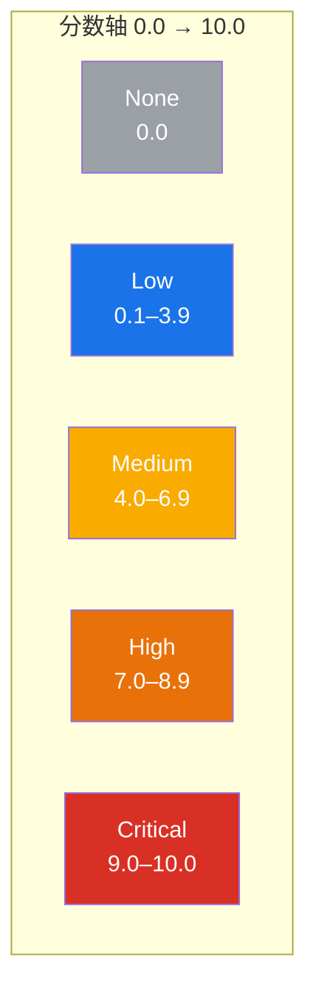

# 🚦 严重性等级

## 简介

每个 CVSS 分数（基础、时间或环境）都会映射到五个**严重性等级**之一：`None`、`Low`、`Medium`、`High` 或 `Critical`。本页记录确切的阈值、`GetSeverity`/`ParseSeverity` API，以及工具包如何将数值分数渲染为人类可读的标签。

## 等级分档

阈值遵循 CVSS v3.1 规范，实现位于 `pkg/cvss/severity.go`：

| 等级 | 分数范围 | 颜色 | 含义 |
|------|---------|------|------|
| **None** | `0.0` | ⚪ 灰 | 无影响 |
| **Low** | `0.1 – 3.9` | 🔵 蓝 | 影响极小 |
| **Medium** | `4.0 – 6.9` | 🟡 黄 | 影响中等 |
| **High** | `7.0 – 8.9` | 🟠 橙 | 影响显著 |
| **Critical** | `9.0 – 10.0` | 🔴 红 | 影响灾难性 |

### 等级仪表盘



## 代码实现

### `GetSeverity(score)` —— 数值转等级

```go
// pkg/cvss/severity.go
func GetSeverity(score float64) Severity {
    if score <= 0 {
        return SeverityNone
    } else if score < 4.0 {
        return SeverityLow
    } else if score < 7.0 {
        return SeverityMedium
    } else if score < 9.0 {
        return SeverityHigh
    } else {
        return SeverityCritical
    }
}
```

注意边界语义：`score <= 0` 为 `None`；各档上界**不包含**（`< 4.0`、`< 7.0`、`< 9.0`），因此 `4.0` 落入 `Medium`，`7.0` 落入 `High`，`9.0` 落入 `Critical`。`10.0` 为上限，归入 `Critical`。

### `ParseSeverity(s)` —— 字符串转等级

`ParseSeverity` 不区分大小写地接受规范名称（`None`、`none`、`NONE` 均可），其他值返回错误：

```go
sev, err := cvss.ParseSeverity("Critical")
if err != nil { /* 处理 */ }
// sev == cvss.SeverityCritical
```

### `Severity` 类型

`Severity` 是命名字符串类型，提供便利谓词 —— `IsNone()`、`IsLow()`、`IsMedium()`、`IsHigh()`、`IsCritical()` —— 以及 `String()` 方法：

```go
var s cvss.Severity = cvss.GetSeverity(9.8)
s.IsCritical() // true
s.String()     // "Critical"
```

### 通过 Calculator

`Calculator.GetSeverityRating(score)` 委托给独立的 `GetSeverity`，因此评分后只需一次调用即可得到等级：

```go
calc := cvss.NewCalculator(cvssObj)
base, _ := calc.GetBaseScore()
rating := calc.GetSeverityRating(base) // cvss.SeverityCritical
```

## 示例

用 CLI 评分并查看等级：

```bash
$ cvss score "CVSS:3.1/AV:N/AC:L/PR:N/UI:N/S:U/C:H/I:H/A:H"
9.8 (Critical)

$ cvss score "CVSS:3.1/AV:N/AC:L/PR:N/UI:N/S:U/C:L/I:L/A:N"
6.5 (Medium)

$ cvss score "CVSS:3.1/AV:N/AC:L/PR:N/UI:N/S:U/C:N/I:N/A:N"
0.0 (None)
```

## 相关

- [评分公式](./scoring-formula) —— 分数在定级前是如何算出的
- [预设与严重性](./presets) —— 每个等级档位的现成向量
