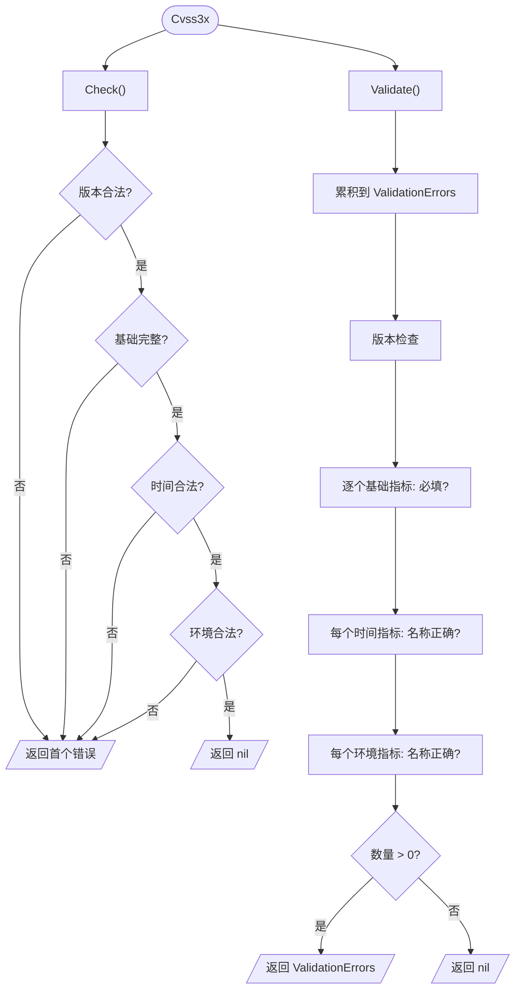

# ✅ 校验模型

## 简介

工具包在每个 `Cvss3x` 上提供两个互补的校验入口：

- **`Check()`** —— 短路，返回**首个**错误（普通 `error`）。快速，适合"这能用吗？"。
- **`Validate()`** —— 将**所有**错误收集到结构化的 `ValidationErrors`。适合"告诉我哪里全错了"。

两者都校验版本、基础指标完整性，以及已设置的时间/环境指标名称。本页追踪校验流程与错误类型。

## Check 与 Validate



### `Check()` —— 首个错误优先

定义于 `pkg/cvss/cvss3x.go`，`Check` 按 版本 → 基础 → 时间 → 环境 的顺序遍历，遇到**首个**问题即作为普通 `error` 返回：

```go
func (x *Cvss3x) Check() error {
    // nil 接收者、版本、基础完整性、时间、环境...
    // 在首个失败处返回
}
```

由于评分（`Calculate`、`GetBaseScore` 等）会先调用 `Check()`，非法向量永远不会进入计算器 —— 你会在得到无意义分数前先收到错误。

### `Validate()` —— 收集全部

定义于 `pkg/cvss/validate.go`，`Validate` 将每个问题累积到 `ValidationErrors`（`*ValidationError` 切片）。它**不短路**，因此缺失三个基础指标的向量会一次性报告全部三个：

```go
type ValidationError struct {
    Metric  string // 如 "AV"、"PR"、"E"
    Message string // 人类可读描述
}
type ValidationErrors []*ValidationError
```

每个 `ValidationError` 暴露 `Metric`（短名）与 `Message`。`ValidationErrors` 支持：

- `.Error()` —— 用 `;` 连接的字符串
- `.MissingMetrics()` —— 仅返回指标短名列表
- `.HasErrors()` —— `len > 0`
- `.Unwrap() []error` —— Go 1.20+ 多错误解包，使 `errors.Is`/`errors.As` 可用

## 哨兵错误

`pkg/cvss/errors.go` 定义了可供 `errors.Is` 使用的可复用哨兵值：

```go
var (
    ErrNilReceiver           = errors.New("nil receiver")
    ErrIncompleteBaseMetrics = errors.New("incomplete base metrics")
    ErrUnsupportedVersion    = errors.New("unsupported CVSS version")
    ErrInvalidMetricValue    = errors.New("invalid metric value")
)
```

## MissingMetrics

`MissingMetrics()` 是 `Validate()` 的便利封装，仅返回消息为 `is required but not set` 的基础指标名：

```go
// pkg/cvss/validate.go
func (x *Cvss3x) MissingMetrics() []string
```

## 代码实现

```go
cv := cvss.NewCvss3x() // 空 —— 未设置任何基础指标

// Check：返回首个问题
if err := cv.Check(); err != nil {
    fmt.Println("不可用:", err)
}

// Validate：返回全部
if err := cv.Validate(); err != nil {
    var ve cvss.ValidationErrors
    if errors.As(err, &ve) {
        fmt.Println("缺失:", ve.MissingMetrics())
        // 例如 [AV AC PR UI S C I A]
    }
}

// 仅缺失名称
fmt.Println(cv.MissingMetrics())

// 哨兵匹配
if errors.Is(err, cvss.ErrIncompleteBaseMetrics) { /* ... */ }
```

## 示例

```bash
$ cvss validate "CVSS:3.1/AV:N/AC:L/PR:N"
✗ validation failed: metric UI: is required but not set; metric S: is required but not set; ...
```

CLI 的 `validate` 命令展示完整的 `ValidationErrors` 列表，让你一次修完所有问题，而非逐个排查。

## 相关

- [Go SDK：校验](/zh/sdk/validation) —— 面向 SDK 的校验 API
- [评分公式](./scoring-formula) —— `Check()` 是计算器的前置门槛
- [CLI：validate](/zh/cli/) —— 命令行封装
