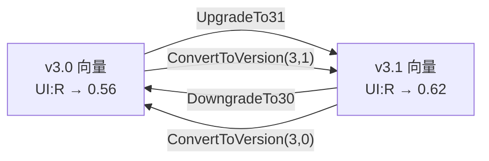

# 🔀 CVSS v3.0 与 v3.1 差异

## 简介

CVSS v3.1 是对 v3.0 的精炼，而非重新设计。两个版本间几乎所有指标值都相同 —— 但有两处不同，且足以改变最终分数：

1. **`UI:R`（User Interaction: Required）** 在 v3.0 为 `0.56`，在 v3.1 为 `0.62`。
2. **`roundUp` 算法** —— v3.0 与 v3.1 在最终分数如何取整到一位小数上措辞不同。

本页记录这两处差异、展示版本分支代码，并说明如何在版本间转换向量。

## 差异一：`UI:R` 指标值

`UI:N` 在两个版本中均为 `0.85`。只有 `UI:R` 不同：

| 指标取值 | v3.0 | v3.1 |
|---------|------|------|
| `UI:N` | 0.85 | 0.85 |
| `UI:R` | **0.56** | **0.62** |

分支逻辑位于 `pkg/vector/user_interaction.go`：

```go
// GetUserInteractionScore 返回 UI 分数，遵循 CVSS 版本差异
// CVSS v3.0: UI:R = 0.56; CVSS v3.1: UI:R = 0.62; UI:N = 0.85（两版本相同）
func GetUserInteractionScore(ui Vector, minorVersion int) float64 {
    if ui == nil || ui.IsNotDefined() {
        return 1.0
    }
    switch ui.GetShortValue() {
    case 'N':
        return 0.85
    case 'R':
        if minorVersion == 0 {
            return 0.56 // CVSS v3.0 value
        }
        return 0.62 // CVSS v3.1 value
    default:
        return ui.GetScore()
    }
}
```

由于 `ESC = 8.22 × AV × AC × PR × UI`，`UI` 越高，可利用性子评分越高，进而基础评分越高。因此含 `UI:R` 的向量在 **v3.1 下的分数略高于 v3.0**。

## 差异二：`roundUp` 算法

CVSS 规范将 `Roundup(x)` 定义为"大于等于 `x` 的、精确到一位小数的最小数"。工具包实现该单一算法（位于 `pkg/cvss/calculator.go`），统一应用：

```go
func roundUp(x float64) float64 {
    intInput := int(math.Round(x * 100000))
    if intInput%10000 == 0 {
        return float64(intInput) / 100000
    }
    return float64(intInput + (10000 - intInput%10000)) / 100000
}
```

规范对 v3.0 与 v3.1 取整过程的*措辞*略有不同，但上述整数算术实现满足两版本共用的"大于等于 x 的一位小数最小数"契约。`RoundUp` 从 `pkg/cvss/scores.go` 导出，便于调用方一致取整。

## 版本转换

`Cvss3x` 携带 `MajorVersion`/`MinorVersion`。v3.0 与 v3.1 之间的转换**不改变任何指标值** —— 仅改写版本号，之后评分会自动选用正确的 `UI:R` 常量与取整行为。



API（位于 `pkg/cvss/conversion.go`）：

```go
// 通用：任意受支持的 3.x 目标
func (x *Cvss3x) ConvertToVersion(major, minor int) (*Cvss3x, error)

// 便利封装
func (x *Cvss3x) UpgradeTo31() (*Cvss3x, error)      // → ConvertToVersion(3, 1)
func (x *Cvss3x) DowngradeTo30() (*Cvss3x, error)    // → ConvertToVersion(3, 0)
```

`ConvertToVersion` 先克隆向量（`x.Clone()`，原向量不受影响），再设置版本号。它会拒绝 `3.0`/`3.1` 以外的任何次版本。

## 代码实现

```go
cv := mock.LowCvss31()           // v3.1
v30, err := cv.DowngradeTo30()   // 现为 v3.0，指标不变
v31, err := v30.UpgradeTo31()    // 转回 v3.1

// 直接调用
v30b, err := cv.ConvertToVersion(3, 0)
```

仅支持 v3.0 与 v3.1 —— `ConvertToVersion` 对其他次版本返回错误，`Check`/`Validate` 也会拒绝 `MinorVersion` 不在 `{0, 1}` 中的向量。

## 示例

对同一向量在两个版本下评分，观察 `UI:R` 差异：

```bash
# v3.1 —— UI:R 贡献 0.62
$ cvss score "CVSS:3.1/AV:N/AC:L/PR:N/UI:R/S:U/C:H/I:H/A:H"
8.8 (High)

# v3.0 —— 指标相同，UI:R 贡献 0.56
$ cvss score "CVSS:3.0/AV:N/AC:L/PR:N/UI:R/S:U/C:H/I:H/A:H"
8.7 (High)
```

指标相同、版本不同 → `0.1` 的分数差异，完全由 `UI:R` 常量驱动。

## 相关

- [评分公式](./scoring-formula) —— `UI` 如何进入 `ESC`
- [校验模型](./validation) —— 校验时强制的版本检查
- [用户交互指标](/zh/metrics/user-interaction) —— 指标参考
