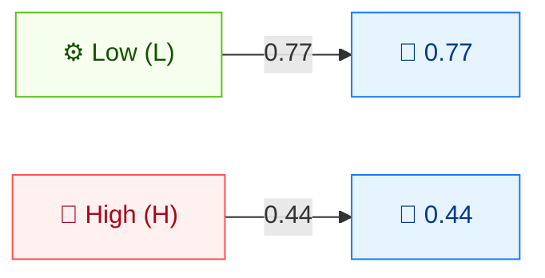

# ⚙️ 攻击复杂度 (AC)

🟦 基础指标 · 📐 评分影响

## 定义

攻击复杂度 (AC) 刻画成功利用漏洞所必需、且超出攻击者控制范围的条件。它描述的是攻击能否可靠复现，而非编写利用代码的技术难度。

## 取值

| 短值 | 长值 | 分数 | 描述 |
| ---- | ---- | ---- | ---- |
| `L` | Low  | 0.77 | 不存在特殊条件；攻击者可随意重复成功。 |
| `H` | High | 0.44 | 成功攻击依赖超出攻击者控制的条件（竞态、环境知识、中间人位置等）。 |

分数取自 `pkg/vector/attack_complexity.go`。

## 分数映射



低复杂度 = 可重复、受攻击者控制的成功（0.77，分数更高）。高复杂度 = 成功依赖超出攻击者控制的条件（0.44，分数更低）。

## 评分影响

AC 是**可利用性**子分的乘数。`Low`（0.77）保持高分；`High`（0.44）约莫将可利用性贡献减半，明显拉低最终基础分数。

## 示例

```bash
cvss score "CVSS:3.1/AV:N/AC:L/PR:N/UI:N/S:U/C:H/I:H/A:H"  # AC:Low
cvss score "CVSS:3.1/AV:N/AC:H/PR:N/UI:N/S:U/C:H/I:H/A:H"  # AC:High
```

```text
9.8 (Critical)   # AC:L
8.1 (High)       # AC:H
```

Go SDK：

```go
package main

import (
    "fmt"

    "github.com/scagogogo/cvss-skills/pkg/vector"
)

func main() {
    low, _ := vector.GetAttackComplexity('L')
    high, _ := vector.GetAttackComplexity('H')
    fmt.Printf("AC:L=%.2f  AC:H=%.2f\n", low.GetScore(), high.GetScore())
}
```

## 源码位置

[`pkg/vector/attack_complexity.go`](https://github.com/scagogogo/cvss-skills/blob/main/pkg/vector/attack_complexity.go) — 定义 `AttackComplexityLow` (0.77) 与 `AttackComplexityHigh` (0.44)，以及 `MAC` 修改后变体。

## 相关

- [指标总览](./)
- [攻击向量 (AV)](./attack-vector)
- [修改后指标 (M*)](./modified)
