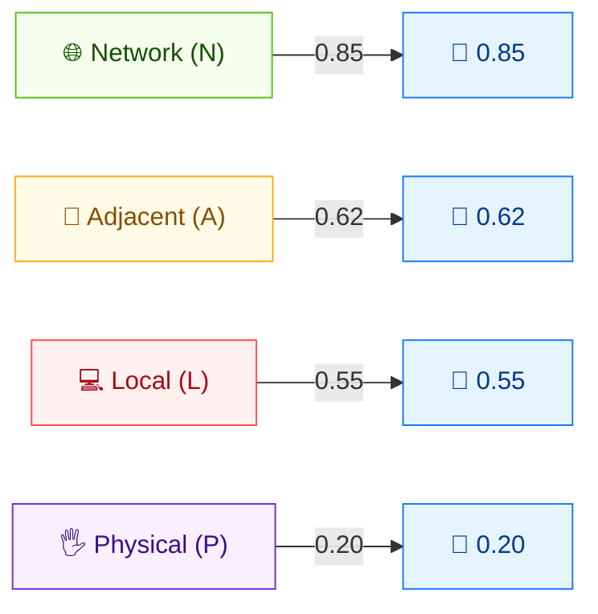

# 🌐 攻击向量 (AV)

🟦 基础指标 · 📐 评分影响

## 定义

攻击向量 (AV) 描述漏洞被利用时的上下文环境，刻画攻击者需要多"远"才能触达目标——从整个互联网一直到与设备的物理接触。漏洞越容易被触达，分数越高。

## 取值

| 短值 | 长值 | 分数 | 描述 |
| ---- | ---- | ---- | ---- |
| `N` | Network  | 0.85 | 漏洞组件绑定到网络协议栈，攻击者可在任意位置，直至整个互联网（远程可利用）。 |
| `A` | Adjacent | 0.62 | 绑定到网络协议栈，但受限于逻辑相邻的拓扑（同一物理/逻辑网络，如蓝牙、本地局域网）。 |
| `L` | Local    | 0.55 | 不绑定到网络协议栈；攻击者通过本地访问（键盘/控制台/SSH）或借助用户交互触达目标。 |
| `P` | Physical | 0.20 | 攻击者必须物理接触或操纵漏洞组件（如冷启动攻击、evil maid）。 |

分数取自 `pkg/vector/attack_vector.go`。

## 分数映射



分数越高 = 越容易触达 = 可利用性越强。**Network** 最危险；**Physical** 需要物理接触。

## 评分影响

AV 是基础分数中**可利用性 (Exploitability)** 子分的乘数。Network 最易利用（0.85），驱动最高分；Physical（0.20）显著拉低分数。四个取值单调递减，因此从 `N` 走向 `P` 必然降低分数。

## 示例

在其余指标相同（`AC:L/PR:N/UI:N/S:U/C:H/I:H/A:H`）的情况下对比四种攻击向量：

```bash
cvss score "CVSS:3.1/AV:N/AC:L/PR:N/UI:N/S:U/C:H/I:H/A:H"  # Network
cvss score "CVSS:3.1/AV:A/AC:L/PR:N/UI:N/S:U/C:H/I:H/A:H"  # Adjacent
cvss score "CVSS:3.1/AV:L/AC:L/PR:N/UI:N/S:U/C:H/I:H/A:H"  # Local
cvss score "CVSS:3.1/AV:P/AC:L/PR:N/UI:N/S:U/C:H/I:H/A:H"  # Physical
```

```text
9.8 (Critical)   # AV:N
8.8 (High)       # AV:A
8.4 (High)       # AV:L
6.8 (Medium)     # AV:P
```

Go SDK：

```go
package main

import (
    "fmt"

    "github.com/scagogogo/cvss-skills/pkg/vector"
)

func main() {
    for _, v := range []rune{'N', 'A', 'L', 'P'} {
        av, _ := vector.GetAttackVector(v)
        fmt.Printf("AV:%c  score=%.2f  long=%s\n", v, av.GetScore(), av.GetLongValue())
    }
}
```

## 源码位置

[`pkg/vector/attack_vector.go`](https://github.com/scagogogo/cvss-skills/blob/main/pkg/vector/attack_vector.go) — 定义 `AttackVectorNetwork` (0.85)、`AttackVectorAdjacent` (0.62)、`AttackVectorLocal` (0.55)、`AttackVectorPhysical` (0.20)，以及 `MAV` 修改后变体。

## 相关

- [指标总览](./)
- [修改后指标 (M*)](./modified)
- [SDK：vector 包](../sdk/vector)
