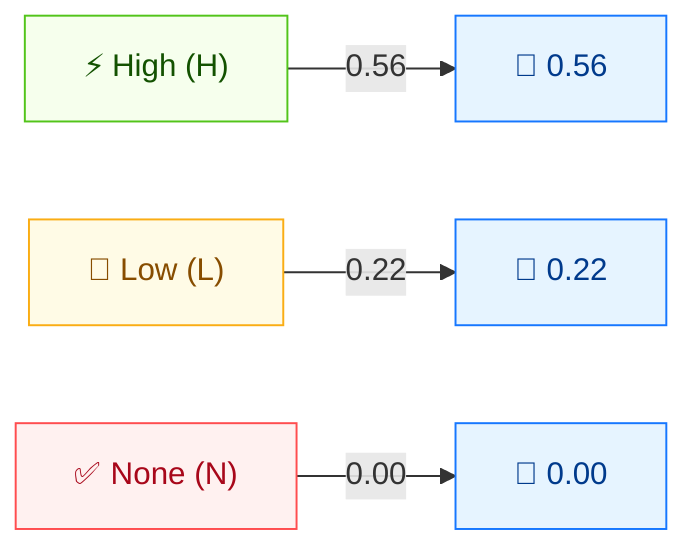

# ⏱️ 可用性 (A)

🟦 基础指标 · 📐 影响子分

## 定义

可用性 (A) 衡量受影响组件内可用性的损失程度——攻击者拒绝资源访问的能力。它与机密性、完整性同为构成**影响 (Impact)** 子分的三项 CIA 指标之一。

## 取值

| 短值 | 长值 | 分数 | 描述 |
| ---- | ---- | ---- | ---- |
| `H` | High | 0.56 | 可用性完全丧失：攻击者可完全拒绝资源访问，持续或持久。 |
| `L` | Low  | 0.22 | 性能下降或资源可用性中断，但攻击者无法完全拒绝服务，影响非直接严重。 |
| `N` | None | 0.00 | 受影响组件内无可用性影响。 |

分数取自 `pkg/vector/availability.go`。

## 分数映射



C、I、A 三个指标**分数刻度相同**（H=0.56、L=0.22、N=0.00）。它们汇入 ISC（影响）子分：取值越高影响越大。完全损失（H）影响最大；无损失（N）不计。

## 评分影响

A 喂入**影响**子分。三者按 `Impact = 1 − (1 − C) × (1 − I) × (1 − A)` 合并。仅 A 有影响时，`A:H` 得影响 0.56，`A:L` 得 0.22，`A:N` 得 0。

## 示例

将 C、I 设为 `None` 以单独观察 A：

```bash
cvss score "CVSS:3.1/AV:N/AC:L/PR:N/UI:N/S:U/C:N/I:N/A:H"  # A:High
cvss score "CVSS:3.1/AV:N/AC:L/PR:N/UI:N/S:U/C:N/I:N/A:L"  # A:Low
cvss score "CVSS:3.1/AV:N/AC:L/PR:N/UI:N/S:U/C:N/I:N/A:N"  # A:None
```

```text
7.5 (High)     # A:H
5.3 (Medium)   # A:L
0.0 (None)     # A:N
```

Go SDK：

```go
package main

import (
    "fmt"

    "github.com/scagogogo/cvss-skills/pkg/vector"
)

func main() {
    h, _ := vector.GetAvailability('H')
    l, _ := vector.GetAvailability('L')
    n, _ := vector.GetAvailability('N')
    fmt.Printf("A:H=%.2f  A:L=%.2f  A:N=%.2f\n", h.GetScore(), l.GetScore(), n.GetScore())
}
```

## 源码位置

[`pkg/vector/availability.go`](https://github.com/scagogogo/cvss-skills/blob/main/pkg/vector/availability.go) — 定义 `AvailabilityHigh` (0.56)、`AvailabilityLow` (0.22)、`AvailabilityNone` (0)，以及 `MA` 修改后变体。

## 相关

- [指标总览](./)
- [机密性 (C)](./confidentiality)
- [完整性 (I)](./integrity)
- [安全需求 (CR/IR/AR)](./requirements)
- [修改后指标 (M*)](./modified)
