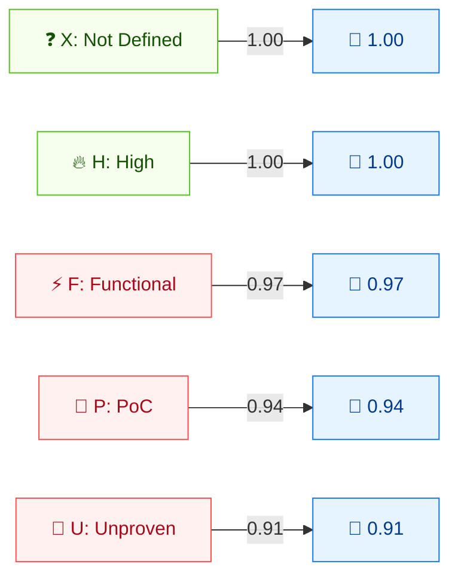

# 🧪 利用代码成熟度 (E)

🟨 时间指标 · 📐 时间乘数

## 定义

利用代码成熟度 (E) 衡量当前漏洞利用技术或代码的可用状态。它是**时间指标**：随利用代码从理论走向可靠的自动化攻击工具而随时间演变。

## 取值

| 短值 | 长值 | 分数 | 描述 |
| ---- | ---- | ---- | ---- |
| `X` | Not Defined      | 1.00  | 信息不足；与 `High` 同效。 |
| `H` | High             | 1.00  | 存在可自治的功能代码，或无需利用（手动触发）；可靠易用的自动化工具可用。 |
| `F` | Functional       | 0.97  | 存在功能性利用代码，在多数情况下可用。 |
| `P` | Proof-of-Concept | 0.94  | 存在 PoC 代码，或攻击演示对多数系统不实用；可能需大幅修改。 |
| `U` | Unproven         | 0.91  | 无利用代码，或利用仅停留在理论。 |

分数取自 `pkg/vector/exploit_code_maturity.go`。

## 分数映射



时间指标是 **乘数（≤1）**，只会降低基础分。X/H = 1.00（不降）。F/P/U = 依次降低，反映利用代码成熟度下降。

## 评分影响

E 是时间分数的**乘数**：`时间分数 = 基础 × E × RL × RC`。`High` 与 `Not Defined` 都等价于 `1.0`（不变）；成熟度越低分数越低。由于 `X`（未定义）与 `High` 行为相同，省略 E 时该乘数不影响基础分数。

## 示例

在基础 Critical 漏洞上对比各 E 取值：

```bash
cvss score "CVSS:3.1/AV:N/AC:L/PR:N/UI:N/S:U/C:H/I:H/A:H/E:X"  # Not Defined
cvss score "CVSS:3.1/AV:N/AC:L/PR:N/UI:N/S:U/C:H/I:H/A:H/E:H"  # High
cvss score "CVSS:3.1/AV:N/AC:L/PR:N/UI:N/S:U/C:H/I:H/A:H/E:F"  # Functional
cvss score "CVSS:3.1/AV:N/AC:L/PR:N/UI:N/S:U/C:H/I:H/A:H/E:P"  # Proof-of-Concept
cvss score "CVSS:3.1/AV:N/AC:L/PR:N/UI:N/S:U/C:H/I:H/A:H/E:U"  # Unproven
```

```text
9.8 (Critical)   # E:X  (== High)
9.8 (Critical)   # E:H
9.6 (Critical)   # E:F
9.3 (Critical)   # E:P
9.0 (Critical)   # E:U
```

Go SDK：

```go
package main

import (
    "fmt"

    "github.com/scagogogo/cvss-skills/pkg/vector"
)

func main() {
    for _, v := range []rune{'X', 'H', 'F', 'P', 'U'} {
        e, _ := vector.GetExploitCodeMaturity(v)
        fmt.Printf("E:%c=%.2f\n", v, e.GetScore())
    }
}
```

## 源码位置

[`pkg/vector/exploit_code_maturity.go`](https://github.com/scagogogo/cvss-skills/blob/main/pkg/vector/exploit_code_maturity.go) — 定义 `ExploitCodeMaturityNotDefined` (1)、`ExploitCodeMaturityHigh` (1)、`ExploitCodeMaturityFunctional` (0.97)、`ExploitCodeMaturityProofOfConcept` (0.94)、`ExploitCodeMaturityUnproven` (0.91)。

## 相关

- [指标总览](./)
- [修复级别 (RL)](./remediation-level)
- [报告可信度 (RC)](./report-confidence)
