# 📊 CVSS 指标总览

🧮 评分 · 📐 Base + Temporal + Environmental

CVSS v3.x 向量字符串是一系列指标短名与取值的序列。每个指标都属于三大组之一：Base 组刻画漏洞的内在性质；Temporal 组反映漏洞随时间演变的状态；Environmental 组则针对具体部署环境对分数进行裁剪。

## 指标分组

```mermaid
flowchart LR
    subgraph Base["基础指标组 (8)"]
        AV["AV 攻击向量"]
        AC["AC 攻击复杂度"]
        PR["PR 所需权限"]
        UI["UI 用户交互"]
        S["S 范围"]
        C["C 机密性"]
        I["I 完整性"]
        A["A 可用性"]
    end
    subgraph Temporal["时间指标组 (3)"]
        E["E 利用代码成熟度"]
        RL["RL 修复级别"]
        RC["RC 报告可信度"]
    end
    subgraph Environmental["环境指标组 (11)"]
        CR["CR 机密性需求"]
        IR["IR 完整性需求"]
        AR["AR 可用性需求"]
        MAV["MAV 修改后攻击向量"]
        MAC["MAC 修改后攻击复杂度"]
        MPR["MPR 修改后所需权限"]
        MUI["MUI 修改后用户交互"]
        MS["MS 修改后范围"]
        MC["MC 修改后机密性"]
        MI["MI 修改后完整性"]
        MA["MA 修改后可用性"]
    end
    Base --> Temporal
    Temporal --> Environmental
```



评分按从左到右的方向计算：**基础分数 → 时间分数 → 环境分数**。每一阶段都将前一阶段的分数乘上本阶段的指标因子，因此环境分数始终是最具体、也是最终的数值。

## 全部指标

| 短名 | 长名 | 分组 | 取值数 |
| ---- | ---- | ---- | ------ |
| AV   | 攻击向量            | 基础 | 4 |
| AC   | 攻击复杂度          | 基础 | 2 |
| PR   | 所需权限            | 基础 | 3 |
| UI   | 用户交互            | 基础 | 2 |
| S    | 范围                | 基础 | 2 |
| C    | 机密性              | 基础 | 3 |
| I    | 完整性              | 基础 | 3 |
| A    | 可用性              | 基础 | 3 |
| E    | 利用代码成熟度      | 时间 | 5 |
| RL   | 修复级别            | 时间 | 5 |
| RC   | 报告可信度          | 时间 | 4 |
| CR   | 机密性需求          | 环境 | 4 |
| IR   | 完整性需求          | 环境 | 4 |
| AR   | 可用性需求          | 环境 | 4 |
| MAV  | 修改后攻击向量      | 环境 | 5 |
| MAC  | 修改后攻击复杂度    | 环境 | 5 |
| MPR  | 修改后所需权限      | 环境 | 5 |
| MUI  | 修改后用户交互      | 环境 | 5 |
| MS   | 修改后范围          | 环境 | 3 |
| MC   | 修改后机密性        | 环境 | 5 |
| MI   | 修改后完整性        | 环境 | 5 |
| MA   | 修改后可用性        | 环境 | 5 |

## 向量字符串结构

向量字符串以 CVSS 版本前缀开头，随后是按固定顺序排列的指标对：

```
CVSS:3.1/AV:N/AC:L/PR:N/UI:N/S:U/C:H/I:H/A:H
```

- `CVSS:3.1` — 版本前缀（`3.0` 或 `3.1`）。
- 基础指标在前，顺序为 **AV / AC / PR / UI / S / C / I / A**。
- 时间指标随后：**E / RL / RC**（均可选）。
- 环境指标最后：**CR / IR / AR / MAV / MAC / MPR / MUI / MS / MC / MI / MA**（均可选）。
- 每对为 `短名:取值`。`X` 表示 "Not Defined"（未定义），告知评分器回退到基础值。

时间与环境指标均可省略。省略时，评分器按其默认值（`X` / Not Defined）处理，等价于不改变前一阶段分数。

## 评分管线

1. **基础分数** — 由 8 个基础指标计算。同一漏洞的基础分数恒定不变。
2. **时间分数** — `基础 × E × RL × RC`。每个时间指标都是乘数；`X`（未定义）等价于 `1`（不变）。
3. **环境分数** — 应用需求权重（CR/IR/AR）与修改后指标（M*），针对具体环境精修结果。

用 CLI 一次性查看三者：

```bash
cvss score --all "CVSS:3.1/AV:N/AC:L/PR:N/UI:N/S:C/C:H/I:H/A:H/E:H/RL:O/RC:C/CR:H"
```

```text
Base: 10.0 (Critical), Temporal: 9.4 (Critical), Environmental: 9.7 (Critical)
```

## 各指标子页

### 基础指标

- [攻击向量 (AV)](./attack-vector)
- [攻击复杂度 (AC)](./attack-complexity)
- [所需权限 (PR)](./privileges-required)
- [用户交互 (UI)](./user-interaction)
- [范围 (S)](./scope)
- [机密性 (C)](./confidentiality)
- [完整性 (I)](./integrity)
- [可用性 (A)](./availability)

### 时间指标

- [利用代码成熟度 (E)](./exploit-code-maturity)
- [修复级别 (RL)](./remediation-level)
- [报告可信度 (RC)](./report-confidence)

### 环境指标

- [安全需求 (CR/IR/AR)](./requirements)
- [修改后指标 (M*)](./modified)

## 源码位置

指标定义与分数位于 [`pkg/vector/`](https://github.com/scagogogo/cvss-skills/tree/main/pkg/vector)。每个指标对应一个 `.go` 文件，暴露预设变量，并在需要时提供版本/范围感知的分数辅助函数。

## 相关

- [SDK：vector 包](../sdk/vector)
- [CLI：score 命令](../cli/commands/score)
- [概念：评分](../concepts/scoring)
