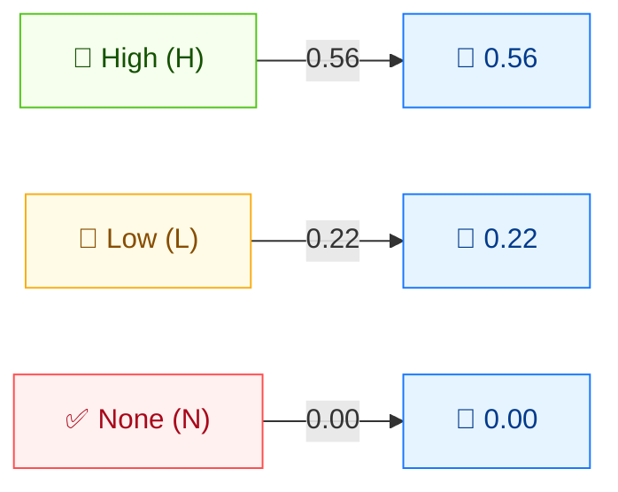

# ✏️ 完整性 (I)

🟦 基础指标 · 📐 影响子分

## 定义

完整性 (I) 衡量受影响组件内完整性的损失程度——攻击者修改数据的能力及该修改的严重性。它与机密性、可用性同为构成**影响 (Impact)** 子分的三项 CIA 指标之一。

## 取值

| 短值 | 长值 | 分数 | 描述 |
| ---- | ---- | ---- | ---- |
| `H` | High | 0.56 | 完整性完全丧失，或完全失去保护（如攻击者可修改受影响组件保护的任意/全部文件）。 |
| `L` | Low  | 0.22 | 数据可被修改，但攻击者控制有限或修改非直接严重。 |
| `N` | None | 0.00 | 受影响组件内无完整性损失。 |

分数取自 `pkg/vector/integrity.go`。

## 分数映射



C、I、A 三个指标**分数刻度相同**（H=0.56、L=0.22、N=0.00）。它们汇入 ISC（影响）子分：取值越高影响越大。完全损失（H）影响最大；无损失（N）不计。

## 评分影响

I 喂入**影响**子分。三者按 `Impact = 1 − (1 − C) × (1 − I) × (1 − A)` 合并。仅 I 有影响时，`I:H` 得影响 0.56，`I:L` 得 0.22，`I:N` 得 0。

## 示例

将 C、A 设为 `None` 以单独观察 I：

```bash
cvss score "CVSS:3.1/AV:N/AC:L/PR:N/UI:N/S:U/C:N/I:H/A:N"  # I:High
cvss score "CVSS:3.1/AV:N/AC:L/PR:N/UI:N/S:U/C:N/I:L/A:N"  # I:Low
cvss score "CVSS:3.1/AV:N/AC:L/PR:N/UI:N/S:U/C:N/I:N/A:N"  # I:None
```

```text
7.5 (High)     # I:H
5.3 (Medium)   # I:L
0.0 (None)     # I:N
```

Go SDK：

```go
package main

import (
    "fmt"

    "github.com/scagogogo/cvss-skills/pkg/vector"
)

func main() {
    h, _ := vector.GetIntegrity('H')
    l, _ := vector.GetIntegrity('L')
    n, _ := vector.GetIntegrity('N')
    fmt.Printf("I:H=%.2f  I:L=%.2f  I:N=%.2f\n", h.GetScore(), l.GetScore(), n.GetScore())
}
```

## 源码位置

[`pkg/vector/integrity.go`](https://github.com/scagogogo/cvss-skills/blob/main/pkg/vector/integrity.go) — 定义 `IntegrityHigh` (0.56)、`IntegrityLow` (0.22)、`IntegrityNone` (0)，以及 `MI` 修改后变体。

## 相关

- [指标总览](./)
- [机密性 (C)](./confidentiality)
- [可用性 (A)](./availability)
- [安全需求 (CR/IR/AR)](./requirements)
- [修改后指标 (M*)](./modified)
