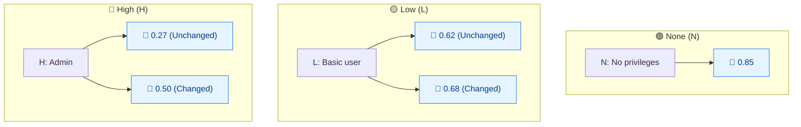

# 🔑 所需权限 (PR)

🟦 基础指标 · 📐 评分影响（依赖 Scope）

## 定义

所需权限 (PR) 描述攻击者在成功利用漏洞之前必须拥有的权限级别。`None` 表示攻击者未授权；`Low` 表示普通用户；`High` 表示对漏洞组件的管理控制权。

## 取值

PR 在基础指标中很特殊：其分数取决于 **Scope** 是否为 `Changed`。下表同时列出两种取值。

| 短值 | 长值 | 分数 (Scope Unchanged) | 分数 (Scope Changed) | 描述 |
| ---- | ---- | ---------------------- | -------------------- | ---- |
| `N` | None  | 0.85 | 0.85 | 攻击者在攻击前未授权，无需访问任何设置或文件。 |
| `L` | Low   | 0.62 | 0.68 | 攻击者需要普通用户权限，只能影响自己的设置/文件。 |
| `H` | High  | 0.27 | 0.50 | 攻击者需要（管理级别的）显著控制权。 |

分数取自 `pkg/vector/privileges_required.go`（`GetPrivilegesRequiredScore` 辅助函数）。

## 分数映射



PR 具有 **Scope 依赖**：L/H 分数随 Scope 变化。Unchanged = L/H 分数更低（更难利用）。Changed = 分数更高（影响溢出漏洞组件）。

## 评分影响

PR 是**可利用性**子分的乘数。无需权限（`None`，0.85）保持最高分；需要管理员权限（`High`）显著拉低分数。由于取值随 Scope 变化，跨安全边界（`S:C`）的漏洞在"需要权限"上受惩罚更轻——跨边界影响本身已经体现了严重程度。

请使用 `GetPrivilegesRequiredScore(pr, scopeChanged)` 获取正确数值；`PrivilegesRequiredLow`/`High` 的静态 `Score` 字段仅保存 Scope Unchanged 的值（0.62 / 0.27）。

## 示例

对比 Scope Unchanged 与 Changed 下的各 PR 取值：

```bash
# Scope Unchanged
cvss score "CVSS:3.1/AV:N/AC:L/PR:N/UI:N/S:U/C:H/I:H/A:H"  # PR:N
cvss score "CVSS:3.1/AV:N/AC:L/PR:L/UI:N/S:U/C:H/I:H/A:H"  # PR:L
cvss score "CVSS:3.1/AV:N/AC:L/PR:H/UI:N/S:U/C:H/I:H/A:H"  # PR:H

# Scope Changed
cvss score "CVSS:3.1/AV:N/AC:L/PR:N/UI:N/S:C/C:H/I:H/A:H"  # PR:N
cvss score "CVSS:3.1/AV:N/AC:L/PR:L/UI:N/S:C/C:H/I:H/A:H"  # PR:L
cvss score "CVSS:3.1/AV:N/AC:L/PR:H/UI:N/S:C/C:H/I:H/A:H"  # PR:H
```

```text
9.8 (Critical)   # PR:N  S:U
8.8 (High)       # PR:L  S:U
7.2 (High)       # PR:H  S:U
10.0 (Critical)  # PR:N  S:C
10.0 (Critical)  # PR:L  S:C
9.1 (Critical)   # PR:H  S:C
```

Go SDK — 始终使用 Scope 感知的辅助函数：

```go
package main

import (
    "fmt"

    "github.com/scagogogo/cvss-skills/pkg/vector"
)

func main() {
    low, _ := vector.GetPrivilegesRequired('L')
    // 正确的、Scope 感知取值：
    fmt.Println(vector.GetPrivilegesRequiredScore(low, false)) // 0.62 (S:U)
    fmt.Println(vector.GetPrivilegesRequiredScore(low, true))  // 0.68 (S:C)
}
```

## 源码位置

[`pkg/vector/privileges_required.go`](https://github.com/scagogogo/cvss-skills/blob/main/pkg/vector/privileges_required.go) — 定义预设变量及 `GetPrivilegesRequiredScore(pr, scopeChanged)` 辅助函数以解析正确取值。另见 `IsScopeChanged` / `IsModifiedScopeChanged`。

## 相关

- [指标总览](./)
- [范围 (S)](./scope)
- [修改后指标 (M*)](./modified)
