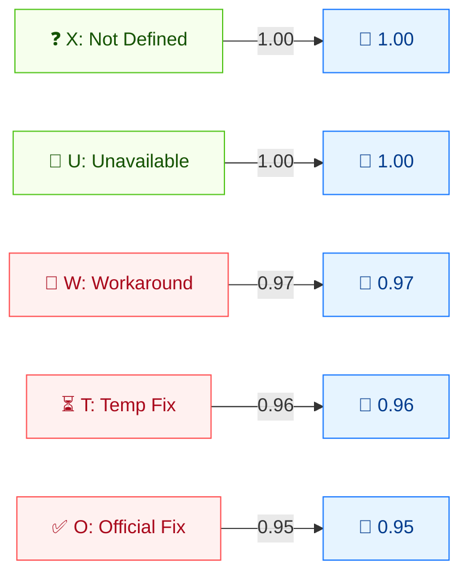

# 🛠️ 修复级别 (RL)

🟨 时间指标 · 📐 时间乘数

## 定义

修复级别 (RL) 刻画漏洞可用修复的状态。它是**时间指标**：随着修复逐步发布（变通方案 → 临时修复 → 官方修复），分数下降，反映真实风险降低。

## 取值

| 短值 | 长值 | 分数 | 描述 |
| ---- | ---- | ---- | ---- |
| `X` | Not Defined   | 1.00  | 信息不足；与 `Unavailable` 同效。 |
| `U` | Unavailable   | 1.00  | 无可用方案或无法应用。 |
| `W` | Workaround    | 0.97  | 存在非官方、非厂商方案（用户补丁或缓解步骤）。 |
| `T` | Temporary Fix | 0.96  | 存在官方但临时的修复（厂商热补丁、工具或变通）。 |
| `O` | Official Fix  | 0.95  | 存在完整厂商方案（官方补丁或升级）。 |

分数取自 `pkg/vector/remediation_level.go`。

## 分数映射



时间乘数（≤1）：修复越充分，分数越低。X/U = 1.00（无修复，不降）。W/T/O = 依次降低，反映紧迫性下降。

## 评分影响

RL 是时间分数的**乘数**：`时间分数 = 基础 × E × RL × RC`。`Unavailable` 与 `Not Defined` 都等价于 `1.0`（不变）；修复越好分数越低。由于 `X`（未定义）与 `Unavailable` 行为相同，省略 RL 时该乘数不影响基础分数。

## 示例

```bash
cvss score "CVSS:3.1/AV:N/AC:L/PR:N/UI:N/S:U/C:H/I:H/A:H/RL:X"  # Not Defined
cvss score "CVSS:3.1/AV:N/AC:L/PR:N/UI:N/S:U/C:H/I:H/A:H/RL:U"  # Unavailable
cvss score "CVSS:3.1/AV:N/AC:L/PR:N/UI:N/S:U/C:H/I:H/A:H/RL:W"  # Workaround
cvss score "CVSS:3.1/AV:N/AC:L/PR:N/UI:N/S:U/C:H/I:H/A:H/RL:T"  # Temporary Fix
cvss score "CVSS:3.1/AV:N/AC:L/PR:N/UI:N/S:U/C:H/I:H/A:H/RL:O"  # Official Fix
```

```text
9.8 (Critical)   # RL:X  (== Unavailable)
9.8 (Critical)   # RL:U
9.6 (Critical)   # RL:W
9.5 (Critical)   # RL:T
9.4 (Critical)   # RL:O
```

Go SDK：

```go
package main

import (
    "fmt"

    "github.com/scagogogo/cvss-skills/pkg/vector"
)

func main() {
    for _, v := range []rune{'X', 'U', 'W', 'T', 'O'} {
        rl, _ := vector.GetRemediationLevel(v)
        fmt.Printf("RL:%c=%.2f\n", v, rl.GetScore())
    }
}
```

## 源码位置

[`pkg/vector/remediation_level.go`](https://github.com/scagogogo/cvss-skills/blob/main/pkg/vector/remediation_level.go) — 定义 `RemediationLevelNotDefined` (1)、`RemediationLevelUnavailable` (1)、`RemediationLevelWorkaround` (0.97)、`RemediationLevelTemporaryFix` (0.96)、`RemediationLevelOfficialFix` (0.95)。

## 相关

- [指标总览](./)
- [利用代码成熟度 (E)](./exploit-code-maturity)
- [报告可信度 (RC)](./report-confidence)
