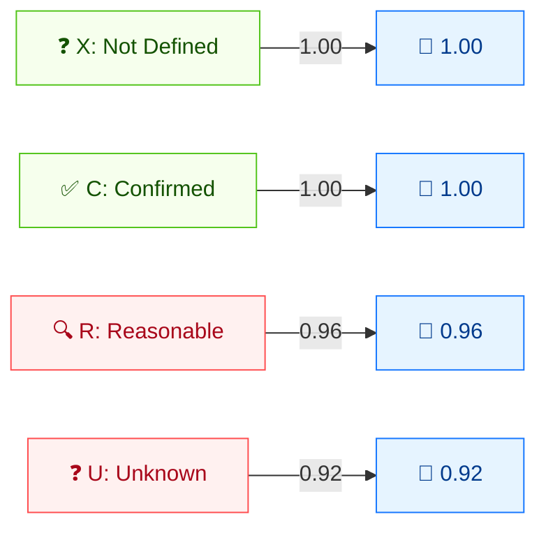

# 🔎 报告可信度 (RC)

🟨 时间指标 · 📐 时间乘数

## 定义

报告可信度 (RC) 刻画对漏洞存在性及技术细节可信度的把握程度。它是**时间指标**：随着报告被独立复现与确认，RC 上升。

## 取值

| 短值 | 长值 | 分数 | 描述 |
| ---- | ---- | ---- | ---- |
| `X` | Not Defined | 1.00  | 信息不足；与 `Confirmed` 同效。 |
| `C` | Confirmed   | 1.00  | 存在详尽报告或可功能性复现；来源经独立验证或厂商确认。 |
| `R` | Reasonable  | 0.96  | 已发布重要细节，有合理把握可复现，但未完全确认。 |
| `U` | Unknown     | 0.92  | 报告表明存在漏洞但原因不明或报告相互矛盾；可信度低。 |

分数取自 `pkg/vector/report_confidence.go`。

## 分数映射



时间乘数（≤1）：置信度越低，分数越低。X/C = 1.00（完全可信）。R/U = 降低分数，反映不确定性。

## 评分影响

RC 是时间分数的**乘数**：`时间分数 = 基础 × E × RL × RC`。`Confirmed` 与 `Not Defined` 都等价于 `1.0`（不变）；可信度越低分数越低。由于 `X`（未定义）与 `Confirmed` 行为相同，省略 RC 时该乘数不影响基础分数。

## 示例

```bash
cvss score "CVSS:3.1/AV:N/AC:L/PR:N/UI:N/S:U/C:H/I:H/A:H/RC:X"  # Not Defined
cvss score "CVSS:3.1/AV:N/AC:L/PR:N/UI:N/S:U/C:H/I:H/A:H/RC:C"  # Confirmed
cvss score "CVSS:3.1/AV:N/AC:L/PR:N/UI:N/S:U/C:H/I:H/A:H/RC:R"  # Reasonable
cvss score "CVSS:3.1/AV:N/AC:L/PR:N/UI:N/S:U/C:H/I:H/A:H/RC:U"  # Unknown
```

```text
9.8 (Critical)   # RC:X  (== Confirmed)
9.8 (Critical)   # RC:C
9.5 (Critical)   # RC:R
9.1 (Critical)   # RC:U
```

Go SDK：

```go
package main

import (
    "fmt"

    "github.com/scagogogo/cvss-skills/pkg/vector"
)

func main() {
    for _, v := range []rune{'X', 'C', 'R', 'U'} {
        rc, _ := vector.GetReportConfidence(v)
        fmt.Printf("RC:%c=%.2f\n", v, rc.GetScore())
    }
}
```

## 源码位置

[`pkg/vector/report_confidence.go`](https://github.com/scagogogo/cvss-skills/blob/main/pkg/vector/report_confidence.go) — 定义 `ReportConfidenceNotDefined` (1)、`ReportConfidenceConfirmed` (1)、`ReportConfidenceReasonable` (0.96)、`ReportConfidenceUnknown` (0.92)。

## 相关

- [指标总览](./)
- [利用代码成熟度 (E)](./exploit-code-maturity)
- [修复级别 (RL)](./remediation-level)
