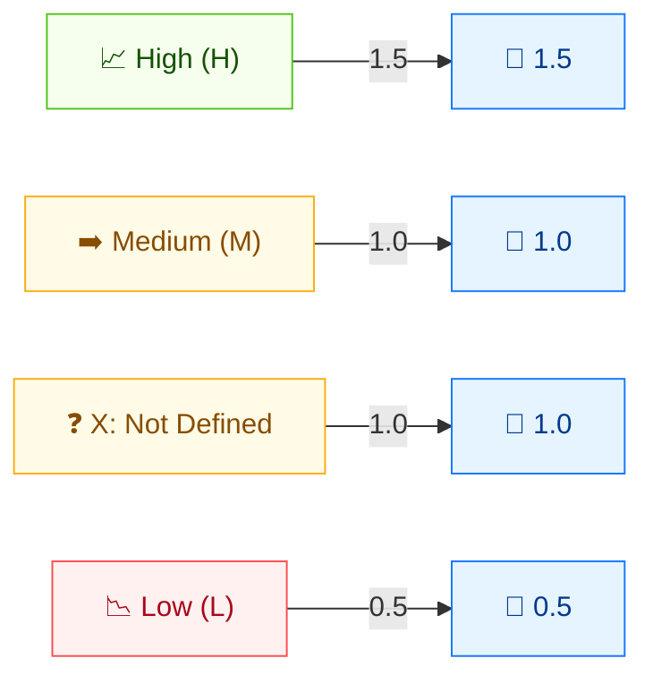

# ⚖️ 安全需求 (CR / IR / AR)

🟩 环境指标 · 📐 影响权重 (1.5 / 1 / 0.5 / 1)

## 定义

三项需求指标——**CR**（机密性需求）、**IR**（完整性需求）、**AR**（可用性需求）——让组织表达每个 CIA 维度对*本*环境有多重要。它们是**环境指标**：将基础 CIA 影响按组织实际优先级重新加权，而非通用最坏情况。

## 取值

CR、IR、AR 各自都取相同的四个取值，分数也相同。

| 短值 | 长值 | 分数 | 描述 |
| ---- | ---- | ---- | ---- |
| `X` | Not Defined | 1.0   | 信息不足；与 `Medium` 同效。 |
| `H` | High        | 1.5   | 该维度损失对组织可能造成**灾难性**影响。 |
| `M` | Medium      | 1.0   | 损失可能造成**严重**影响。 |
| `L` | Low         | 0.5   | 损失可能仅造成**有限**影响。 |

分数取自 `pkg/vector/confidentiality_requirement.go`、`integrity_requirement.go` 与 `availability_requirement.go`。

## 分数映射



CR/IR/AR 是 **环境权重修饰符**。H=1.5 **放大**影响；L=0.5 **缩小**；M/X=1.0 保持不变。它们对对应的 CIA 取值进行缩放。

## 评分影响

需求指标是**权重**，在环境分数计算时乘到对应基础影响值上。`High` (1.5) 放大该影响维度；`Low` (0.5) 抑制它；`Medium` 与 `Not Defined` (1.0) 保持不变。对有保密性影响的漏洞设 `CR:H` 可将该维度的 High 基础分提升至 Critical 级别。

由于 `X`（未定义）与 `Medium` 行为相同（均为 1.0），省略某项需求指标时不影响对应影响。

## 示例

将 I、A 影响设为 `None` 以单独观察 CR：

```bash
cvss score "CVSS:3.1/AV:N/AC:L/PR:N/UI:N/S:U/C:H/I:N/A:N/CR:X"  # Not Defined (== Medium)
cvss score "CVSS:3.1/AV:N/AC:L/PR:N/UI:N/S:U/C:H/I:N/A:N/CR:H"  # High
cvss score "CVSS:3.1/AV:N/AC:L/PR:N/UI:N/S:U/C:H/I:N/A:N/CR:M"  # Medium
cvss score "CVSS:3.1/AV:N/AC:L/PR:N/UI:N/S:U/C:H/I:N/A:N/CR:L"  # Low
```

```text
7.5 (High)       # CR:X  (== Medium)
9.3 (Critical)   # CR:H  (权重 1.5)
7.5 (High)       # CR:M  (权重 1.0)
5.7 (Medium)     # CR:L  (权重 0.5)
```

`CR:H` 将基础 7.5 (High) 抬升至 9.3 (Critical)；`CR:L` 则降至 5.7 (Medium)——同一漏洞因环境对机密性的需求不同而得分差异巨大。

Go SDK：

```go
package main

import (
    "fmt"

    "github.com/scagogogo/cvss-skills/pkg/vector"
)

func main() {
    cr, _ := vector.GetConfidentialityRequirement('H')
    fmt.Println(cr.GetScore()) // 1.5
}
```

## 源码位置

- [`pkg/vector/confidentiality_requirement.go`](https://github.com/scagogogo/cvss-skills/blob/main/pkg/vector/confidentiality_requirement.go) — `CR`：High 1.5 / Medium 1 / Low 0.5 / Not Defined 1。
- [`pkg/vector/integrity_requirement.go`](https://github.com/scagogogo/cvss-skills/blob/main/pkg/vector/integrity_requirement.go) — `IR`：同尺度。
- [`pkg/vector/availability_requirement.go`](https://github.com/scagogogo/cvss-skills/blob/main/pkg/vector/availability_requirement.go) — `AR`：同尺度。

## 相关

- [指标总览](./)
- [机密性 (C)](./confidentiality)
- [完整性 (I)](./integrity)
- [可用性 (A)](./availability)
- [修改后指标 (M*)](./modified)
