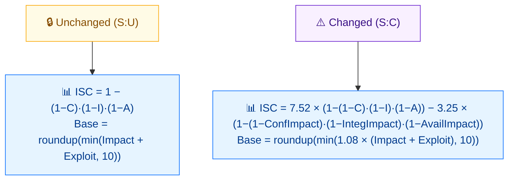

# 🔀 范围 (S)

🟦 基础指标 · 📐 评分影响（改写评分公式）

## 定义

范围 (S) 刻画漏洞是否只影响与漏洞组件**同一**安全权威管理的资源（`Unchanged`），还是影响**另一**安全权威管理的资源（`Changed`）。当受影响组件与漏洞组件不同、且由不同权威管理时，Scope 为 `Changed`。

## 取值

| 短值 | 长值 | 分数 | 描述 |
| ---- | ---- | ---- | ---- |
| `U` | Unchanged | 0 | 被利用漏洞只能影响与漏洞组件同一安全权威管理的资源。 |
| `C` | Changed   | 0 | 被利用漏洞可影响漏洞组件安全权威之外的资源（漏洞组件与受影响组件不同且由不同权威管理）。 |

Scope 本身没有直接数值（两者均为 `0`），其作用是结构性的。

## 分数映射



Scope 是 **结构性** 的，不带数值（两个取值均为 0）。但它会改变 **ISC（影响）公式**，并在 Changed 时施加 **`1.08` 乘子**——因此相同 C/I/A 取值下 S:C 评分明显更高。

## 评分影响

Scope 不提供自己的乘数。它**改写评分公式**：

1. 改变使用的**所需权限 (PR)** 取值——`S:C` 使用更高的 PR 分数（如 `PR:L` 用 0.68 而非 0.62）。见 [PR](./privileges-required)。
2. 基础分数公式对 `S:U` 与 `S:C` 有不同分支；`S:C` 分支采用不同的合并步骤与取整（`ceil` of `min(...)`），因此同样其他指标下 `S:C` 通常比 `S:U` 得分更高。

## 示例

```bash
cvss score "CVSS:3.1/AV:N/AC:L/PR:N/UI:N/S:U/C:H/I:H/A:H"  # Scope Unchanged
cvss score "CVSS:3.1/AV:N/AC:L/PR:N/UI:N/S:C/C:H/I:H/A:H"  # Scope Changed
```

```text
9.8 (Critical)   # S:U
10.0 (Critical)  # S:C
```

Go SDK — 检测 Scope 以正确喂给 PR：

```go
package main

import (
    "fmt"

    "github.com/scagogogo/cvss-skills/pkg/vector"
)

func main() {
    scope, _ := vector.GetScope('C')
    fmt.Println(vector.IsScopeChanged(scope)) // true
}
```

## 源码位置

[`pkg/vector/scope.go`](https://github.com/scagogogo/cvss-skills/blob/main/pkg/vector/scope.go) — 定义 `ScopeUnchanged` 与 `ScopeChanged`，以及 `MS` 修改后变体。`IsScopeChanged` / `IsModifiedScopeChanged` 辅助函数位于 [`pkg/vector/privileges_required.go`](https://github.com/scagogogo/cvss-skills/blob/main/pkg/vector/privileges_required.go)。

## 相关

- [指标总览](./)
- [所需权限 (PR)](./privileges-required)
- [修改后指标 (M*)](./modified)
