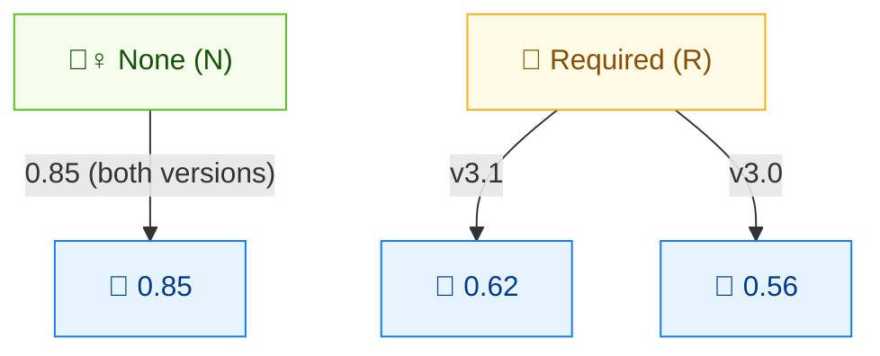

# 🤝 用户交互 (UI)

🟦 基础指标 · 📐 评分影响（依赖版本）

## 定义

用户交互 (UI) 刻画利用漏洞是否需要（攻击者以外的）用户执行某项动作。`None` 表示无需任何用户参与即可利用漏洞系统；`Required` 表示必须由用户先执行某动作（如打开文档、点击链接）才能利用。

## 取值

| 短值 | 长值 | 分数 (v3.1) | 分数 (v3.0) | 描述 |
| ---- | ---- | ----------- | ----------- | ---- |
| `N` | None     | 0.85 | 0.85 | 无需任何用户交互即可利用漏洞系统。 |
| `R` | Required | 0.62 | 0.56 | 成功利用需要用户先执行某动作。 |

分数取自 `pkg/vector/user_interaction.go`（`GetUserInteractionScore` 辅助函数）。`UserInteractionRequired` 的静态 `Score` 字段为 v3.1 取值（0.62）。

## 分数映射



None = 无需用户交互（0.85，更危险）。Required = 用户需先执行动作。**版本敏感**：UI:R 在 v3.1 计 0.62，在 v3.0 计 0.56（v3.0 对 Required 惩罚更重）。

## 评分影响

UI 是**可利用性**子分的乘数。关键要点：**`UI:R` 在 CVSS v3.0 中为 0.56，在 v3.1 中为 0.62**。v3.1 规范上调了该值，以更准确反映"需要用户交互"是比最初建模更轻的 deterrent。`UI:N` 在两个版本中相同（0.85）。

务必从向量字符串读取版本前缀，并调用 `GetUserInteractionScore(ui, minorVersion)`——`minorVersion` 为 `0`（v3.0）或 `1`（v3.1）。

## 示例

跨两个 CVSS 版本对比 `UI:N` 与 `UI:R`：

```bash
# CVSS v3.1
cvss score "CVSS:3.1/AV:N/AC:L/PR:N/UI:N/S:U/C:H/I:H/A:H"  # UI:N
cvss score "CVSS:3.1/AV:N/AC:L/PR:N/UI:R/S:U/C:H/I:H/A:H"  # UI:R (0.62)

# CVSS v3.0
cvss score "CVSS:3.0/AV:N/AC:L/PR:N/UI:N/S:U/C:H/I:H/A:H"  # UI:N
cvss score "CVSS:3.0/AV:N/AC:L/PR:N/UI:R/S:U/C:H/I:H/A:H"  # UI:R (0.56)
```

```text
9.8 (Critical)   # UI:N  v3.1
8.8 (High)       # UI:R  v3.1  (0.62)
9.8 (Critical)   # UI:N  v3.0
8.5 (High)       # UI:R  v3.0  (0.56)
```

注意 v3.0 的 `UI:R`（8.5）与 v3.1 的 `UI:R`（8.8）相差 0.3 分——完全由 0.56 → 0.62 的分数变化导致。

Go SDK — 传入 CVSS 次版本号：

```go
package main

import (
    "fmt"

    "github.com/scagogogo/cvss-skills/pkg/vector"
)

func main() {
    req, _ := vector.GetUserInteraction('R')
    fmt.Println(vector.GetUserInteractionScore(req, 0)) // 0.56 (v3.0)
    fmt.Println(vector.GetUserInteractionScore(req, 1)) // 0.62 (v3.1)
}
```

## 源码位置

[`pkg/vector/user_interaction.go`](https://github.com/scagogogo/cvss-skills/blob/main/pkg/vector/user_interaction.go) — 定义 `UserInteractionNone` (0.85) 与 `UserInteractionRequired`（静态 0.62），以及处理 v3.0/v3.1 差异的 `GetUserInteractionScore(ui, minorVersion)` 辅助函数。

## 相关

- [指标总览](./)
- [攻击向量 (AV)](./attack-vector)
- [修改后指标 (M*)](./modified)
