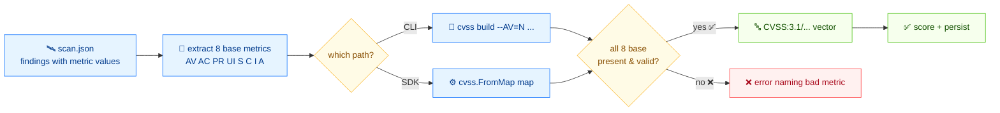

# 🛠️ 从扫描结果构建 CVSS 向量

## 问题

你的扫描器输出的是原始指标值（攻击向量、复杂度、权限……），而不是 CVSS 向量串。你需要把它们组装成规范的 `CVSS:3.1/...` 向量，便于评分和入库。

## 方案

流程如下：



### 1. 表示扫描输出

`scan.json`——每个发现一项，带 8 个基础指标的短码值：

```json
{
  "target": "web-server-01",
  "findings": [
    {
      "id": "CVE-2024-1234",
      "attack_vector": "N", "attack_complexity": "L",
      "privileges_required": "N", "user_interaction": "N",
      "scope": "U", "confidentiality": "H",
      "integrity": "H", "availability": "H"
    },
    {
      "id": "CVE-2024-5678",
      "attack_vector": "L", "attack_complexity": "H",
      "privileges_required": "H", "user_interaction": "R",
      "scope": "U", "confidentiality": "L",
      "integrity": "L", "availability": "L"
    }
  ]
}
```

### 2. CLI：按发现逐条 `build`

`build` 把每个指标当作一个 flag，输出规范向量：

```bash
cvss build \
  --AV=N --AC=L --PR=N --UI=N --S=U --C=H --I=H --A=H
```

```text
CVSS:3.1/AV:N/AC:L/PR:N/UI:N/S:U/C:H/I:H/A:H
```

时间和环境指标是可选 flag，传上就扩展向量：

```bash
cvss build \
  --AV=N --AC=L --PR=N --UI=N --S=U --C=H --I=H --A=H \
  --E=F --RL=T --RC=C
```

```text
CVSS:3.1/AV:N/AC:L/PR:N/UI:N/S:U/C:H/I:H/A:H/E:F/RL:T/RC:C
```

要 v3.0 向量用 `--cvss-version 3.0`。

### 3. Go SDK：对每个发现用 `FromMap`

`cvss.FromMap` 接受一个 `map[string]string`，key 是指标短名（如 `"AV": "N"`），还要一个 `"version"` 项。对解码成 map 的 JSON 发现来说天然契合。

```go
package main

import (
	"encoding/json"
	"fmt"

	"github.com/scagogogo/cvss-skills/pkg/cvss"
)

type scanReport struct {
	Target   string    `json:"target"`
	Findings []finding `json:"findings"`
}

type finding struct {
	ID                string `json:"id"`
	AttackVector      string `json:"attack_vector"`
	AttackComplexity  string `json:"attack_complexity"`
	PrivilegesRequired string `json:"privileges_required"`
	UserInteraction   string `json:"user_interaction"`
	Scope             string `json:"scope"`
	Confidentiality   string `json:"confidentiality"`
	Integrity         string `json:"integrity"`
	Availability      string `json:"availability"`
}

func main() {
	raw := []byte(`{
	  "target": "web-server-01",
	  "findings": [
	    {"id":"CVE-2024-1234","attack_vector":"N","attack_complexity":"L","privileges_required":"N","user_interaction":"N","scope":"U","confidentiality":"H","integrity":"H","availability":"H"},
	    {"id":"CVE-2024-5678","attack_vector":"L","attack_complexity":"H","privileges_required":"H","user_interaction":"R","scope":"U","confidentiality":"L","integrity":"L","availability":"L"}
	  ]
	}`)

	var report scanReport
	if err := json.Unmarshal(raw, &report); err != nil {
		panic(err)
	}

	for _, f := range report.Findings {
		cv, err := cvss.FromMap(map[string]string{
			"version": "3.1",
			"AV": f.AttackVector, "AC": f.AttackComplexity,
			"PR": f.PrivilegesRequired, "UI": f.UserInteraction,
			"S": f.Scope, "C": f.Confidentiality,
			"I": f.Integrity, "A": f.Availability,
		})
		if err != nil {
			fmt.Printf("%s: %v\n", f.ID, err)
			continue
		}
		fmt.Printf("%s -> %s\n", f.ID, cv.String())
	}
}
```

```text
CVE-2024-1234 -> CVSS:3.1/AV:N/AC:L/PR:N/UI:N/S:U/C:H/I:H/A:H
CVE-2024-5678 -> CVSS:3.1/AV:L/AC:H/PR:H/UI:R/S:U/C:L/I:L/A:L
```

`FromMap` 会校验每个值，所以 `"AV": "X"` 这种笔误会返回一个点名道姓指出坏指标的错——不会悄悄产生垃圾向量。

## 讨论

- **8 个基础指标都要。** `build` 缺任一基础 flag 就报错；`FromMap` 会列出所有坏/缺的指标。不完整向量是另一套工具——见 [给不完整向量算分](/zh/recipes/score-partial-vector)。
- **指标名用短码。** 基础用 `AV`、`AC`、`PR`、`UI`、`S`、`C`、`I`、`A`；时间用 `E`、`RL`、`RC`；环境用 `CR`、`IR`、`AR`、`MAV`、`MAC`、`MPR`、`MUI`、`MS`、`MC`、`MI`、`MA`。完整表见 [`enumerate`](/zh/cli/commands/enumerate)。
- **位置参数用 `FromVectorValues`。** 如果你拿到的是 `key:value` 对而不是 map，`cvss.FromVectorValues("3.1", "AV:N", "AC:L", ...)` 效果一样，不用 map。
- **不是你想要的？** 要把向量*反过来*变成 map，CLI 用 [`map`](/zh/cli/commands/map)，Go 用 `Cvss3x.ToMap()`。

## 另见

- [`build`](/zh/cli/commands/build)——本篇用到的 CLI 命令
- [From Map](/zh/sdk/from-map)——`FromMap` / `FromVectorValues` / `ToMap` 参考
- [`enumerate`](/zh/cli/commands/enumerate)——合法指标名与取值
- [给不完整向量算分](/zh/recipes/score-partial-vector)
- [导出 JSON](/zh/recipes/export-to-json)
