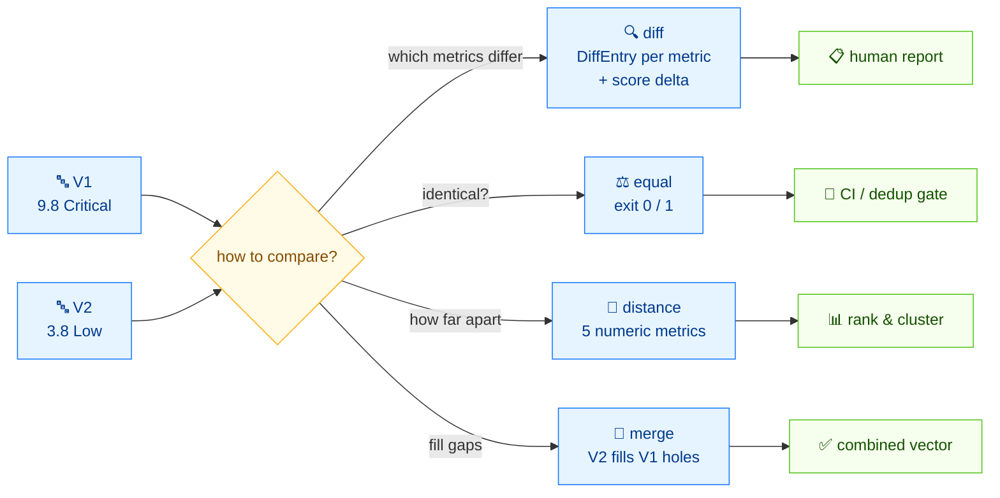

# 🔀 对比两个 CVSS 向量并计算分数变化

## 问题

两条公告用略有不同的向量描述同一个 CVE——或者复分析改了一个指标——你需要看清到底哪些指标不同、分数变了多少。

## 方案

流程如下——两个向量，四种比较方式：



### CLI：`diff`

```bash
cvss diff \
  "CVSS:3.1/AV:N/AC:L/PR:N/UI:N/S:U/C:H/I:H/A:H" \
  "CVSS:3.1/AV:L/AC:H/PR:H/UI:R/S:U/C:L/I:L/A:L"
```

```text
Found 7 difference(s):

  AV: N (Network) → L (Local)
  AC: L (Low) → H (High)
  PR: N (None) → H (High)
  UI: N (None) → R (Required)
  C: H (High) → L (Low)
  I: H (High) → L (Low)
  A: H (High) → L (Low)

Score: 9.8 (Critical) → 3.8 (Low)  [Δ=-6.0]
```

要机器可读，用 `--format json`：

```bash
cvss diff --format json \
  "CVSS:3.1/AV:N/AC:L/PR:N/UI:N/S:U/C:H/I:H/A:H" \
  "CVSS:3.1/AV:L/AC:H/PR:H/UI:R/S:U/C:L/I:L/A:L"
```

```json
{
  "differences": [
    { "metric": "AV", "v1": "N", "v1_long": "Network", "v2": "L", "v2_long": "Local" },
    { "metric": "AC", "v1": "L", "v1_long": "Low", "v2": "H", "v2_long": "High" },
    { "metric": "PR", "v1": "N", "v1_long": "None", "v2": "H", "v2_long": "High" },
    { "metric": "UI", "v1": "N", "v1_long": "None", "v2": "R", "v2_long": "Required" },
    { "metric": "C", "v1": "H", "v1_long": "High", "v2": "L", "v2_long": "Low" },
    { "metric": "I", "v1": "H", "v1_long": "High", "v2": "L", "v2_long": "Low" },
    { "metric": "A", "v1": "H", "v1_long": "High", "v2": "L", "v2_long": "Low" }
  ],
  "score1": 9.8,
  "score2": 3.8,
  "score_delta": -6.000000000000001,
  "severity1": "Critical",
  "severity2": "Low"
}
```

### Go SDK：`Cvss3x.Diff`

`Diff(other *Cvss3x) []DiffEntry` 遍历基础、时间、环境指标，对短值不同的每个指标返回一条记录（含“设置了 vs 没设置”的差异）。

```go
package main

import (
	"fmt"

	"github.com/scagogogo/cvss-skills/pkg/parser"
)

func main() {
	a, _ := parser.ParseString("CVSS:3.1/AV:N/AC:L/PR:N/UI:N/S:U/C:H/I:H/A:H")
	b, _ := parser.ParseString("CVSS:3.1/AV:L/AC:H/PR:H/UI:R/S:U/C:L/I:L/A:L")

	for _, d := range a.Diff(b) {
		fmt.Println(d.String()) // 例如 "AV: N vs L"
	}
}
```

```text
AV: N vs L
AC: L vs H
PR: N vs H
UI: N vs R
C: H vs L
I: H vs L
A: H vs L
```

`DiffEntry` 带 `Metric`、`V1`、`V2`、`V1Long`、`V2Long`，所以你可以直接用结构体字段拼自己的报告格式，不必依赖 `.String()`。

## 讨论

- **一边有一边没有的指标也算差异。** `Diff` 会给未设置的一边填 `"-"`，所以拿一个只含基础指标的向量去对比一个带时间指标的向量，会标记 E/RL/RC。
- **分数变化的方向。** `score_delta` 是 `score2 - score1`（这里是 `3.8 - 9.8 = -6.0`）；负数表示第二个向量更轻。
- **`Diff` 比的是短值，不是分数。** 两个 `PR:L` 在 `Diff` 看来是“相等”的，尽管 PR 的分数取决于 Scope——在意分数空间差异时用 [距离度量](/zh/recipes/measure-similarity)。
- **不是你想要的？** 要数值化的距离/相似度，看 [度量相似度](/zh/recipes/measure-similarity)。要把两个向量合并成一个，用 [`merge`](/zh/cli/commands/merge) / `Cvss3x.Merge`。

## 另见

- [`diff`](/zh/cli/commands/diff)——本篇用到的 CLI 命令
- [距离与对比](/zh/sdk/diff)——`Diff` / `DiffEntry` 参考
- [度量相似度](/zh/recipes/measure-similarity)
- [`merge`](/zh/cli/commands/merge)——合并两个向量
